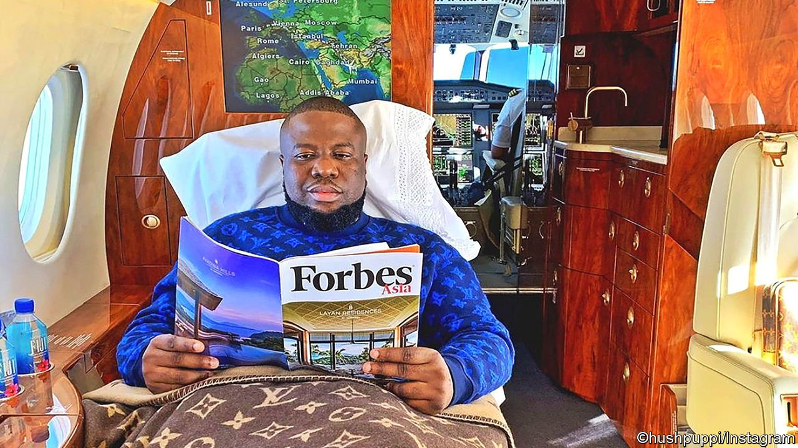

###### Crime and government

# A fraudster’s confession rebounds on Nigeria’s top cop 

##### The murky links between a scam artist and detective 

 

> Aug 12th 2021 

IT IS AN Instagram account to inspire envy. In one picture Ramon Abbas, a Nigerian who calls himself “Hushpuppi”, is leaning against a white Rolls-Royce. In another the Roller is purple. Lest his 2.5m followers think he is partial only to palatial British cars, other posts show him with a red Ferrari and sporting a red Chanel handbag or lounging in a private jet (pictured below).

Nowhere on Hushpuppi’s feed is there a picture showing him in handcuffs being led away by police in Dubai. Nor of the $40m in cash that they seized in raids on several apartments there before handing him over to America’s Federal Bureau of Investigation (FBI) to face charges of money-laundering and cybercrimes.


Few were surprised when they learned that Hushpuppi had pleaded guilty in April. But Nigerians were stunned on July 28th when court documents were unsealed implicating their most famous cop, Abba Kyari, who is known for tracking down and locking up kidnappers, of whom Nigeria has far too many. Mr Kyari is now himself wanted by the law, oddly enough for locking up one of Hushpuppi’s accomplices. In this case, though, it was not sleuthing that got Mr Kyari his man. The indictment alleges that Hushpuppi promised to pay him for the arrest.

The plot began, according to the indictment, with a wheeze to swindle $1.1m out of a businessman who wanted a loan to build a school in Qatar, by impersonating bankers and setting up a fake bank website. Of the money raked in, $230,000 was spent on a watch that was hand-delivered to Hushpuppi in Dubai.

But then the thieves fell out over the size of the cut going to Kelly Chibuzo Vincent, whose job it had been to set up the fake bank website. Feeling cheated, Mr Vincent called the businessman and told him of the scam. Hushpuppi, furious, allegedly offered the Nigerian detective money to arrest Mr Vincent and give him the “beating of his life”. Job done, Mr Kyari, a deputy commissioner of police, took photos of the arrested man and sent them as proof—along with details of a bank account into which payment could be made.

Mr Kyari insists he is innocent and said he arrested Mr Vincent only because he had threatened to kill members of Hushpuppi’s family in Nigeria. He denies accepting money. But an affidavit submitted by the FBI, backed up by messages between cop and fraudster, showed that Mr Kyari was told to hold Vincent until the scam was completed and that he had asked for a cut of the profits. Mr Kyari allegedly received some $20,000 for his role.

Unusually for an organisation that often overlooks wrongdoing by its officers, Nigeria’s police force has suspended Mr Kyari and opened an investigation. Nigerians gripe that cops are more likely to try to extort money from them than to respond to distress calls. In 2005 a former police chief, Tafa Balogun, pleaded guilty to money-laundering and was made to forfeit 16bn naira ($120m), several houses and a “jeep farm” with hundreds of pricey cars. Shortly after the seizures the recovered loot vanished and the houses and cars were auctioned off for peanuts to cronies, prompting parliamentarians to demand that Mike Okiro, Mr Balogun’s successor, account for the looted loot.

Mr Kyari’s indictment may not be the biggest scandal to hit the police. But it is demoralising for the public. His heroics in battling kidnappers had earned him a presidential medal of courage and made him unusually popular for a policeman. His fall would be a blow to the many who saw him as proof that a cop can rise to the top by working hard and staying clean. Perhaps he may have been too good to be true. ■

