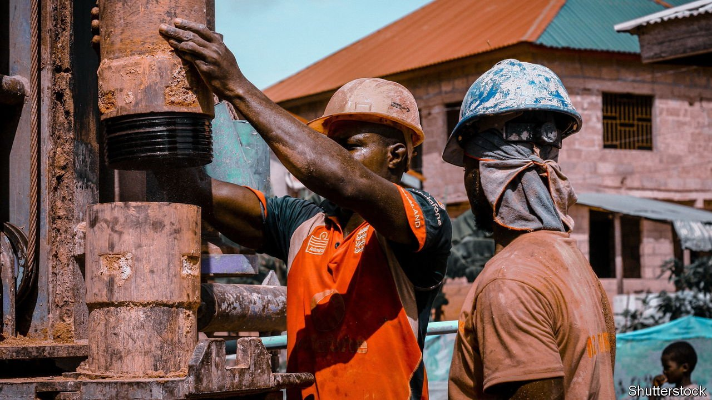

###### Crude business

# Ghana plans to buy back oil licences no one wants 

##### Activists say the numbers don’t add up 

 

> Aug 12th 2021 

IT WAS NOT meant to be this way. Ghana made its first big oil discovery only in 2007, a generation after its corruption-addled and environmentally damaged regional peers. But the expected bonanza of investment and revenue has failed to materialise. ExxonMobil, an oil company, quit this year without drilling a well. Total decided to pass altogether. Chinese firms have gone elsewhere. Now the nominally centre-right and pro-market government plans to step in and buy back the oilfields no one else wants.

On August 6th Parliament voted to support plans by Matthew Prempeh, the energy minister, to pay up to $1.1bn to acquire large stakes in Deepwater Tano-Cape Three Points (DWT-CTP) and South Deepwater Tano (SDWT). The two oil blocks are more than 100km offshore and in deep water. Both have discoveries of oil, but neither is in development, still less production.


Mr Prempeh says the fields could produce 200,000 barrels per day within four years, more than double Ghana’s dwindling output. “Oil majors are shifting from fossil fuels to renewable energy,” he complains. Without new foreign investment, Ghana had two choices. It could leave the oil and gas in the ground or get involved in the production game. The deal will create jobs, he says, and return a handsome profit.

It is also a great deal for Norwegian shipping billionaire Kjell Inge Røkke, who controls Aker Energy and AGM, two oil firms with stakes in the blocks. Mr Røkke’s firms acquired a 50% stake in DWT-CTP in 2018 for just $100m. A year later, he persuaded the government to relinquish a 14% stake in SDWT, arguing it would make the licences more attractive to the potential partners that never materialised. Last September, Mr Røkke himself said it was time to “move focus” to renewables, and in May hinted at withdrawing from Ghana.

Bright Simons, an activist, says the government has overvalued the blocks and is buying licences that might otherwise have been relinquished anyhow. Industry sources say the biggest beneficiaries may be the well-connected local firms that will expect to win contracts if exploration takes off. The Energy Committee took just a day to consider the minister’s request, and Parliament barely two hours to rubber stamp the minister’s request to negotiate the purchase. Perhaps it ought to take more time when the deal comes back for ratification.

