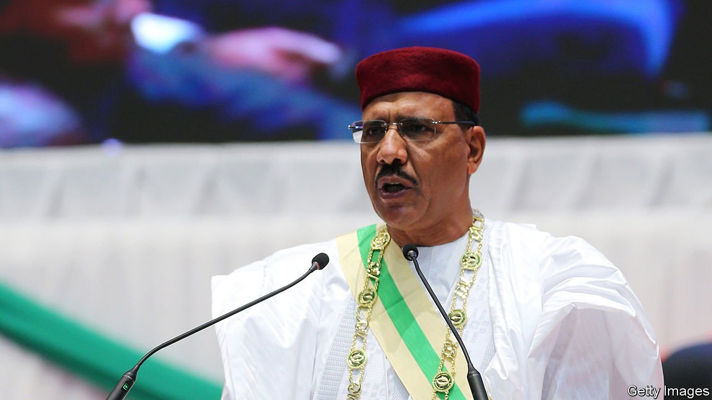

###### Jihadists on all sides

# Mohamed Bazoum, Niger’s new president, asks for help 

##### Niger is caught between Islamic State and Boko Haram 

 

> Aug 14th 2021 

SINCE A WAVE of anti-French protests broke out last year across parts of the Sahel, few leaders in the region have wanted to appear to be too chummy with the former colonial power, or for that matter any of the Western countries which have sent troops to help fight jihadists. Mohamed Bazoum, who was sworn in as president of Niger in April in its first democratic transfer of power, is less standoffish. He not only welcomes the French military presence in his country, but thinks other Western powers should be doing far more to help roll back the insurgent groups that have overrun parts of Mali and are causing havoc in Burkina Faso, Niger and Nigeria.

“We are not satisfied with the international community as a whole in its way of fighting terrorism in this area,” Mr Bazoum (pictured) tells The Economist. “Against the same adversary, Daesh [Islamic State], in Iraq we saw a great international coalition. But today, we are not seeing the same mobilisation through the UN, in particular.” The region has enough troops, and these are being trained and advised by French and allied forces. But it lacks air power and the money to pay its men, which the UN could provide, he says.


Niger, which is ranked as the world’s poorest country across a range of measures by the UN Development Programme, is caught between two jihadist insurgencies. Along its western borders with Mali and Burkina Faso it faces groups such as the Islamic State in the Greater Sahara (ISGS) and Jama’at Nasr al-Islam wal Muslimin (JNIM), which is linked to al-Qaeda. The number of attacks mounted by these and allied groups will increase by a third this year, predicts the Africa Centre for Strategic Studies, part of America’s Department of Defence.

On current trends the conflict will lead to more than 2,400 deaths in the Sahel this year. In Niger’s east, meanwhile, the government is battling the jihadists of Boko Haram who attack across the border from safe areas in Nigeria or from the marshes of Lake Chad. Roughly 500,000 people are living in camps in Niger because of violence in the country or its neighbours.

Mr Bazoum’s response has been to host the headquarters of a French-led counter-terrorism operation, known as the Takuba Task Force, which will include commandos from nine European countries and will focus on training and advising local forces. This is meant to become the leading Western effort in the Sahel as France winds down its own counter-terrorism force, Operation Barkhane, which currently has about 5,000 troops deployed in the Sahel and has its headquarters in Chad. Yet improving Niger’s security will depend on whether its neighbours restore stability. “If Malian territory is at the mercy of terrorist groups, as is the case today...our situation will remain difficult,” he says.

Within Niger Mr Bazoum is not just relying on force. He hopes to deal with the discontent that leads some to join the insurgents. To win people over he is trying to provide services such as clinics, clean water and schools in remote villages, and to attract investment by curbing corruption. Investments in infrastructure and solar energy are aimed at boosting growth and output, particularly on farms. Mr Bazoum is also aiming to slow the world’s fastest rate of population growth by building boarding schools for girls, with the aim of keeping them in education until they are 18 years old. Currently, many leave school at 13 and are married within a year. By 18 many will already have two babies, he says, contributing to a “crazy” fertility rate of almost seven births per woman.

Improving governance and education will take time. Yet if Niger is left unaided, time may not be on its side. ■

