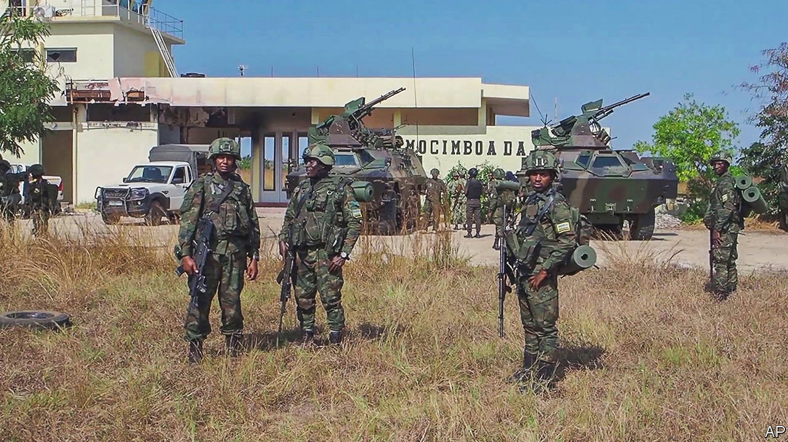

###### Cabo Delgado

# Why Mozambique invited foreign troops to fight its jihadists 

##### Rwandan soldiers are rescuing a huge gas project. But the insurgents’ grievances still fester 

 

> Aug 12th 2021 

MOCíMBOA DA PRAIA has been at the centre of Mozambique’s war against jihadists. For years the town in the north-eastern province of Cabo Delgado has been home to aggrieved Muslims from the Mwani ethnic group, angry at how the mostly Catholic Makonde elite dominate politics and business. The port was also a hub for people, ideas and goods—Islamists from across east Africa, fundamentalism and, later, money and guns. In October 2017, when an Islamic sect turned violent, it was the site of the first battle of a conflict that has cost at least 3,200 lives and displaced 800,000 people. The insurgency then grew. Jihadists seized Mocímboa da Praia in August last year. From there they plotted an attack in March on Palma, 80km along the coast, which led to the shelving of a nearby gas project that the government had hoped would transform the economy.

Many Mozambicans therefore cheered when, on August 8th, Mocímboa da Praia was reclaimed. Whether this marks the beginning of the end for the group known locally as al-Shabab (like the unrelated Somali group) is unclear. What is certain is that the operation led by the Rwanda Defence Force (RDF) reflects how a locally rooted conflict is internationalising.


Filipe Nyusi, Mozambique’s president, has been criticised for a slow and weak response to the insurgents. But since the golden goose that is the liquefied natural gas (LNG) project waddled off, he has been more purposeful. In April he visited Paul Kagame, Rwanda’s president, in Kigali. A Rwandan army reconnaissance team visited Mozambique the next month. A 1,000-strong RDF force arrived in July.

Opponents of Messrs Nyusi and Kagame speculate that France is footing the bill. They note that Emmanuel Macron visited Mr Kagame a month after Mr Nyusi. The French president also received the two African leaders in Paris, where the Mozambican leader met the boss of Total, the French energy firm in charge of the LNG project. Nonsense, say the French. “We are covering all our own costs,” says Ronald Rwivanga, an RDF spokesman.

Rwanda is in some ways an attractive ally for Mr Nyusi. He had been reluctant to invite soldiers from the Southern African Development Community (SADC), which worries about insecurity spreading across the region. SADC troops were deployed only on August 9th. He does not want to be beholden to South Africa, the regional big power and provider of most of the mission’s manpower (it has authorised the use of 1,495 personnel). The RDF is battle-hardened and highly disciplined. South Africa’s army has faced years of austerity.

For Mr Kagame the mission has several aims. Kigali and Maputo are roughly the same distance (1,700km) from Pemba, the provincial capital of Cabo Delgado. Rwanda is worried that jihadism in eastern Congo and northern Mozambique could metastasise. Rwanda is also short of friends, a result of hunting down enemies in other countries and backing rebels in its neighbourhood. Helping Mozambique gains Rwanda a new ally. And it pleases America, Britain and France. The presence of Rwandan dissidents in Mozambique may have played a small role in the decision, too. On May 23rd Cassien Ntamuhanga, a Rwandan journalist and asylum-seeker, was arrested in Mozambique, reportedly in the presence of someone speaking Rwanda’s main language. He has not been seen since. (Rwanda denies any knowledge of the incident.)

 


It is unclear how Rwandans and Mozambicans will work with a SADC contingent that also includes Angolans, Botswanans and Zimbabweans. Mozambique says it is in charge, yet the RDF has taken the lead, much to the delight of propagandists accompanying it. “Covering RDF in combat is like going to a Mike Tyson fight, in his prime,” tweeted one sycophant.

Tanzania, whose main city, Dar es Salaam, is just 700km from Pemba, has been wary of involvement. In the past it had close links with its southern neighbour. But during the presidency of John Magufuli, who died in March, the insurgency strained relations. Mozambicans complain that Tanzania fuels the violence (funding and some fighters come over the border). Tanzanians accuse the Mozambicans of a botched response. Frosty relations make it harder to fight an insurgency that takes advantage of a fluid frontier. Tanzania’s new president, Samia Suluhu Hassan, may prove more co-operative.

Western countries are keen on upgrading Mozambican forces. America will soon conduct its second training mission. The EU is finalising its plan, led by Portugal. Britain has offered similar help. France has proposed maritime co-operation. The West may be asked to fund some of the Africans’ military response.

Should that happen, they ought to press Mr Nyusi on his strategy. The insurgents have not been vanquished. The ease with which the RDF marched on Mocímboa da Praia suggests they retreated to the bush rather than fight. Analysts reckon that the group may change its plans, spreading out across northern Mozambique and adopting guerrilla tactics.

The way the offensive has unfolded indicates that Mr Nyusi’s priority is to resuscitate the LNG project. The RDF has retaken key towns and secured roads to the gas infrastructure. Mozambique hopes that Total will return in 2022.

The danger is that a narrow focus on the gas project does not address the root causes of the conflict. So long as the people of Cabo Delgado see few benefits from the development of local natural resources, and see a state unable to provide health care, education, jobs and security, grievances will fester. Last year Mr Nyusi announced a new northern development agency. But some worry it is just a sop to donors.

Across Africa attempts to crush extremism through military means alone have often failed. The international response may bring back the gas companies. But will it help the people? ■

