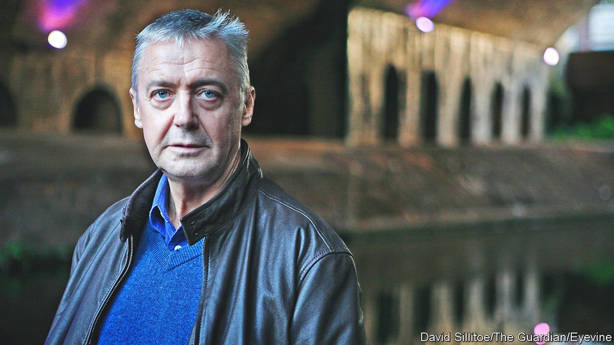

###### Puccini with lunch-trays

# Obituary: Graham Vick believed glorious music belonged to everyone 

##### The opera director died on July 17th, aged 67 

 

> Aug 14th 2021 

ON A WARM summer evening the Long Interval at Glyndebourne is an idyll of Englishness. Evening light turns gold across the lake and the brooding shoulder of Firle Beacon; and across the lawns stroll the opera-goers, in black tie or bright designer dresses, bound for the picnic tables they have set up under the trees. There follows a gentle universal popping of corks out of bottles. Almost everyone is of a certain age and a certain income bracket, for whom this is a pleasure well-earned.

Graham Vick was director of productions at Glyndebourne from 1994 to 2000. He was a scruffy figure, still with tones of his native Merseyside, who had come to the Sussex country house because he felt it was a good place to grow. His career there was certainly unpredictable. He gave them a terrifying version of Tchaikovsky’s “Queen of Spades”, full of skeletons and blood, but also a ravishingly austere “Eugene Onegin”; a “Pélleas et Mélisande” of appropriately haunting strangeness, but a “Don Giovanni” that featured sado-masochism and a pile of manure. Audiences went for their suppers then with rather less appetite than usual.


For him, it was a bit odd that he was there at all. As a firm socialist, he was sickened by the ever-widening gap between rich and poor. And he believed with a passion that opera, like all music, belonged to everyone. The stories it told had been humanity’s for millennia—tales of love, hate, greed, courage, betrayal. In Mozart’s day, errand-boys had whistled his tunes in the street. Operas then were performed with the house lights up and players close to the audience. He blamed Wagner for starting the rot, hiding the orchestra and audience in darkness at Bayreuth. The people were separated from their stories then, passive observers.

He worked hard in the grandest places. At the New York Met he directed “Il Trovatore”, and at Covent Garden in 1990 his “Falstaff” opened the refurbished house. They were glamorous, fabulous, seductive, these “temples”, as he called them. But they were also black holes, institutions where opera became a largely commercial enterprise and the repertoire static and sedate. He wanted to be questioning, finding new things, tearing down barriers and bringing in the young, uneducated and ignored—like the teenagers he had seen once in Italy, listening entranced, when he threw the doors of an airless opera house open to the street.

Fortunately, he was good at finding antidotes to deadness. At Scottish Opera in the 1980s he founded Opera Go Round, which toured the Highlands and islands in a minibus with five singers and a piano. They went to schools and halls; in factory canteens, his ideal place, he gave burly men and women in headscarves Puccini with their lunch-trays. He hoped to share the wonder he had felt as a boy, when he watched Tito Gobbi on television turn into the villain Scarpia in “Tosca”, or when Peter Pan at the Liverpool Empire flew through the window into a limitless new world.

His own new world was Birmingham. That was where he found himself and did his best work, in a city better known for manufacturing, tangled motorways and the nasal twang of the natives. By 2000, though, he had built a smaller touring troupe into the Birmingham Opera Company, and he put on a production there every year until covid-19 struck. The company was the city in miniature, old and young, every race and colour, and everyone could join in. (The same diversity-rule applied to the professional principals: he was the first director in Britain to cast a black tenor, Ronald Samm, as the lead in Verdi’s “Otello”.) Anyone could sing in the chorus, join in the dancing or work offstage; there were no auditions. Everything was sung in English, done in modern dress and performed in derelict or abandoned buildings. Ordinary people had to know that opera was about them. The characters’ problems were theirs. Opera was no longer some red-and-gold sanctum they did not dare to enter. It was their world, and they were in it.

Many of the works he did were difficult and rarely staged, but the volunteers’ enthusiasm knew no bounds. They were happy to take on Stockhausen’s “Wednesday from Light”, where a camel defecated planets and a string quartet relayed sounds to the stage from helicopters; or Shostakovich’s “Lady Macbeth of Mtsensk”, where they had to play rats, policemen and drunks; or Tippett’s “The Ice Break”, where they were rioting mobs. The music challenged them but, as Stockhausen said, it was only a matter of tuning in to find a truly spiritual experience.

To all this he brought the same care as to anything he did for the temples. He began (as Gobbi had advised) by poring over the words of a work and getting to the heart of its ideas. Only then would he turn to the music. On set and generally he was a bundle of anxiety, obsessed with detail, never satisfied even with his successes. “As ye sow, so shall ye reap,” was the mantra that echoed in his ears: the moral of “Don Giovanni”, in fact.

In the temples there were sizeable egos to contend with. At Birmingham, by contrast, it was always a two-way process. He took ideas from the volunteers as readily as he gave them. No one in the company, or in the audience, was more important than anyone else. He refused to have VIP receptions, and all the tickets were cheap—which made sense, as there were seldom seats in the cavernous spaces where players and spectators met each other.

Changing that audience, though, was harder. In 1990, when he had put on his pocket “Ring” (ten hours over two evenings, with 12 singers and 18 orchestral players) in a leisure centre in bleak Erdington, he had been sad to see the car park full of pricey German cars. The people of Erdington itself had not come. And indeed, three decades later, ordinary folk had still not exactly crowded into Glyndebourne. If anything, as he reviewed his years of campaigning, opera seemed to be getting more exclusive and more privatised. He had left Glyndebourne because it no longer offered him the feeling he could change the world. It could probably satisfy him only when he saw mass-breakdancing on the hallowed lawns and heard, on the Downs nearby, some shepherd on a quad bike whistling a snatch of Verdi. ■

