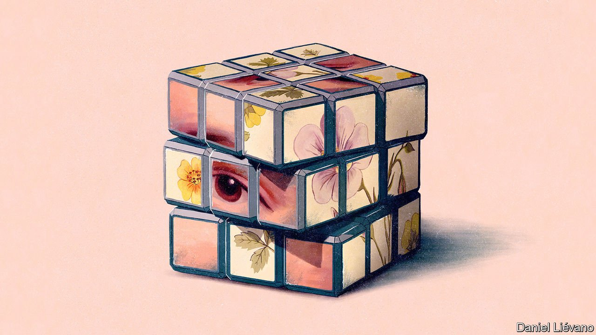
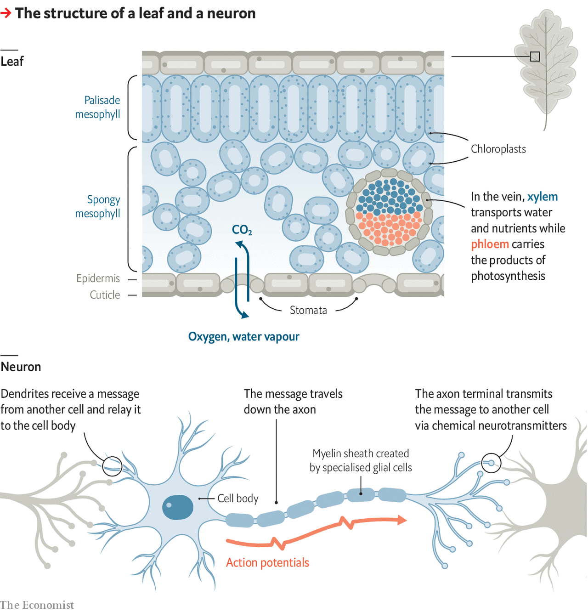

###### Biology brief

# How organisms are organised 

##### Like any well-run operation, a body is made of specialised parts 

 

> Aug 12th 2021 

ALL LIFE is made of cells. But to build a complex, multicelled organism from those cells almost always requires them to come in more than one type. This means that as cells multiply in a growing organism they need to differentiate, which they do by expressing different subsets of genes from within the genome they all share. Different patterns of gene expression produce different types of cell.

These complex patterns of gene expression appear to be the preserve of eukaryotes—creatures built of cells that have their primary genomes wrapped up in a complex compartment called a nucleus. Sponges, descended from some of the earliest multicellular creatures, have a handful of cell types. Plants have dozens. Animals have hundreds.


The number of cell types is, broadly speaking, a function of the degree to which these creatures have bodies made up of organs—arrangements in which the activities of different types of cells are co-ordinated in order to perform a specific function or functions. Sponges do not have organs; they just have voids through which they pump water from which single-celled prey can be plucked. This does not require lots of different sorts of cells. Plants have some organs, but not that many: stems and roots; petals, stamens and pistils by means of which to reproduce; and a few more.

It is in complex animals that organs come into their own as a plethora of sophisticated, functional entities. How large that plethora is in a given animal species lies, to some extent, in the eye of the biologist doing the beholding. As in many other areas of science, some are lumpers and some are splitters. A lumper may see a mammalian ear as an organ. A splitter may want to differentiate all sorts of components, such as the structure in the inner ear called “the organ of Corti”, after the anatomist who first described it. Lists of human organs thus vary in length, but 78 is a number that often pops up in medical texts.

What is more, animals tend to have a standard complement of each type of organ. A healthy oak tree may have 100,000 leaves or 300,000 leaves. There is no proper number of blossoms for a cherry. But a complex animal comes with a fixed number of almost all of its organs: one ear if it is a praying mantis, two wings if it is a bird, three hearts if it is an octopus, four stomachs if it is a cow, five arms if it is a starfish, six eyes if it is a recluse spider, 32 brains if it is a leech, and so on. These organs will be arranged according to a specific body plan. Oaks can grow branches and roots in whatever pattern seems best. Animals cannot.

This is because animals and plants have different relationships with time and space. These different ways of life require different sorts of flexibility. Animals move through space but, once adult, change shape comparatively little over time. Plants stay still in space but change shape a lot as they grow. Most animals seek the energy they need by hunting or foraging. Plants’ energy-seeking behaviour is a matter of growing roots to take in water and minerals, and flat, green surfaces to absorb the sunshine and carbon dioxide that make up the preponderance of their food.

In most plants, those surfaces are embodied in one of the loveliest and most straightforward of organs: the leaf. In the heart of a leaf are chloroplast-rich mesophyll cells responsible for the bulk of the photosynthesis. On the leaf’s sunnier side these cells are packed closely together, like a palisade. On the shadier side they are arranged like a sponge, so that air can circulate through, bringing with it the carbon dioxide which photosynthesis requires.

Photosynthesis also needs water. This is drawn up from the roots through tubes called xylem and evaporates within a leaf, moistening the air that the mesophyll cells make use of. Other tubes, called phloem, carry away the sugars created through photosynthesis. Air moves in and out through openings in the leaf’s cuticle, called stomata. If water is plentiful the stomata dilate, allowing lots of carbon dioxide in. If water is in short supply they clamp down, reducing the rate of photosynthesis but stopping the plant from drying out.

Stomata aside, plant behaviour is largely a matter of growth to permit greater access to water and minerals from below, and sunlight and carbon dioxide from above. Stuck as plants are, where they sprouted, that is best achieved through plasticity and building on the results of the last growing season. A preordained body plan—three branches at 120° to each other here, 42 leaves per twig there—would be ludicrous.

Animals’ active lifestyles, by contrast, need nerves and muscles. These require far more energy to do their work than any plant tissue does. This also means a body plan optimised for the sorts of behaviours that the animal bases its life on. Muscles, nerves and bones need to grow to a pre-arranged design much more than branches, twigs and leaves do.

Most of these organs are physically coherent. The co-ordination of their cells is achieved by structural linkage between them. In some cases you can say where they begin and end well enough that it is possible to cut one out of one person and put it into another. Some, though, are distributed—most notably the immune system, which has outposts throughout the body and a range of single-celled components coursing through the blood. The activities of its different types of cells are still co-ordinated, but through passing interactions as much as lasting structures.

Some human organs, such as kidneys and lungs, have back ups. Some can be lost with little consequence—the spleen, for example—and most can be sacrificed without making life impossible. One, the placenta, is temporary and may be regrown as required. They cover a wide range of sizes and complexity. A submandibular gland weighs about ten grams; the gut weighs a couple of kilograms. The simplest organ in the human body is probably the bladder, a distensible sac that has a handful of cell types. The most complicated is the brain, which has about 86bn nerve cells, or neurons (there are 133 types of these in its cortex alone), supported by a slightly smaller number of so-called glial cells.

 


The nervous system as a whole is more complex yet, finding its way into pretty much all of the other organs the body has to offer. It is the zenith of the twin processes of differentiation (many different types of cell) and integration (a highly functional structure) which is at the heart of what makes organs tick.

In the main, the various types of neuron have nuclei which are, together with their immediately surrounding cytoplasm, located in the brain or the spinal cord. But they also have protuberances called axons, which reach out from them, in some cases into the rest of the body, and so may stretch for a metre or more. These axons are wrapped in sheaths of a fatty material called myelin, secreted by specialised glial cells. Loss of this myelin has bad effects, such as multiple sclerosis.

Most cells in all organs have ways of talking to their neighbours. But no others do so as much and as clearly as neurons do. Their axons, and the shorter protuberances called dendrites which come off both the axon and the main cell body, mean they have far more neighbours than any other sort of cell. A single neuron may easily be connected to 10,000 others. Some are connected to 100,000. And they have over 100 types of chemical neurotransmitter with which to send and/or receive messages at these points of connection.

Neurons also need a way to send signals rapidly between their distant parts. They do this via electrical impulses called action potentials that run along their cell membranes, assisted by the myelin sheaths. The result is a network with trillions of connections, which is in communication with all parts of the body, and which can also carry out, in ways not yet understood, the computational processes needed to analyse the inputs it receives, and act appropriately.

When organs go bad

For organs to work, their cells need to be disciplined. They must know their place and must divide only when necessary. Unfortunately, but inevitably, this discipline is always at risk of breaking down.

When multicellular creatures evolved, so did various forms of cellular self-sacrifice. A fundamental aspect of cellular differentiation is that it requires the majority of cells to give up the strongest Darwinian imperative of the lot: their posterity. Evolution configured the nuclear operating system so that cells could be required to grow only within certain constraints, to stop reproducing when told to or even to die on command if the rest of the body required it. It is only through the application of such rules, programmed into the way in which the cells express their genes, that multicellular life is possible.

Mutations sometimes break down these controls, freeing cells to replicate. Some of these mutations pass down the generations, predisposing an individual’s cells to the freebooting life. Some are picked up along the way. Once a cell begins to replicate unbidden, it and its descendants acquire further mutations. The immune system will try to stop such uncontrolled growth—but mutations which cause it to turn a blind eye often crop up too. This is how cancers arise and flourish.

Cancer can be life-threatening. And even if it doesn’t get you, something else will. Individual bodies are merely expendable links in the great chain of being. They have their exits and their entrances, and one body in its time plays many parts. The nature of these individual lives is the topic of the next Biology brief. ■

In this series on the levels of life

1 

2 

3 Making organs*

4 The story of a life

5 What is a species, anyway?

6 Finding living planets

