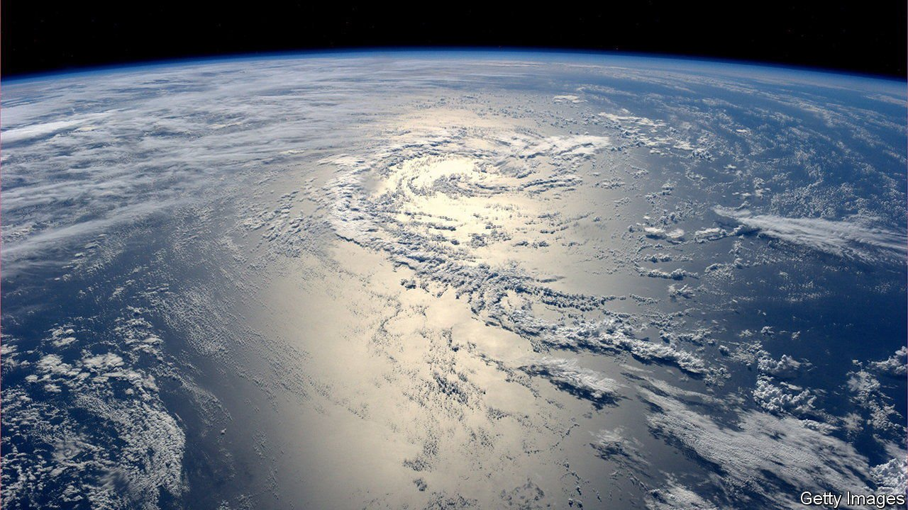

###### It that cannot be named

# Geoengineering is conspicuously absent from the IPCC’s report 

##### For all its risks, it could help keep the planet cool 

 

> Aug 14th 2021 

KNOWING WHAT is going on in the climate requires observations taken from high orbit, the ocean depths and all sorts of places in between, as well as models which stretch the powers of the most super supercomputers. Knowing what is going on as scientists and government representatives fine-tune the bit of an  on which governments officially sign off—the “summary for policymakers” (SPM)—is more akin to reading tea leaves. Was the removal of “fossil fuels” from one of its chart captions a pernicious, if petty, piece of petrostate obfuscation? Or just a way to make the technical definition involved sufficiently broad? It is hard to say if you were not in the room.

And what to make of things that didn’t make it to the summary in the first place—such as solar geoengineering, which the IPCC refers to as “solar-radiation modification”? In the SPM of the previous report, in 2013, this approach to climate change, which involves modifying the atmosphere to boost the amount of sunlight reflected back to space, was deemed to “have the potential to substantially offset a global temperature rise”. The body of the new report agrees, finding that research has consistently shown such methods “could offset some of the effects of increasing greenhouse gases on global and regional climate, including the carbon and water cycles”. But this time round there is no discussion in the SPM.


Asked why, the authors say, reasonably, that there is not room for everything: the draft report stretches to almost 4,000 pages. What is more, the second and third parts of the assessment, which deal with impacts, adaptation and mitigation, will also look at the question when they are released next year. Only after they are published will it be possible to take a view in the round.

But it is also true that a lot of climate scientists and others believe that talk of solar geoengineering is a siren call that could lure policymakers away from the course of greenhouse-gas cuts while not, in the end, doing any good—and possibly dashing the whole planet on to the rocks. Whether achieved through particles in the stratosphere, brightened maritime clouds or some other means, solar geoengineering would not be a simple reversal of greenhouse warming; it is a form of deliberate climate change with its own potentially dangerous side-effects. Its impacts on atmospheric chemistry and circulation are not well understood. An approach which suited one country might be bad for another.

The decision to include it in the SPM in 2013 was controversial at the time and criticised afterwards. But Janos Pasztor, head of the Carnegie Climate Governance Initiative (C2G), regrets that it was not included this time, too. Neither he nor C2G advocate solar geoengineering. But he thinks that “when the world can go in many different ways, you need to prepare for that.” If the possibility is not discussed, it does not go away; it is just less scrutinised, and the world less well prepared. Uncomfortable as such difficult discussions may be, says Mr Pasztor, “We can’t just keep our head in the sand.”

For more coverage of climate change, register for The Climate Issue, our fortnightly , or visit our 

