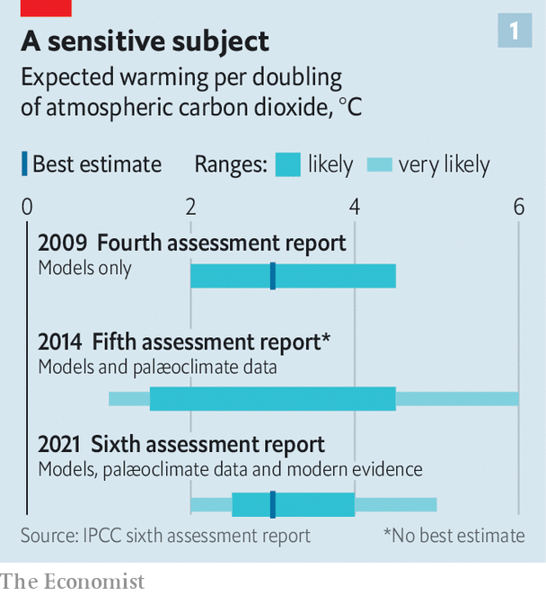
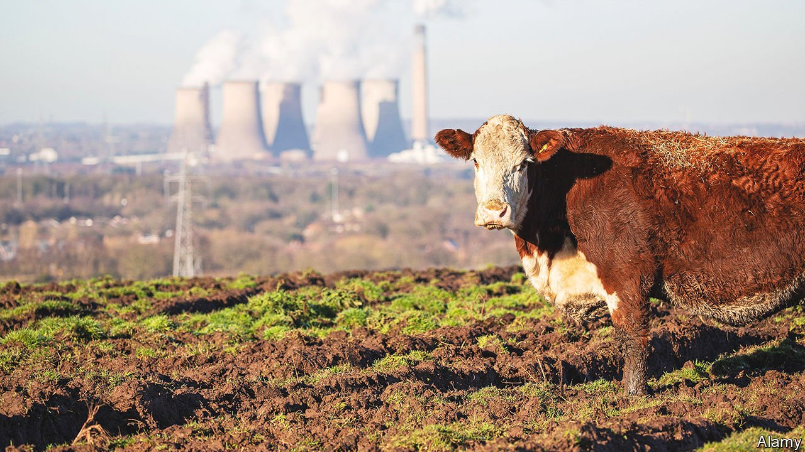

###### A new reality

# The IPCC delivers its starkest warning yet about climate change 

##### The effects of a hotter planet are visible around the world 

 

> Aug 11th 2021 

AT A KEY moment in the film “Jaws”, police chief Martin Brody, having known that a shark attack was possible, witnesses one actually happen. The director, Steven Spielberg, underlines the transformative nature of Brody’s shock with a shot which makes inspired use of a camera technique called a “dolly zoom”. Nothing on screen actually moves. But Brody’s guilty face seems to rush towards the audience, taking up more and more of the frame. At the same time his surroundings, rather than being displaced, are revealed more fully.

The report released on August 9th by the Intergovernmental Panel on Climate Change, the first part of the IPCC’s sixth assessment report (AR6), presents the spectacle of the possible becoming real in a similarly unnerving way, mixing close-up alarm with wide-angle context. It is a starker and blunter document than its predecessor in AR5, which was published in 2013. The statements in the summary expressing “high confidence” handily outnumber those that offer only “medium confidence”. Last time around the two categories were roughly level pegging.


Part of that higher confidence is down to better science, which is welcome. Another part is down to bitter experience, which is not. The report stresses that the world is living through climate change, not watching it draw near. Its 234 authors base their conclusions, in a phrase that acts as something of a refrain, on “multiple lines of evidence”. Some of that evidence comes from computer models, and some from improved physical understanding of various planetary processes. Crucially, an increasing proportion comes from direct observations of the way in which the world has changed so far.

Start with the predictions of what lies dead ahead. Over the past decade the Earth has been between 0.95°C and 1.2°C (1.7-2.2°F) hotter than it was in the second half of the 19th century; the best estimate is 1.1°C. That is more than 0.2°C higher than the change that AR5 found when it made the same comparison in the previous decade. Though some of the difference is now put down to AR5 having underestimated the then current temperatures, most is seen as being due to continued heating.

The total amount by which the planet will heat up depends pretty closely on cumulative greenhouse-gas emissions. That allows the “carbon budgets” associated with various levels of worldwide temperature rise to be calculated. For AR6 this exercise in climate accounting has been gone through all over again.

Worldwide greenhouse-gas emissions since 1850 are now put at 2,400bn tonnes of carbon dioxide, give or take 10%. Every subsequent 1,000bn tonnes is likely to cause between 0.27°C and 0.63°C more warming. If that seems quite imprecise, it is a much tighter estimate than was previously possible. Such calculations rely ultimately on how sensitive global temperatures are to rising carbon-dioxide levels. That crucial number is one of those things which is easier to estimate now that there is more experience to go on. The error range is notably smaller now than it was in AR5 (see chart 1).

 


The budget associated with a 50% chance of keeping warming below 1.5°C—the more ambitious of the two goals laid out in the Paris agreement of 2015—allows just 500bn more tonnes to be emitted. That is about 15 years of industrial emissions at current rates. To avoid busting that budget would require the whole world, not just rich countries, to get net emissions of carbon dioxide down to zero before 2050. That is a tall order, to put it mildly. Even the most ambitious of the various emissions scenarios modelled by the IPCC‘s experts offers less than a 50% chance of staying below 1.5°C of heating.

The very-low-emission scenarios do offer a fighting chance of keeping warming below 2°C. But the emission cuts they require go far beyond what the nations of the world have currently promised. What is more, those scenarios mandate not just heroic emission cuts but also “negative emissions”—techniques that actively remove carbon dioxide from the atmosphere, thus paying back some of the carbon budget spent previously. It is just about conceivable that, if emissions fall very quickly and carbon-dioxide removal scales up really well, warming may exceed 1.5°C during the coming decades but fall back below that level by the end of the century.

Happily, the report confirms that removing carbon dioxide from the atmosphere might be a plausible way of reducing temperatures. Since such removals now offer the only way of reconciling the modest near-term cuts currently enshrined in national policies with the much more dramatic long-term ambitions those same countries proclaim, this is just as well. If the IPCC had found large-scale carbon-dioxide removal untenable that would have put the kibosh on the whole idea of reaching net-zero emissions.

But the report also notes that such removals could affect more than just temperatures. They could also have an impact on food production, biodiversity and water availability and quality, especially if they are carried out through the use of huge forestry plantations. And it has nothing to say about how those systems might operate or how much they would cost—that work is left to the reports on impacts and on mitigation, which are due out next year.

You’re going to need a cleaner boat

Meanwhile, in wide-angle, the predicted consequences of a warming world are becoming clearer and more fine-grained. Again, this is partly the product of better scientific understanding, and partly the product of direct experience. In 2013 AR5 referred to just three studies linking extreme weather events to rising temperatures. The authors of the latest report were able to assess hundreds of such event-attribution papers. Those allow it to make the clear statement that climate change is already affecting every inhabited region of the planet, with human influence contributing to many observed changes in weather and climate extremes.

The current trend towards more frequent and intense heavy rainfall will continue, but not monotonically; rain and snowfall will become more variable within seasons and, probably, from year to year. The authors are thus fairly certain that flooding will be more frequent and intense in most of Asia and Africa if the world warms by 1.5°C, and pretty sure the same changes will be seen in North America and Europe. Earlier melting of mountain snow-packs will add to the flood risk in some areas; in others, higher sea levels will raise the risk, as will the greater frequency of the most intense tropical cyclones.

Heatwaves will climb in number and severity. Extreme “wet-bulb” temperatures—a measure which includes the degree to which humidity makes it harder for the human body to shed heat—will become more common more quickly than unadjusted high temperatures do. Temperatures on the hottest days in some mid-latitude regions, including parts of Europe, will rise 1.5 to 2 times as fast as global warming more generally.

The oceans will heat up more slowly than the land. But as they do so they will expand and rise, a trend exacerbated by the melting of glaciers and ice caps. The warming will not be even. The Arctic will heat up more than other seas; in every one of the IPCC‘s scenarios there will be sea-ice-free days in the Arctic by the middle of the century. There will be local aberrations, too. Marine heatwaves—short-lived bursts of hot water which have only recently become a topic of concern—are expected to continue to become more common, especially in the tropics and the Arctic.

Ocean warming will also suppress the tendency of waters from different depths to mix. Both the heatwaves and the increased stratification will have ecological effects that may be profound, both in the Arctic and beyond.

Generally speaking, what is wet becomes wetter, what is dry, drier, and what is uncommon more common. The rarer the event, the higher the likelihood that it will become more frequent. Even at 1.5°C of heating the report warns there will be some events—heatwaves, droughts and such—that are more severe than any that have been observed before. This is true at a global level as well as a regional one. “Low-likelihood, high-impact” events are, by their nature, hard to be specific about. It is a good bet they become more likely with higher temperatures. But even at comparatively modest levels of warming such calamities as widespread forest dieback or a collapsing Antarctic ice sheet are hard to completely rule out.

Recommendations about what to do are not part of this report’s remit. But nevertheless it pushes hard for more and stronger action on methane. In terms of its contribution to warming so far, methane is second only to carbon dioxide (see chart 2). Atmospheric levels of the stuff, like those of carbon dioxide, are higher than at any other point in human history. But unlike carbon dioxide, atmospheric methane is transient—it has an atmospheric half-life of less than a decade. This means that cuts in methane emissions pay off much faster than cuts in carbon dioxide. If the world is really serious about trying to keep below 2°C of warming, let alone 1.5°C, doubling down on attempts to cut methane emissions, both from industry and agriculture, should be a high priority.

 


As the report points out, this is particularly important because of the effects of another pollutant. Sulphates are given off mostly by coal plants and the sorts of heavy fuel oils that power big ships. They have the opposite effect to methane and carbon dioxide: by reflecting sunlight back into space, they cool the planet. The IPCC reckons sulphate pollution keeps the world about 0.5°C cooler than it would otherwise be. Without it, the world would probably have already breached the Paris aspiration of limiting temperature rises to 1.5°C.

The problem is that sulphates are deadly. Over the past few decades they have contributed a great deal to the particulate air pollution that has killed tens of millions. Clean-air laws have seen them increasingly scrubbed out of fuels and smoke stacks. The IPCC report finds that continuing this good work on air pollution would contribute to global warming in all the emission scenarios it studied. That is another reason, it says, to promote quick and lasting cuts in methane emissions. Without increased ambition on methane, cleaner, clearer air will add to the challenge of rising temperatures.

Mr Spielberg’s coup de cinema in “Jaws” marks the moment when the police chief realises that the opportunity to avert calamity is gone; his inaction has led to a covert threat becoming a blood-in-the-water reality. As a result the chief is seized by a new fervour for action—one which brings him into direct conflict with the mayor, who prefers to minimise the risks so as not to scare off the tourists.

When it comes to climate change the realisation has hardly been instantaneous; it has been dawning for at least a decade or so. But coming as it does in a summer of shattered temperature records and terrifying fires and floods, an IPCC report in which predictions of future global warming are, more than ever before, backed up with observations should offer a similar punctuation. Deciding how much action to take on climate change is politically hard, because it means imposing high costs today for largely hidden benefits tomorrow. But when, in November, the world’s governments get together in Glasgow to discuss how they can improve on the insufficient action they have taken to date, they need to think like people who have seen the blood in the water.

For more coverage of climate change, register for The Climate Issue, our fortnightly , or visit our 

