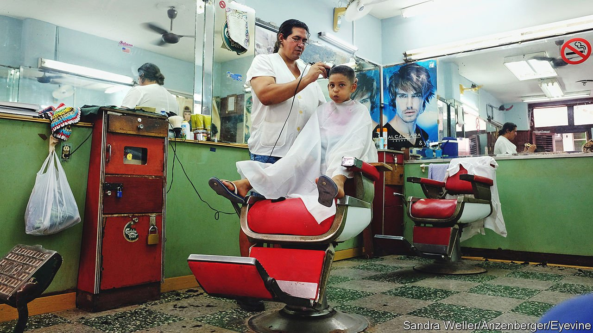

###### A small step away from socialism

# Cuba’s government approves small and medium-sized enterprises 

##### All the while it is still cracking down on protesters 

 

> Aug 12th 2021 

ON AUGUST 6TH the Cuban council of state approved a long-awaited law authorising the creation of small and medium-sized enterprises. The announcement came less than a month after thousands of Cubans took to the streets calling for freedom and an end to the Communist dictatorship. After a brutal crackdown, around 380 protesters are now in prison awaiting trial on charges such as “delinquency”.

The announcement could be designed partly to distract attention from the state’s suppression of dissent. On an island with the fourth-highest official covid-19 infection rate in the world it will be tricky for people to forget that there was enough petrol to power motorcycles, trucks and buses filled with boinas negras (a special-forces unit of the Cuban military) who were sent out to rough up the protesters in July, but not enough for ambulances or incinerators to cremate the dead.


Nonetheless, it is a welcome reform. It is part of what the government calls the “ perfeccionamiento”, or perfection, of socialism. Everyone else recognises it as allowing a bit of free enterprise to compensate for socialism’s failures. In February Cuba’s council of ministers increased the number of trades open to cuentapropistas, or self-employed people. Some 124 sectors are reserved for the state, but everything else is open to entrepreneurs. Even with the recent changes, the legal status of cuentapropistas is ill-defined. Applying for the necessary permits is a slog that can take ages. The rules are designed to keep cuentapropistas small (and therefore no threat to state-owned firms). They can only hire relatives or other self-employed subcontractors. They cannot incorporate, so there is no legal difference between their personal capital and their business capital—if the business goes bust, so do they.

Despite these shackles, enterprising Cubans have flocked to start their own micro-businesses. Since 2010 the share of the workforce who are self-employed has soared from 3% to 13%, or more than 600,000 people. Just over a third are women; a third are under 30. They are concentrated in the largest cities, and are most likely to work as taxi-drivers or run restaurants and food kiosks.

The new law, which still needs to be published in Cuba’s official gazette, is expected to allow small and even medium-sized private businesses to incorporate. This could mean that private firms will be allowed to hire staff (rather than just nephews or independent contractors). It could also mean that multiple investors will be able to put money into a private firm with limited liability. That would make Cuba much more attractive to foreign investors. Incorporation would also make paying taxes simpler and borrowing less daunting. But not all industries will be treated equally. Architects, journalists, lawyers, vets, translators and interpreters, among others, are not allowed to work in the private sector, or to incorporate.

Cuba’s state firms are pampered, inefficient and the main reason why the island is so short of basic goods. This, in turn, is one reason why Cubans have been protesting. Last year GDP shrank by 11%. New official statistics show that imports and exports of goods have been declining since 2018, well before the pandemic scuppered tourism and starved Cuba of hard currency. Hoping to boost morale, the government has distributed some food, donated from Mexico and elsewhere, in the areas where the largest protests occurred.

Oniel Díaz of Auge, a consultancy, has called for reforms to unleash the private sector since 2017. He is excited by the new law, but cautious too. Opening a business is likely to continue to be much slower than elsewhere in the world. “At the end of the day, this is still Cuba.”■

