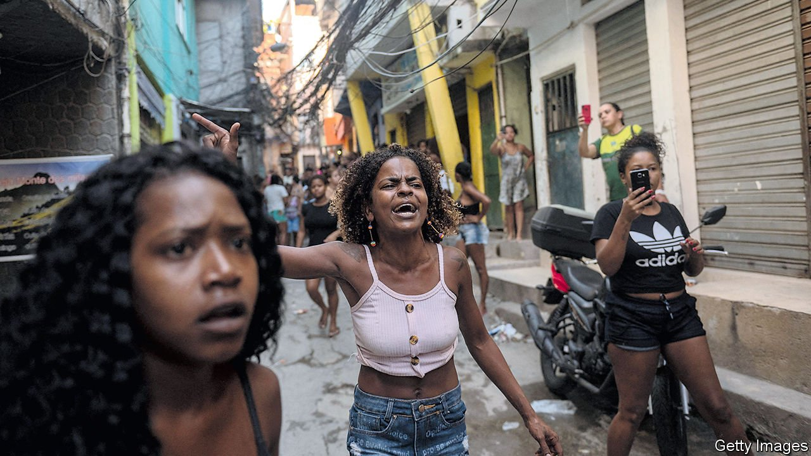
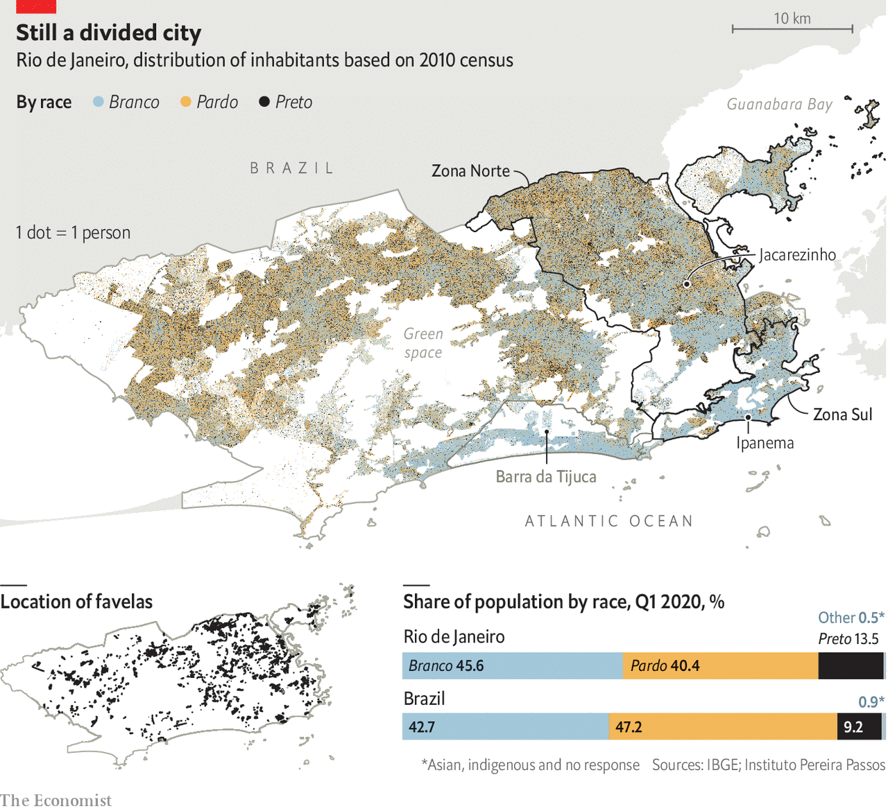

###### One city, two worlds

# Rio de Janeiro asks why its cops kill so many black people 

##### Activists are increasingly pushing back 

 

> Aug 12th 2021 

AT DAWN ON May 6th residents of Jacarezinho, a favela in Rio de Janeiro, woke to the sound of police helicopters and gunfire. Ten hours later, 28 people were dead, nearly all of them black men. Mariana de Paula, a 27-year-old accountant and activist who lives on the morro (“hill”, as steep favelas like Jacarezinho are called), told her boss that it was too dangerous to travel to the office. Her boss, who is white, suggested she use a ride-hailing app. “She didn’t get it,” says Ms de Paula, who is black. The shooting sounded like popcorn. The victims included one police officer, shot by drug traffickers, and 27 residents killed by the police. Some were unarmed. It was the deadliest police raid in the state’s history.

When the shooting stopped, Ms de Paula began her commute down alleyways that zigzag to the bottom of the morro, through a tunnel from Rio’s poor Zona Norte to the rich Zona Sul, and finally to Barra da Tijuca, a beachside strip that is 72% white. In mostly white neighbourhoods in Rio flats can cost 2,000 reais ($400) per square foot. Their inhabitants blame poverty and corruption for the violence that plagues the city. But a growing chorus from Ms de Paula’s Rio, the mostly black peripheries and favelas, suggests there is more to it than that.


Black Brazilians are increasingly arguing not only that the police are too trigger-happy but also that their violence is sometimes racially motivated. In 2019 Brazilian cops killed 6,357 people. In the state of Rio they killed 1,814: nearly twice as many people as cops killed in the United States, which has a population 19 times as large. Eight out of ten Brazilians killed by police are negros, a grouping that combines the official racial categories of preto, “black”, and pardo, “brown” or “mixed”. (Throughout this article, “black” refers to the unofficial category of negros.) Police killings tripled between 2013 and 2020 and now represent around a third of all homicides in some states.

Part of the explanation lies in history. Brazil was the last country in the Americas to outlaw slavery. Though former slaves did not suffer formal segregation of the kind imposed by South Africa or the American South, poverty and laws criminalising vagrancy and African religions had a similar effect. Rio “civilised and modernised itself by expelling second-class citizens to the morros”, writes Zuenir Ventura in “Cidade Partida” (Divided City, 1994).

Black people too poor to live elsewhere built shantytowns (see map). Their residents became cheap labour for factories in Zona Norte and white families in Zona Sul. Today black Brazilians are 56% of Brazil’s population but 70% of the poor. Unemployment is 17% for blacks versus 12% for whites. White Brazilians earn almost twice as much as black ones do.

 


Jacarezinho, which sits between a defunct General Electric plant and two train lines, has 40,000 residents. Its past as a haven for former slaves earned it the nickname “Rio’s blackest favela”. Over the years, poverty has bred resourcefulness. Residents add one floor after another to homes packed like Lego bricks. Shops sell everything from birthday cakes to beard-trimmers. But there is no proper sewerage system. Nor are there many formal jobs. Open-air drug markets are manned by teens with AK-47s, despite a huge police station at the bottom of the favela.

In 2008 a police commander in Rio called the force “the best social insecticide” after a raid that killed nine people. Rio’s civil police is responsible for investigating crimes, but like the military police, its encounters with favelas consist mostly of operations with heavy weapons and hundreds of men. Decades of iron-fist policing have failed to curb violence. A recent study by the state prosecutor’s office showed that in the month after lethal raids, crime in the vicinity tends to tick up, not down. And raids claim innocent lives. In the past five years, eight children under the age of 12 were killed during police operations in Rio. At least 24 were injured. During the Jacarezinho raid a nine-year-old saw police kill a man in her bedroom, soaking her mattress with his blood.

The Department for the Protection of Children and Adolescents says it spent months planning the raid in May, which was meant to arrest 21 people suspected of recruiting minors to drug gangs. But evidence appears to be scant—consisting mainly of photos from Twitter. Officers made only six arrests. Of the 27 people killed, some were minors and most were not on the suspect list (police say they were wanted on other charges). It looked like a “revenge operation”, says Daniel Hirata of the Federal Fluminense University in Rio. When an officer dies in a raid, civilian deaths are twice as likely.

Despite the levels of violence—which police argue is needed to counter crime—most citizens are indifferent to the plight of favela residents, says Silvia Ramos of the Centre for Security and Citizenship Studies, a think-tank. Brazilians see police killings as a natural response to overall violence. They express more fear than citizens of any of the 163 countries surveyed by the Institute for Economics and Peace, an Australian think-tank. Some 95% are somewhat or very worried about being the victims of violence. Another poll found that 57% agreed with the phrase “a good criminal is a dead criminal.”

“You can’t go into a favela with roses,” argues Carlos Monjardim, the head of the residents’ association in Ipanema, a rich neighbourhood in the south of the city. It has 42 community police officers, whom locals “adore”. Mr Monjardim’s biggest concern is an “invasion” of people selling knick-knacks on the pavements.

He refers to the idea, first mooted in the 1930s, that a lack of laws against interracial romance and greater mixing have made Brazil a “racial democracy”. “Racism doesn’t exist here,” he says, pointing to his love of samba and his adopted sister, who is black. He supports the populist president, Jair Bolsonaro, who has called residents of quilombos (communities founded by escaped slaves) “fat and lazy” and says that activists are “importing…tensions alien to our history”.

Indeed segregation in Brazil, including the existence of favelas and separate “service” elevators for maids and cooks, tends to be attributed to class, not race. Even left-wing types “used to say racism is just a fruit of economic inequality”, says Luiz Eduardo Soares, who as an adviser to Rio’s security secretary in 1999-2000 tried to reduce crime by filling favelas with projects, such as a snazzy cultural centre.

But such schemes are often underfunded. Killings by police fell 86% between 2008 and 2014 in “police pacification unit” areas, built in the lead-up to the 2016 Olympics. These community policing units were disbanded in 2019, after their budget was cut from 5m reais to just 10,000. Attempts to reform the police cost reformers like Mr Soares their jobs.

The revolution is now televised

Attitudes have started to change, however. This is partly due to pressure from activists, academics and a small but growing contingent of black politicians. More recently Black Lives Matter protests in the United States and the rise of mobile phones and social media have also raised awareness of racism.

Thiago Amparo, a human-rights lawyer, provided live commentary on Brazil’s biggest TV channel for six hours in the wake of George Floyd’s death. In November 2020 protests swept Brazil after white security guards at a Carrefour supermarket beat a black man to death. The supermarket chain agreed to pay 115m reais to civil-rights groups, a record sum. In June a video of a white couple falsely accusing a black surfing instructor of stealing their bicycle went viral. An ongoing survey of news stories about police operations in Brazil found the word “black” only once in 7,000 stories between June 2019 and May 2020 but six times since the death of Mr Floyd.

Michael França, an economist, thinks that Brazil is starting to talk more openly about race. This year he and his colleagues from Insper, a business school in São Paulo, created a “racial-equality index” to measure disparities in different regions. The situation is becoming better in some ways and worse in others.

Public universities now have as many black students as white ones, but while 36% of white 18- to 24-year-olds have completed university or are studying for a degree, the share drops to 18% for black 18- to 24-year-olds. Mr França’s index estimates that it will take 27 years to reach racial equality. And a black Brazilian is nearly three times as likely as a white one to be a victim of homicide. (Most perpetrators are also black.) In the United States a black person is seven times as likely to be killed as a white one. But in Brazil deaths of black people at the hands of cops are a larger share of homicides.

These numbers are finally starting to dawn on people, says Irapuã Santana of Educafro, a civil-rights group. In 2017 the group joined a class-action lawsuit opposing police raids which resulted in orders that Rio’s police take steps to prevent loss of life, such as having ambulances on call and not using schools as bases from which to shoot. After the Supreme Court banned raids during the pandemic, killings by Rio’s police dropped by a third in 2020, saving nearly 600 lives. The ban was still in place when officers entered Jacarezinho. They called the raid “Operation Exceptis”.

But authorities in Rio stubbornly stick to their methods. In 2019 the governor said police should “shoot criminals in their little heads”. He abolished the security secretariat, which had provided a layer of oversight, and weakened the internal-affairs departments (he was later impeached for financial irregularities). When activists argued that officers should be held accountable for the deaths in Jacarezinho, the police sealed the internal investigation for five years. A study in 2008 found that 99% of cases against Rio police officers were dismissed without charges, often without a serious investigation.

This is in contrast to São Paulo, where police lethality has dropped since some units began wearing body cameras (after the raid in Jacarezinho, Rio’s state assembly ordered police to implement a 2009 law that mandates their use). São Paulo is introducing anti-racism training, though this has had mixed results in other countries. The black lieutenant-colonel who is leading the effort, Evanilson Corrêa de Souza, is unwilling to blame racism for deaths in “terrains where criminals are armed to the teeth”. Police “go into favelas with the mentality that they will kill or be killed,” he says, pointing out that black officers make up a third of the police force but two-thirds of officers killed. “We’re killing each other.” Racism isn’t a policing problem, it’s a societal problem, he says.

In the meantime activists will keep pushing for change. Last year Ms de Paula and Thiago Nascimento, a law student from Jacarezinho, helped found LabJaca, a think-tank geared towards favela residents, to track covid-19 cases and urge people to take the virus more seriously. After the raid they changed their focus, organising a protest and releasing a wonky video showing how many school uniforms could be purchased for the cost of weapons used by the police. But few businesses were willing to support LabJaca’s new campaign.

A month after the raid, a friend of Ms de Paula’s was killed by a stray bullet. Kathlen Romeu was 24 years old and 14 weeks pregnant, with a degree from interior-design school and a new flat in a safer part of Rio. She had returned to a favela to visit her grandmother when she was shot by the police, witnesses say. Ms de Paula went on national news to denounce the killing. The next day her co-workers swarmed her. “We saw you on TV,” they said. “You’re famous!” Tens of thousands of strangers followed Ms Romeu on Instagram, liking photos of her baby bump. “You can say all 27 killed in Jacarezinho were criminals,” says Ms de Paula. “But an unborn baby?”■

