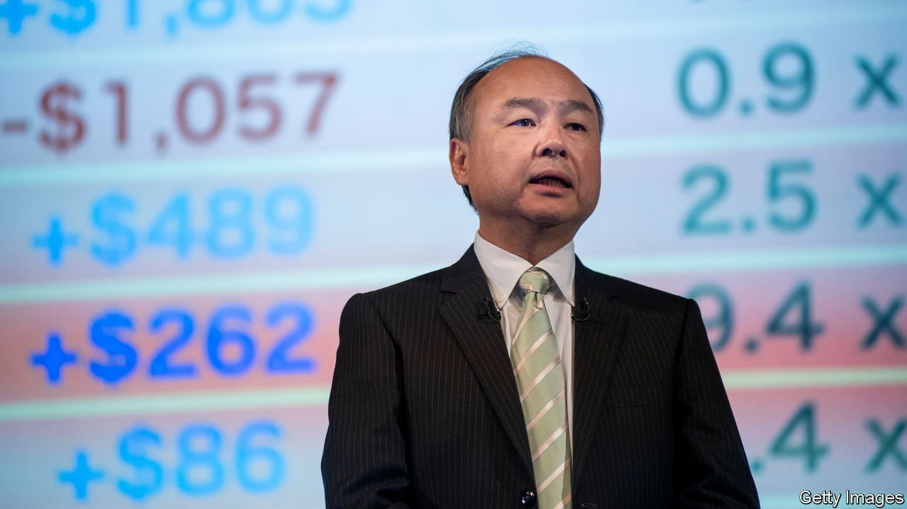
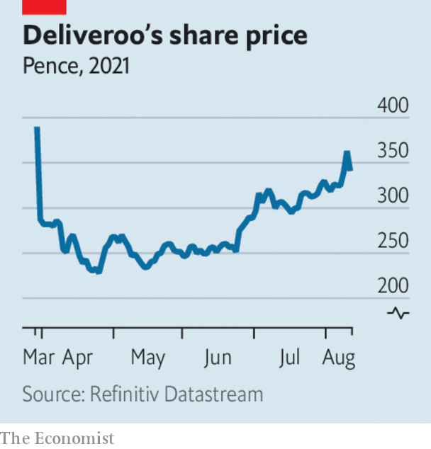

###### 

# Business this week 

#####  

 

> Aug 12th 2021 

Son Masayoshi, the boss of SoftBank, said he was curbing his conglomerate’s enthusiasm to invest in  until the extent of the Chinese government’s crackdown on the tech industry becomes clearer in the coming years. The Japanese company is a big investor in Alibaba and Didi Global, two targets of the ire of regulators in Beijing.

Uncertainty about the future of  was one factor behind the poorly received IPO of Krafton, a South Korean video-games developer that produces the “PlayerUnknown’s Battlegrounds” series. Krafton is backed by Tencent, which distributes its games in China. However, Krafton also had to reduce the listing price for its shares when the Korean regulator questioned how it was calculated.


The American government’s ban on Chinese tech firms with suspected military ties obtaining American technology hit Huawei hard in the first half of the year. Revenue fell by almost 30% compared with the first six months of 2020, and by almost 50% in its consumer-electronics business, which relies on American chips for smartphones.

Bukalapak raised $1.5bn when it listed its shares on the Jakarta stockmarket, making it Indonesia’s biggest-ever IPO. The e-commerce group has the backing of big foreign investors, including Microsoft and Jack Ma’s Ant Group, and is the first unicorn startup to go public in the country.

America’s Securities and Exchange Commission approved a controversial requirement by the Nasdaq for companies that list on its markets to disclose statistics on the diversity of their boards and to have at least two “diverse directors”, or explain why they do not. One director must be a woman and the other from a racial or sexual minority; all must “identify” with their diverse group. Firms have a few years to comply.

American employers created 943,000 jobs in July, the most since last August. , however, and is not expected to do so for at least another six months. , meanwhile, remained at 5.4% in July.

 expanded by 4.8% in the second quarter over the previous three months, boosted by the end of pandemic restrictions on restaurants and pubs (just in time for the Euros football tournament). The economy is now 4.4% smaller than it was at the end of 2019, before covid-19 struck; it is on course to return to its pre-pandemic level by the end of this year.

All that carbon

Saudi Aramco reported a net profit of $25.5bn for the second quarter. That was an increase of almost 300% on the same three months last year and more than the combined quarterly profits of BP, Chevron, ExxonMobil, Shell and Total. Like its rivals, the Saudi company has gained from a buoyant oil market as economies reopen. Troubled by the hot topic of high petrol prices, the White House has publicly called on OPEC to boost output in order to curb oil prices.

The bidding war intensified for Kansas City Southern, a railway company that transports freight in America and Mexico. Canadian Pacific raised its offer to $31bn in an attempt to derail a proposal from Canadian National that the board at KCS has accepted.

 


Deliveroo reported earnings for the first half. The food-delivery company, which floated on the London stockmarket in March in a dismal IPO, took almost 149m orders in the January-to-June period, twice as many as during the same six months last year. It has expanded even more into grocery deliveries and restaurant fare. The lifting of lockdown measures in Britain, its prime market, has not had a material impact on its business; ordering meals from home has now become routine for customers who acquired the taste during the pandemic.

Jab or job?

The chief executives of American Airlines and Delta Air Lines said they would not impose a requirement on existing staff to have the covid-19 vaccine, but they will encourage them to do so. This came after United Airlines instructed all its workers based in America to get vaccinated by October 25th at the latest.

Virgin Atlantic is reportedly planning to list shares on the London stockmarket for the first time since its founding in 1984. The airline is owned by Virgin Group and Delta. During the pandemic it has cut costs by slashing jobs. It is expecting a surge in transatlantic travel as restrictions ease.

A least $611m-worth of cryptocurrencies vanished from Poly Network, a decentralised finance platform, in one of the largest cyber-heists targeting the digital-asset industry. Within hours, however, crypto sleuths tracked down the unnamed hacker, who started returning the funds after declaring “he was not so interested in money.”

