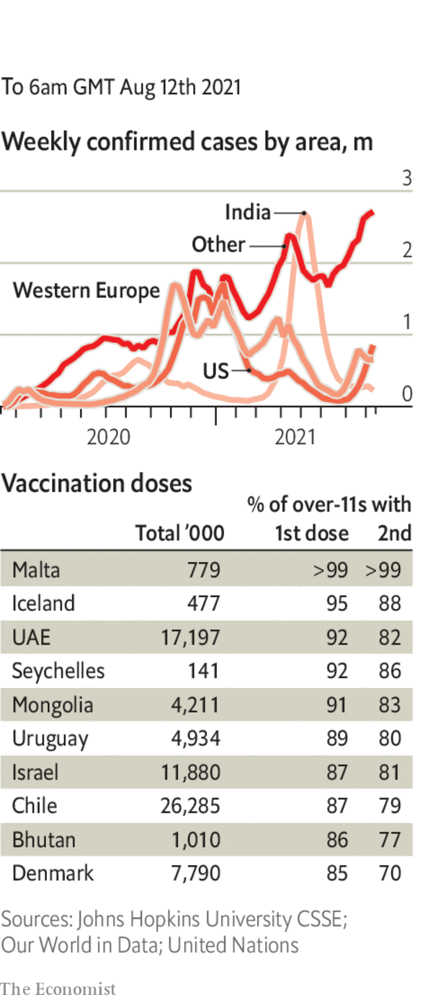

###### 

# Politics this week 

#####  

 

> Aug 12th 2021 

The  released the first part of its latest assessment report. The Earth is warming. Even with a drastic reduction in greenhouse-gas emissions temperatures will probably be 1.5C above their late-19th century levels by 2050. Climate change is under way, the report laments, with all the environmental consequences that brings. The extent of the damage depends on the cumulative build-up of emissions and can be limited if the world strives for net-zero carbon emissions.

 said he would resign as governor of New York, after his Democratic colleagues in the state assembly prepared to impeach him over allegations from 11 women of sexual harassment. Mr Cuomo insists his actions did not amount to misconduct and said he was forced out by a political system “driven by the extremes”.


Republicans in the state legislature in Texas issued arrest warrants for Democratic lawmakers who have left the state so that a quorum can’t be reached to pass a bill on electoral procedures (the Democrats say the bill is racist). This came after the state Supreme Court lifted a stay on the legislature from making the arrests.

. The legislation was supported by 19 Republicans. It now goes to the House, where there is little sign of a similar blossoming of bipartisanship, especially over a budget plan that increases spending on programmes for the poor and raises taxes on the rich.

 continued their onslaught, capturing ten of Afghanistan’s 34 provincial capitals in less than a week. They have murdered civil servants and ordered single women to “marry” their troops. America, Britain and India have asked their citizens to leave immediately. The Afghan army chief has been sacked. Joe Biden, whose abrupt withdrawal of American forces has emboldened the jihadists, said Afghans must “fight for themselves”.

Protesters and police clashed in Bangkok, as anger mounted over the Thai government’s mishandling of a worsening covid-19 outbreak.

Indonesia’s army said it would no longer force female recruits to undergo “virginity tests”. The tests had been intended to ensure that women in uniform were “moral”. Critics pointed out that they were invasive, humiliating and deterred women from serving. They also conveyed no information about a question the army should not have been asking in the first place.

Zambians voted in a presidential election on August 12th. Polls suggest that the incumbent, Edgar Lungu, would lose in a fair contest. But he has abused state resources to tilt the balance.

Ethiopia’s government called on all capable citizens to join the war against rebel troops from Tigray after they forced the Ethiopian army to retreat from the northern state. Meanwhile the Tigrayan rebels announced an alliance with the Oromo Liberation Army, which the Ethiopian government has also branded as a terrorist group.

Guinea confirmed west Africa’s first case of Marburg virus, which kills between a quarter and nine-tenths of those it infects. The case was detected near the borders of Liberia and Sierra Leone, roughly where an outbreak of Ebola in 2014 killed almost 12,000 people.

At least 65 people were killed in wildfires that swept through forests and villages near Algiers, the capital of Algeria. The dead included 25 soldiers who were evacuating residents. More than a dozen countries sent firefighters and equipment to help contain fires that have ravaged Greece.

Brazil’s populist president, Jair Bolsonaro, ordered the military to parade tanks through the streets of Brasília, the capital, where congress was voting on a proposal to add paper receipts to the electronic voting system. Mr Bolsonaro claims, without proof, that electronic voting is rife with fraud and has threatened to suspend the presidential election in 2022 should paper receipts be rejected by congress, which they were.

Poland agreed to alter a body that disciplines judges after the EU’s highest court said it clashed with the bloc’s prohibition on political control of the judiciary. Separately, the ruling Law and Justice party moved ahead with . The European Commission called it a threat to media freedom.

A British security guard at the British embassy in Berlin was arrested for passing documents to Russia in exchange for cash. Relations between the United Kingdom and Russia were already dire.

A court in China sentenced Michael Spavor, a Canadian businessman, to 11 years’ imprisonment for supposed espionage. His supporters say he is, in effect, a hostage. China’s ruling party would like Canada to release Meng Wanzhou, a well-connected Chinese businesswoman, who faces extradition to America on charges of fraud.

China announced new rules for karaoke parlours, to come into effect on October 1st. Songs that applaud violence, obscenity or crime, or threaten national unity, will be banned.

Coronavirus briefs

 


. The Pentagon laid out plans to make vaccination mandatory for all American troops by mid-September. California said all teachers and schools’ staff would have to be either jabbed or tested regularly.

Despite having one of the highest vaccination rates in the world, infections in Israel surged to their highest levels since February.

More than 75% of adults in Britain have now received both doses of a vaccine.

A ban was lifted on foreign pilgrims in Saudi Arabia. Vaccinated travellers will be allowed to visit the holy sites in Mecca, which attract millions of the faithful each year.

Support for the government led by Suga Yoshihide in Japan has dropped to a new low after new infections surged during the Tokyo Olympics.

