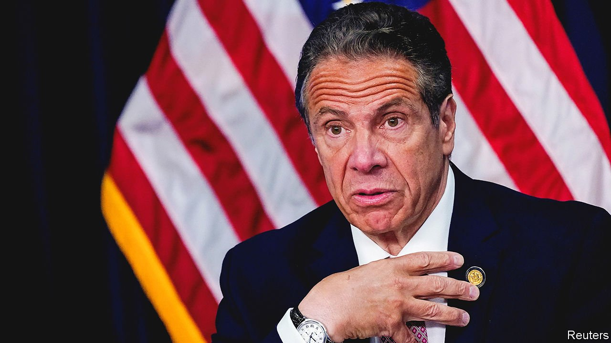

###### Oye, Cuomo va

# Andrew Cuomo protests his innocence and resigns anyway 

##### The governor of New York left before he was pushed 

 

> Aug 10th 2021 

“I AM A New Yorker, born and bred. I am a fighter, and my instinct is to fight through this controversy because I truly believe it is politically motivated,” said Andrew Cuomo, New York’s governor, on August 10th, before switching gears—and resigning. In his typical fashion, Mr Cuomo tried to wrest control of his story, control that he lost earlier this year when nearly a dozen women, including former and current staffers, accused him of groping, kissing and making sexually charged remarks. Even as his political career died, he tried to frame his resignation as an act of public service: “It’s not about me, it’s about we.”

A week earlier, though, “we” (in the form of Letitia James, the state’s attorney-general) published  that corroborated the women’s claims. In the following days he lost what little political support he had left. The entire New York Democratic delegation to Congress called on him to resign, as did President Joe Biden. The state Assembly scheduled impeachment hearings. A vote to impeach him would have come within weeks, with a trial before state senators and senior judges to follow in short order. His top strategist announced her resignation.


Yet Mr Cuomo hung on. Were he the governor of a conservative state, suspicious of the MeToo movement, perhaps he could have weathered the allegations against him, which his lawyers continue to deny. His legal team held two briefings, in which they tried to undermine the credibility of some of his accusers. The governor reportedly had hoped that the Assembly would not pursue impeachment if he said he would not seek re-election. Carl Heastie, the Assembly’s Speaker, made clear on August 9th that he was not interested in a deal. That may have been the moment Mr Cuomo realised he had no option but to go.

His fall has been swift. Just a year ago his daily covid-19 briefings were watched by thousands of Americans, who found the notion that someone in charge might actually be listening to public-health experts soothing. Mr Cuomo was talked about as a possible presidential candidate; some wished he had run last year.

Though his career ends in scandal, Mr Cuomo could point to accomplishments during nearly 11 years in office. In 2011 he signed into law a bill legalising same-sex marriage, which he had pushed to pass. In the wake of the Sandy Hook mass shooting, in which 20 six- and seven-year-olds and six adults were killed, he persuaded the state’s Republicans to support one of the strictest gun-safety laws in the country. He spent billions of dollars to improve infrastructure, building new bridges and improving the subway.

On the other side of the ledger, he abruptly disbanded the state commission to investigate public corruption when it reportedly began to look at groups close to him and his office. Preet Bharara, once a federal attorney (and these days a political podcaster), brought charges against one of his former aides for taking bribes. He also brought charges against people involved in Mr Cuomo’s pet project, the Buffalo Billion, a plan to boost investment in that city.

Like a man caught on the wrong side of sliding doors on the subway, in response to the sexual-harassment claims Mr Cuomo insisted that he never “crossed the line with anyone” and that he did not “realise the extent to which the line had been redrawn.” He blamed generational and cultural differences. Resignation is not the end of Mr Cuomo’s troubles, however.

Earlier this year Ms James released another critical report, saying his administration understated the number of covid-19-related deaths in state nursing homes by as much as 50%. She is also looking into accusations that Mr Cuomo improperly used state staff to help write his book on leadership, which now seems useful mainly for lining the cages of New York’s hamsters. Four district attorneys are looking into whether Mr Cuomo committed any crimes, underlining how cut-throat Democrat-on-Democrat fights can be in a one-party state.

Mr Cuomo will step down before the end of the month and the lieutenant-governor, Kathy Hochul, step in, opening up next year’s gubernatorial race. Ms James, architect of the two reports which ended his career, could well succeed him.■

