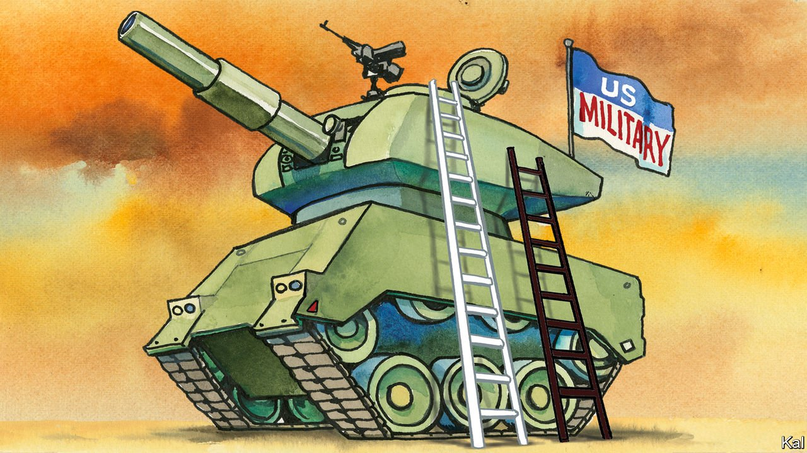

###### Lexington

# Green and black 

##### The US armed forces were a pioneer of racial integration. But where are the black generals? 

 

> Aug 14th 2021 

GENERAL MARK MILLEY, the chairman of America’s joint chiefs of staff, and thus the country’s top military officer, provoked a furore in June when he defended West Point’s teaching of critical race theory, a set of ideas about structural racism. “I want to understand white rage,” he told an audience of bewildered congressmen. “I’ve read Mao Zedong. I’ve read Karl Marx. I’ve read Lenin. That doesn’t make me a communist. So what is wrong with understanding…the country which we are here to defend?”

Plenty, according to Republicans. Such ideas were “very dangerous to unit cohesion and morale”, argued Tom Cotton, a senator. Donald Trump, who picked General Milley for the job, seeing him as a kindred spirit, demanded that he resign, accusing him of appeasing a “woke mob”. Mr Trump’s eldest son posted a doctored photo of the general with pink hair and a rainbow medal.


Yet General Milley is not the only one to have had a racial awakening. When General Charles “CQ” Brown became the chief of the US Air Force in June 2020, the first black American to lead any of its military services, he asked airmen to express their views as part of a review of racial disparities in the force. More than 123,000 of them responded, in 27,000 pages of text. “Those from the majority, when you talk to them, their eyes have opened up,” says General Brown. “They have a different perspective now.”

Like other American institutions, the country’s armed forces are reckoning with the intellectual and political currents unleashed by last year’s murder of George Floyd in Minneapolis and the protests that followed; it was that turmoil which prompted General Brown, then the head of Pacific Air Forces, to record an impassioned video in which he recounted the discrimination he had faced over his career.

It was an uncomfortable moment for an organisation that had told itself a story of unbroken progress. After all, the armed forces were desegregated in 1948, long before other institutions. After the end of the draft in 1973, black representation soared, rising to a third of the army by 1976—thrice the black share of the population.

The meteoric rise of Colin Powell, who joined the army as a young soldier six years before the Civil Rights Act was signed into law, and became the first black chairman of the joint chiefs of staff in 1989, seemed to furnish proof of a post-racial military. “Nowhere else in American society has racial integration gone as far or has black achievement been so pronounced,” wrote Charles Moskos, a sociologist, in 1995. “Indeed, the Army is the only institution in America where whites are routinely bossed around by blacks.”

This, says Jason Dempsey, a former infantry officer who once taught at West Point, is “part of a fairy tale that we tell ourselves”. In fact, the army resisted Harry Truman’s order to integrate. In Korea, 90% of black units were commanded by white officers.

Though rank can upend the racial hierarchies of civilian life, it is generally still whites who do the bossing around: just 8% of the officer corps is black, compared with 14% of the population. And despite General Powell’s trailblazing career, the top brass is astonishingly pale. Only two black officers are to be found among the country’s 43 four-star officers, equivalent to full general.

Professions of race blindness—“I only see green” is a frequent refrain—are common; so too is stereotyping. General Brown recalls “wearing the same flight suit with the same wings on my chest as my peers and then being questioned by another military member: are you a pilot?” A survey conducted in 2019 by the Military Times, a newspaper, found that over half of minority personnel had personally witnessed examples of white nationalism or other racism within the ranks.

Such disparities have deep roots. “Our screening programmes have some level of unconscious bias,” acknowledges General Brown. “I did not know until three or four years ago that we have private pilot time that you can use to boost your score to get to pilot training. I’ll just say that when I was in high school or college, my parents would not have had money for me to do that.”

He points out that black airmen, like black soldiers, have often joined supporting arms, like logistics and maintenance, rather than the operational ones which breed senior officers. One reason for that is that black recruits see support skills as more transferable into the civilian world. Only 2% of air-force pilots are black, unchanged from 30 years ago.

The mechanics of promotion are also stacked against minorities in subtler ways. In each service, older mentors can boost the careers of favoured younger officers at key junctures in their careers. That often benefits graduates of elite colleges, like West Point, at the expense of those who entered through less prestigious routes. It is to redress this imbalance that General Brown meets weekly with his staff to examine promotions to colonel and above, to identify diverse candidates down to the level of majors, who may have spent only a decade in service. “You can’t do it by luck,” he says. “You have to purposely manage it.”

Was blind but now I see

Transforming the demography and culture of a sprawling institution is the work of years. America’s armed forces have over 1.3m personnel. Many quietly share Mr Trump’s concern that fractious debates over identity politics will erode the professionalism of the armed forces. The backlash to the integration of gay servicemen in the 1990s shows how fraught such change can be.

Nevertheless, it is coming. The share of nonwhite cadets at West Point rose from 23% in 2007-09 to 36% in 2019. And whereas the first black officers to reach the top were wary of speaking out on divisive matters, eager to be defined by role, rather than race, their successors have more latitude. “Knowing that there’s very few African-American fighter pilots…I hope I can open the doors for others behind me,” says General Brown, “not just in uniform but in other parts of our society as well.”■

