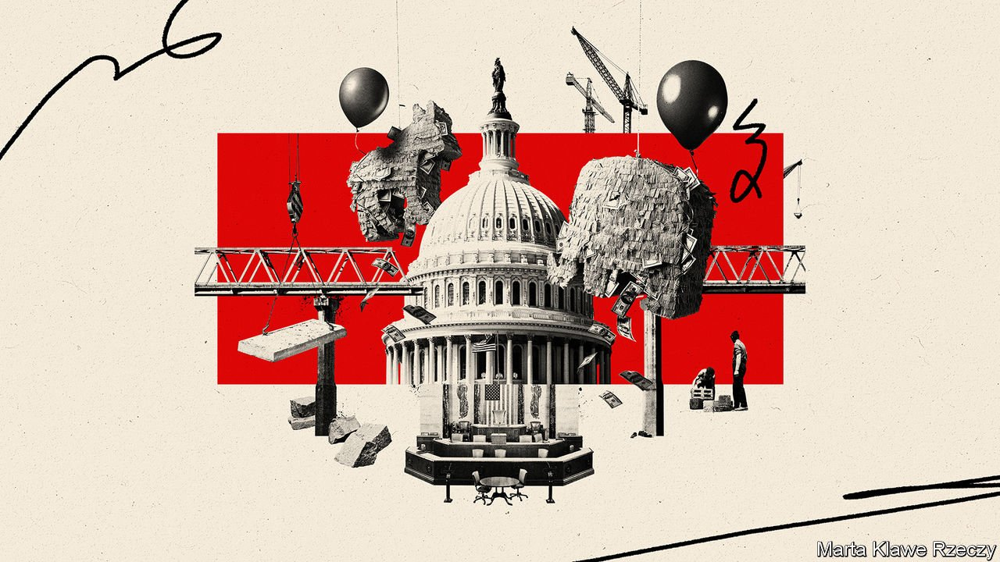
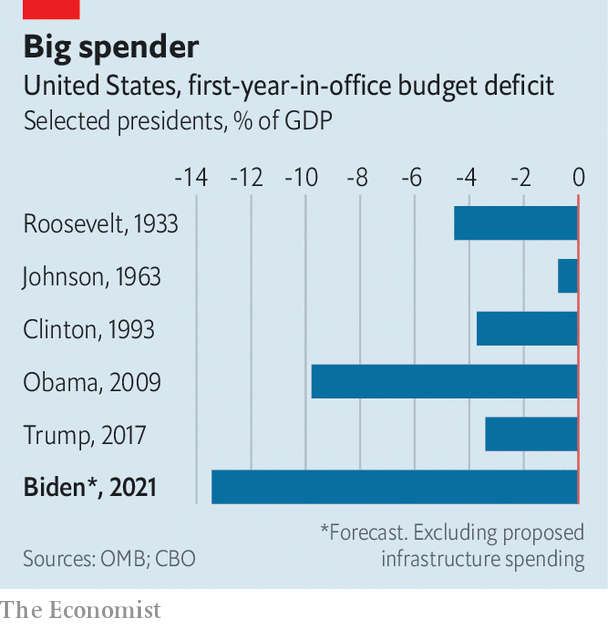

###### Bridge and tunnel

# Joe Biden’s splurge on infrastructure moves a step closer 

##### And on the climate and the safety-net, too. Congress works, maybe? 

 

> Aug 11th 2021 

“THE ICEMAN COMETH” is a play about the downtrodden patrons of Harry Hope’s saloon, who exchange reveries for one another’s pipe dreams. For a while President Joe Biden’s aspirations for a gargantuan infrastructure and social-services package—spending $4trn in order to “build back better”—resembled those of a misbegotten Eugene O’Neill character. The weeks dragged on and negotiations appeared fruitless. Yet in the usually soporific month of August, Mr Biden finds that his pipe dream might in fact yield some actual pipes, plus extra sending on the safety net and climate change too.

On August 10th the Senate passed a bipartisan infrastructure package spanning 2,700 pages, which contains plans to spend $550bn, or 2.5% of GDP, most of it on bridges, roads and railway lines. And then in the early hours of August 11th, the Senate fired the starting gun for the drafting of a budget resolution—a $3.5trn package stuffed with all of Mr Biden’s other partisan aims, the details of which will be negotiated in the months to come.


The White House has made greater headway than many expected. Yet turning this into actual spending will require still more effort. To mollify antsy progressives, neither bill is expected to arrive on the president’s desk without the other. Nancy Pelosi, the Democratic speaker of the House of Representatives, has pledged as much and is not known for bluffing.

So success for Mr Biden continues to depend on an odd-couple strategy: yoking the bipartisan bits of his agenda (traditional spending on roads, bridges, broadband and waterways, largely unmatched by tax increases) to the purely Democratic wish-list (enormous spending on climate-change mitigation and a safety-net expansion, along with much higher taxes on wealthy people and corporations). This approach withstood early defections by Republicans who feared they had been had. Now it must prove itself capable of delivering the remaining legislation, which will be mostly an exercise in Democratic cohesion. If all this works, it will probably become the defining accomplishment of the Biden presidency.

Securing both bills will be hard. To pass their other policy aspirations without any Republican votes, Democrats will now employ a procedure known as budgetary reconciliation, which sidesteps a filibuster if certain conditions are met. Shepherding such a package through Congress requires co-ordinating efforts from a score of committees. That task can now begin: in the early hours of August 11th Democrats passed a budget resolution, a skeletal framing document that gives each committee instructions on how much it can spend. This marks the true start of the hard work: drafting legislative text, collating it into one mega-package and passing it without any Democratic defections—for anything less, in the face of unified Republican opposition, would spell defeat.

Reconciliation is not pretty. Since its use is limited to budgetary matters, it cannot be resorted to often. And since Democrats fear that they will lose their slim majorities in the coming mid-term elections, they have an incentive to hitch any partisan priority that they want to become law onto this omnibus bill.

This bill will be stuffed therefore. Committees will draw up plans to spend hundreds of billions on climate-change research, electric-vehicle charging stations and a Civilian Climate Corps; more than $1trn on various safety-net enhancements like extended child-tax credits, subsidised child care and family leave; and educational benefits from pre-kindergarten to community college. There will be a parallel effort to pay for this by raising the taxes on corporate profits, especially of the overseas variety, and high personal incomes.

 


These legislative schemes would almost certainly increase American deficits and debts beyond their already eye-popping levels. The Congressional Budget Office (CBO), a non-partisan scorekeeper, estimates that America will run a $3trn deficit in Mr Biden’s first year—much of that is the result of the $1.9trn stimulus measure that the president signed into law soon after assuming office. At 13.4% of GDP, the deficit will be the highest in the first year of any modern president (see chart).

The proposed spending on infrastructure and the safety-net would be spread over ten years, not concentrated in just one. Still, it is remarkable that, if Mr Biden gets his way, he could sign legislation authorising the spending of just under $6trn, almost 30% of GDP, in his first year in office. More of the infrastructure spending will be covered by revenue than was the case for the covid-19 relief measure, but a substantial portion will not be.

The CBO‘s assessment of the bipartisan package passed by the Senate found that it would add $256bn to the federal debt. The budget resolution recently passed by Democrats would allow $1.75trn to be added to the tab—suggesting that only half of their proposal could be paid for (and belying the White House’s repeated insistence that it would be fully funded). Already, Janet Yellen, the treasury secretary, warns that the debt ceiling will need to be raised by October 1st to accommodate the current pace of spending.

Almost none of the legislating over the next few months will appeal to Republicans. But that is the point of the segmentation strategy that Mr Biden has chosen. He has pulled off a surprising victory in the bipartisan campaign. The partisan battle promises to be every bit as arduous. ■

For more coverage of Joe Biden’s presidency, visit our dedicated 

