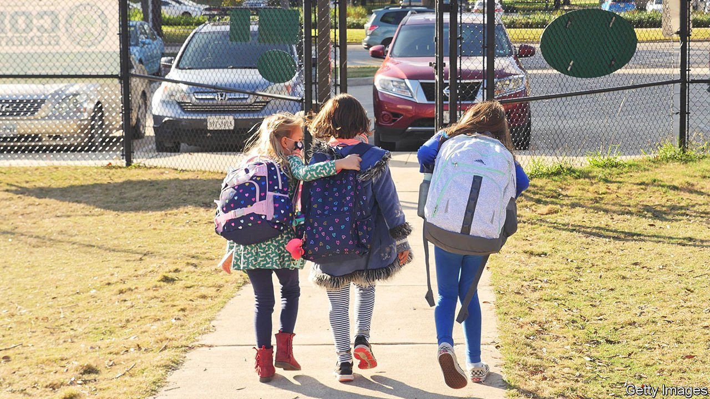

###### Getting schooled

# Texas offers an early case study on getting children back to school while covid-19 is spreading 

##### The state’s eccentric calendar means schools reopen in mid-August 

 

> Aug 12th 2021 

“BACK TO school” is not an autumnal phenomenon in Texas. Students begin their summer holiday in May but return to class in mid-August. The country’s largest Republican state offers a cautionary tale about the struggles that the country will face with children returning to classrooms amid a rising number of covid-19 cases and a more contagious variant.

Already a standoff is escalating between public-school officials and Republican state politicians. In May and again in July, Greg Abbott, the governor, issued executive orders banning government entities, including schools, from requiring masks. But with a rising number of covid-19 cases and hospitalisations coinciding with the start of the academic year, some public-school officials are choosing to flout the governor’s orders.


On August 10th Dallas Independent School District (DISD), which serves more than 150,000 students, became the first in the state to announce that it will require both students and teachers to wear masks. (Several more, including Austin, have followed.) “I fully expect to hear from the attorney-general’s office,” says Michael Hinojosa, DISD’s superintendent. On August 11th Dallas’s county judge, Clay Jenkins, issued his own order to require masking at public schools, child-care centres and some businesses, all but guaranteeing a legal standoff with the state.

Masks are not school officials’ only problem. Another is vaccines, which Mr Abbott has forbidden school districts and others from requiring. DISD has offered free vaccines to employees, but only around half of teaching staff have been vaccinated, says Mr Hinojosa. (The vaccination rate in the state is less than 46% and is barely budging upward.)

Enrollment is another difficulty. Schools have struggled to predict the number of students who will return this autumn. “We probably have more unknowns right this minute than ever,” says Todd Fouche of Frisco Independent School District, which lies to the north of Dallas. School districts’ funding hinges on the number of students attending. Normal attendance in Dallas is 95%, but some of the schools that opened early saw only 60% of students return, before rising to 80%. “Even if we get 80%, we’re still going to lose 15% of our revenue,” says Mr Hinojosa.

Virtual-learning courses could offer a salve, but to the unwelcome surprise of school officials, the legislature did not provide funding for online learning. The latest special legislative session called by the governor could take up the issue again, but Democrats have fled to Washington, DC to stop a voting bill, and the state House has struggled to reach a quorum to start conducting business.

Some school officials have calculated that it is worth it to foot the bill for virtual learning temporarily, in the hope that students will physically return to school when they deem it safe. Frisco, for example, is offering a temporary online option. But if all 8,200 Frisco students who have signed up for it were to continue virtually for the whole autumn semester and the state not change its stance on funding virtual students, that would translate into $30m in lost revenue for the district alone. Meanwhile, more parents are splurging to send their children to private schools, which can impose masks and other health requirements, says Bob Sanborn of Children at Risk, a non-profit.

Children are already struggling academically owing to the disruption wrought by covid-19. In the spring, only 30% of Texas third-graders (ages 8-9) tested at or above grade level in maths, down from 48% in 2019. These recent results may actually overstate the number of students testing at grade level, according to one education expert, since some struggling students did not show up for the exams. ■

Dig deeper

All our stories relating to the pandemic and the vaccines can be found on our . You can also find trackers showing ,  and the virus’s spread across  and .

