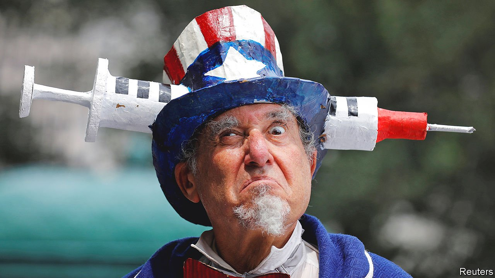

###### Delta dawns

# Vaccine mandates are spreading 

##### But fear of the Delta variant may do enough to raise vaccination rates without them 

 

> Aug 10th 2021 

A SURGE IN covid-19 infections, along with stagnant vaccination rates, has prompted something else to spread across America: vaccine mandates. For months the country had seemed to be moving in the opposite direction. Several states, including some of those where covid-19 cases are soaring, banned vaccination requirements in the spring.

But as the Delta variant spread in late July, California and New York City required public employees to be vaccinated or else submit to regular testing. Days later New York’s mayor said that, as of August 16th, customers and workers at indoor restaurants, bars and gyms will have to present proof of vaccination. The governor of Virginia is requiring state employees to get the vaccine or be tested weekly.


President Joe Biden announced a similar mandate for federal employees on July 29th, leaving room for them to resort to a mix of testing, masking and social distancing. Meanwhile the Department of Veterans Affairs (VA), a federal agency, is insisting that its medical employees have the jab, and the secretary of defence has announced that troops will need to do the same. America is not alone. France, Italy and Hong Kong have implemented mandates for work and social activities.

Some private employers . All of the top 25 public and private universities, as ranked by US News and World Report, will require students to get themselves vaccinated. Walmart, the country’s largest private employer, with nearly 1.6m workers, announced that vaccination would be obligatory for corporate employees and regional managers. Walt Disney Company, Uber, Lyft, Google, and Tyson Foods now require some employees to be vaccinated. CNN, a cable news network, fired three workers who came to the office without the jab.

Vaccination mandates are nothing new in America. The army has required inoculation for several diseases for more than 200 years. All 50 states require schoolchildren to be vaccinated against childhood illnesses like measles and mumps, and about 95% of pupils have had the required jabs, according to the Centres for Disease Control and Prevention. Most states allow exemptions for religious and personal beliefs, but not all. California revoked personal and religious exemptions in 2015. New York removed their religious exemption in 2019 after a  outbreak. In California vaccination rates increased for childhood diseases once the non-medical exemptions were removed.

The law gives states and employers wide discretion to require vaccines, says Walter Olson, a legal scholar at the Cato Institute, a libertarian think-tank, though he expects a challenge to reach the Supreme Court and reinstate the religious exemption prohibited by some states. Many of the covid-19 mandates do include exceptions. Those in California, Virginia and New York City allow regular testing as an alternative.

A recent legal challenge to a vaccination mandate failed. On August 2nd the Seventh Circuit Court of Appeals declined to block Indiana University’s requirement that students get jabbed before returning to campus in the autumn. The three-judge panel—comprising one appointed by Ronald Reagan and two by Donald Trump—dispatched the unvaccinated students’ complaint in four crisp pages. The court relied on a Supreme Court decision from 1905 upholding a requirement that adults be vaccinated against smallpox. Since the university allowed religious and medical exceptions, the court reasoned, and since people “may go elsewhere” for their education, the students had no constitutional claim.

Although most vaccine mandates are probably legal, some might be politically unwise, warns Mr Olson. Only one in ten American vaccine holdouts say they would get the jab based on a work or travel mandate, according to a survey by The Economist and YouGov. Dissenters warn of a potential backlash. Among Germans, support for a hypothetical vaccine mandate dropped by 16 percentage points from 44% between spring and autumn 2020. France, meanwhile, has seen an increase in vaccination rates since announcing the covid-19 vaccine mandate.

Vaccination rates are increasing in the hardest-hit regions, including some of those least likely, for reasons of politics, ever to embrace mandates. Louisiana had 810 new covid-19 cases per 100,000 residents over the past week; only about 38% of the population there are fully vaccinated. But on August 6th the state reported the highest number of administered vaccine doses (20,737) since April 29th.

Florida, with 50% of people fully vaccinated, had 653 new covid-19 cases per 100,000 residents over the past week. The Sunshine State reached a vaccination peak on July 30th: 76,185 doses were administered, the most since June 11th. Other hard-hit states are seeing similar results. In places that will continue to resist mandates, this wave is therefore boosting vaccination rates anyway.■


Dig deeper

All our stories relating to the pandemic and the vaccines can be found on our . You can also find trackers showing ,  and the virus’s spread across  and .

