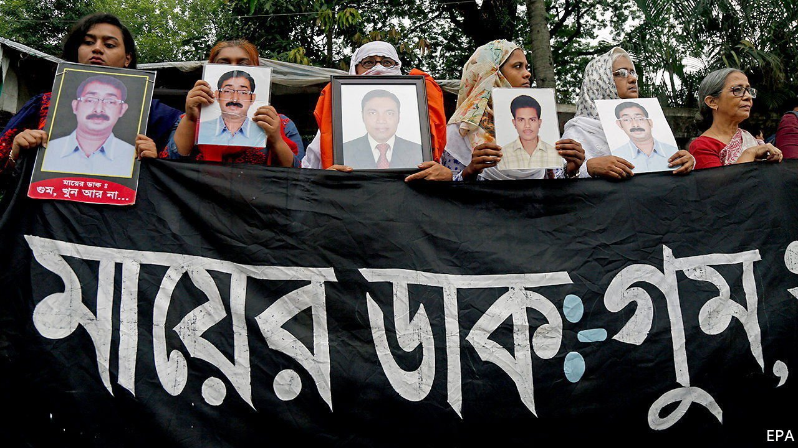

###### They just disappeared

# Critics of Bangladesh’s government are liable to vanish 

##### And some of its supporters treat the matter as a joke 

 

> Aug 19th 2021 

“BABA KOBE ashbe?” (“When will Daddy come?”), asks the youngest daughter of Sajedul Islam Sumon. No one has an answer, but she keeps asking anyway. Her family’s life—and hers—revolves around his absence. Now eight, she was just one when security forces came to their suburb of Dhaka, Bangladesh’s capital, and bundled her father, a local leader for an opposition party, into the back of a van. That was the last time he was seen or heard from.

Mr Sumon’s tale, in a new report on enforced disappearances in Bangladesh, is a chilling example of what can happen to those who oppose or criticise the government of Sheikh Hasina Wajed. Under her 12-year tenure at least 600 Bangladeshis are reckoned to have been “disappeared”.


Many have eventually re-emerged. Some have been implausibly “found” and produced in court—like Shafiqul Islam Kajol, a photojournalist who, 53 days after he went missing in March last year, turned up blindfolded, his legs and arms bound, in a no-man’s land between Bangladesh and India. Police took him into custody, slapping a trespassing charge on to his original crime of posting on Facebook about a sex scandal involving a politician in the ruling party. Others, like Aminul Islam, have returned in body bags. He was a labour activist whose tortured remains were found dumped on the edge of Dhaka, days after his abduction in 2012. Eighty-six victims, including Mr Sumon, are still missing.

While these numbers may seem small in a country of 170m, fear of being goom (disappeared) muzzles millions of voices. Disappearances, along with an array of other human-rights abuses, are not new in Bangladesh. Under previous governments, including those led by the opposition Bangladesh Nationalist Party and the ruling Awami League, dissidents vanished and were killed. But since 2009, the year Sheikh Hasina took office for a second time, state-sponsored abductions have become a systematic tool of oppression, says Meenakshi Ganguly, South Asia director of Human Rights Watch, the advocacy group behind the report.

Bangladesh’s is not the only South Asian state that covertly kidnaps its citizens. Yet, says Ms Ganguly, such actions elsewhere are usually linked to civil strife or insurgencies. Bangladesh is alone in “so blatantly” targeting political opponents and critics for secret detentions. Disappearances have shot up most in the run-up to elections, with over 130 before the 2014 vote and 98 in the year leading up to the ballot in 2018.

Despite such brazenness, ruling-party politicians deny or play down the abductions. In 2017 Sheikh Hasina claimed that Bangladesh’s enforced disappearances paled in comparison with Britain’s, bogusly citing data for missing persons. Her son, Sajeeb Wazed, recently penned an article for the Diplomat, an online news site, calling the “disappearances” comical. Many of the vanished were fugitives who, he joked, had gone into hiding to escape arrest.

Such mocking attitudes percolate down through the state apparatus. When Marufa Islam Ruma sought answers about her missing husband, Mofizul Islam Rashed, security-force officers jeered that he had probably run off with another woman. Years after Mr Sumon’s disappearance, a senior officer came to his family’s home and theatrically walked around the house shouting “Where is Sumon? Let him out, I need to speak to him!”, recalls his niece.

The families interviewed for the report named the Rapid Action Battalion, an elite police squad, as being behind the abductions. But other security units are guilty too, say various rights groups. And they all operate with impunity.

Some families give up or do not try in the first place, says Afroja Islam Akhi, Mr Sumon’s sister, who runs Mayer Dak, an organisation for the families of vanished Bangladeshis. They know their questions may bring punitive repercussions rather than helpful answers. She reckons the number of disappeared is far higher than the 600 known about. “Only God knows the accurate tally.”■

