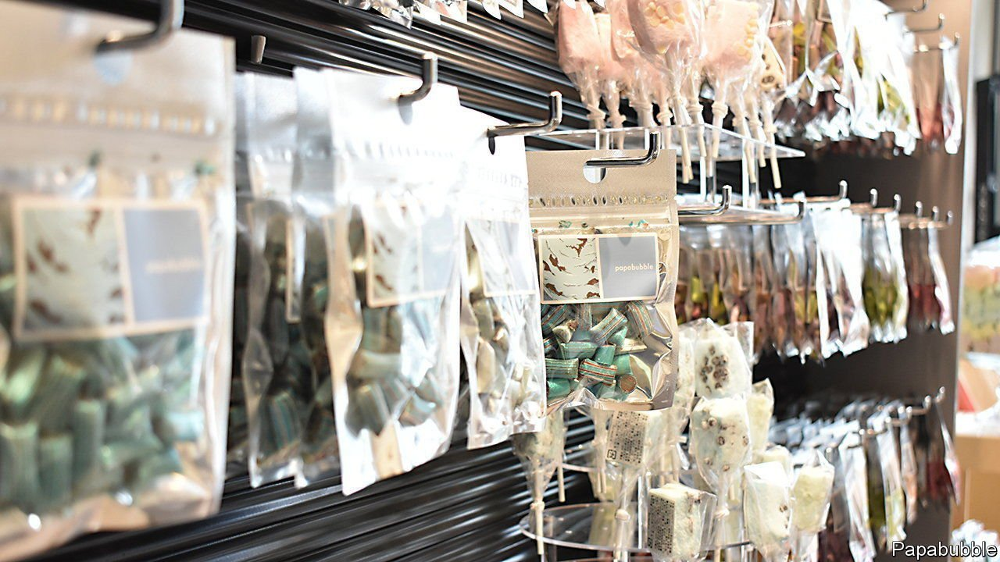

###### The darling buds of Nestlé

# In Japan, novelty sweets mark the seasons 

##### Cherry in the spring, chocominto in the summer 

 

> Aug 21st 2021 

BRIGHT GREEN, chocolate-studded delights sprout on store shelves across Japan every year as temperatures rise. Chocolate-mint ice cream bars; chocolate-mint cookies; chocolate-mint candies, chocolate-mint bubble tea, even chocolate-mint bagels. On Instagram, fans post pictures of their favourite “chocominto” items, tagging posts “#chocomintou”, a play on words meaning the “chocolate-mint party” (as in political party). And then, as suddenly as they appear, the chocominto snacks are gone, wilting away at the end of Japan’s hot summers.

Japanese cooking and traditional sweets have long placed a premium on seasonality. Contemporary candy and snack producers now tap into the seasonal mindset to great effect, peddling cherry-flavoured goods during cherry blossom season and sweet potato-flavoured snacks in the autumn. Chocominto is only the latest limited-edition snack fad to enthrall Japanese consumers. “The Japanese market moves with the season,” says Jérôme Chouchan, the boss of Godiva Japan, which uses ingredients and packaging to send seasonal signals, as with chestnut macaroons and brown or red packaging in the autumn.


Yet the proliferation of seasonal, limited-edition items in Japan has as much to do with the structure of the modern market as with age-old traditions. Japan’s ubiquitous convenience stores, or conbini, prize novelty. The selection in stores usually changes once a week, explains Phillip Sugai of Doshisha University in Kyoto: “Having the same exact chocolate bar on the shelves isn’t appealing to the convenience stores; novelty is exciting.”

Where big international confectionery firms tend to manufacture the same items consistently at scale to minimise costs, “the Japanese model is completely opposite,” says Takaoka Kozo, the former head of Nestlé Japan, a big food and drink company. Under his watch, KitKat, a chocolate-covered wafer, began churning out seasonal and limited-edition flavours; the company has produced hundreds of flavours exclusive to Japan, including salt lychee, red-bean paste and wasabi. (The same approach flopped in Britain, where retailers charged higher fees to carry new items.)

Another factor may be the difficulty of competing on quality in the Japanese market. “Every product tastes good,” says Okayama Takuya of Dataspring, a market-research firm. Instead manufacturers have to find other ways to stand out. “It’s very difficult for us to differentiate from our competitors by improving just taste, we have to have some special edition to do so,” says Yokoi Satoshi, head of the Japanese branch of Papabubble, a high-end Spanish sweet-maker.

The confectioner produces a sweet shaped like a chicken wing for stores in Nagoya, which is known for its fried chicken, and one for Osaka resembling a steamed pork bun, a local speciality. In May, it opened a chocominto pop-up shop in Tokyo’s trendy Aoyama district. Pumping out new flavours every few months can present challenges, especially for foreign companies used to producing high volumes of fewer products. But buzzy items make up for the additional costs in sales, says Mr Takaoka.

Few flavours have as devoted a fan base these days as chocominto, which has developed a cult following on social media. “People who like it really like it,” says Ushikubo Shintaro, an influencer who runs a suite of chocominto-themed social-media accounts and published a guidebook to chocominto offerings in Tokyo. The only downside is its fleeting nature. “It is a little bit sad when the chocominto period ends,” Mr Ushikubo admits. He soothes his sorrow with the strawberry-flavoured sweets that grow on shelves in the winter.

