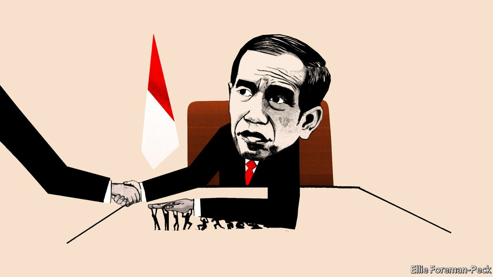

###### Jokowho?

# Indonesia’s president promised reform. Yet it is he who has changed 

##### Democracy is increasingly enfeebled under Jokowi 

 

> Aug 21st 2021 

AGREE OR DISAGREE: “Homosexuals should be given corporal punishment.” That is one of the many odd questions posed in a civil-service exam taken by the 1,300 employees of Indonesia’s Corruption Eradication Commission (KPK) in April. The formerly independent anti-graft agency is to be folded into the civil service, thus requiring its staff to pass an entrance test. Yet the exam was not the standard one taken by all hopefuls. Instead, it was written specially for the KPK, with input from the armed forces and intelligence and counter-terrorism agencies. It included questions about workers’ sex lives and their views on various minorities. Seventy-five employees failed, among them some of the commission’s best investigators. Two-thirds were sacked.

Indonesia is awash with corruption. Last year, it scored 37 out of 100 on a corruption index produced by Transparency International, a global watchdog, lower even than Brazil (38) or India (40). The KPK was set up in 2003 to tackle the scourge. Its investigations of company bosses, bureaucrats, politicians and senior police officers have resulted in the convictions of over 900 people, a clutch of cabinet ministers among them.


It was, perhaps, too effective. Since 2009, police have investigated and arrested top KPK officials, and lawmakers have repeatedly tried to curb its powers. In 2019 Parliament passed a law that stripped the commission of its independence and appointed a police general, himself dogged by allegations of corruption, to head the agency. The taming of the KPK will be complete next month, the deadline for integrating it into the civil service.

That President Joko Widodo, known as Jokowi, put his signature on the bill fatally weakening the KPK surprised many Indonesians. When he was first elected in 2014, he was hailed as a reformer who would protect civil liberties and promote better governance. Yet he has empowered a cabal of politicians, party bosses, bureaucrats and tycoons who have conspired to erode the democracy’s checks and balances. A year after he took office, Indonesia slipped from “free” to “partly free”, on a ranking compiled by Freedom House, a think-tank. By the start of his second term, in 2019, “Indonesia’s democracy had sunk to its lowest point since the end of the New Order,” the name of the authoritarian regime which made way for democracy in 1998, write Thomas Power and Eve Warburton, editors of “Democracy in Indonesia: From Stagnation to Regression”.

The president’s assaults on democracy are manifold. Under Jokowi, the state has stepped up efforts to suppress views it dislikes. In 2017 the government gave itself the power to disband civil-society organisations on national-security grounds. It deals harshly with protesters. Ordinary citizens who criticise the government online are threatened with criminal charges or imprisoned. The information ministry regularly blocks websites it finds objectionable, among them gay-dating services.

Jokowi has also eroded checks on executive privilege. He has appointed toadies to run the police, armed forces and the attorney-general’s office. He has tried to do away with political opposition by manipulating the boards of two rival parties to ensure loyalist factions are in control and by coercing opposition politicians, via threats of prosecution, into supporting his re-election. His enormous coalition encompasses three-quarters of parliamentarians.

At the same time, Jokowi has surrounded himself with generals and relies ever more on the armed forces to help execute domestic policy, such as in increasing rice production. He is fond of centralising authority, reclaiming some powers that were devolved to regional governments after the fall of Suharto, the strongman who ruled Indonesia for three decades until 1998.

On occasion the president does remind voters of the candidate they elected. He visits far-flung regions, home to most ethnic minorities, more often than his predecessors. In 2015 he ordered the closure of a corrupt subsidiary of the state petroleum company. Earlier this year he asked for a review of a draconian internet law.

Such moves keep the Jokowi hype-machine running. Yet they do nothing to deal with the rot deep within the state. The era of reform after Suharto retained many of the old authoritarian’s functionaries. That ensured stability at a delicate moment, but it meant that many officials steering the fledgling democracy were themselves not democrats. “Authoritarianism in Indonesia never truly went away,” notes Ben Bland, Jokowi’s biographer. Neither did corruption. Bureaucrats and politicians continue to treat the state as their own personal piggy bank. Oligarchs nurtured during the New Order clawed back their influence. Today they are the defining force in Indonesian politics, argues Vedi Hadiz of the University of Melbourne.

This was the system that Jokowi’s supporters thought he would dismantle. But the president has proved to be a pragmatist rather than an idealist, riding roughshod over democratic institutions and principles in order to secure the political support necessary to execute his economic agenda. “If you are swimming with the sharks and dancing with the wolves, you have to make friends with some of them,” says Sarwono Kusumaatmadja, a former minister. Enfeebling the KPK is one way to do that.

On the face of it, that would seem at odds with what Indonesians want. Some 82% of those surveyed in 2019 believed that democracy was the best system of government, while only 3% thought that authoritarianism was acceptable “under certain circumstances”. Participation in elections is high. Yet if one asks the average Indonesian why she likes democracy, she will not praise it as a vessel for liberal values, but as a system for delivering prosperity. Jokowi will take comfort in that.■

