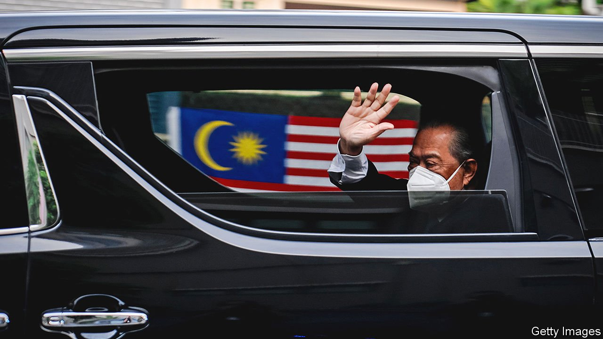

###### Sheraton removed

# Malaysia’s tottering government falls at last 

##### Muhyiddin Yassin’s replacement may not be that different 

 

> Aug 21st 2021 

LIKE MOST Malaysians, Muhyiddin Yassin spent the past 17 months simply trying to survive. Buffeted by the twin crises of covid-19 and the economic devastation that followed in its wake, he had barely kept his head above water since the pandemic began. And just as ordinary people blame their woes on ineffectual leaders, Mr Muhyiddin attributed his troubles to the “kleptocrats” in power. On August 16th, as Malaysia’s daily infection number hovered near its all-time peak, Mr Muhyiddin (pictured) resigned as prime minister.

The shortest-serving prime minister in the history of independent Malaysia, Mr Muhyiddin will not be remembered for much. He came to power via backdoor wheeling-and-dealing known as the “Sheraton move”, after the hotel where some of it took place. He suspended Parliament on the flimsy grounds of a covid-related state of emergency. He will remain as caretaker while a new government is found.


The search is on. On August 17th Sultan Abdullah, the current king (a job that rotates between the country’s nine sultans), met party leaders to discuss their positions. He asked MPs to submit the name of their preferred candidate for prime minister the next day, and invited a small majority of them to the palace on Thursday. He will consult the other sultans on August 20th before making an announcement. For the second time in this Parliament—the first being the appointment of Mr Muhyiddin—the king is playing kingmaker.

The options have narrowed to two front-runners. The first is Anwar Ibrahim, for decades a prime-minister-in-waiting, whom insiders give a 30% chance of at last achieving his ambition. It does not help that Mahathir Mohamad, a former prime minister and power broker, despises him. The other, and more likely, candidate is Ismail Sabri Yaakob, who served as Mr Muhyiddin’s deputy. He reportedly has the backing of most of the MPs who propped up the government that just collapsed, and would represent continuity.

Why, then, bother? Mr Ismail Sabri would be “more circumspect than Muhyiddin in handling and cultivating the top leaders of UMNO”, the Malay party that ruled the country from independence until 2018, says Ariel Tan of the S. Rajaratnam School of International Studies in Singapore. UMNO was the junior partner in Mr Muhyiddin’s coalition government, a role that made its leaders deeply uncomfortable. Besides, it deprived their members of the juiciest ministerial portfolios. Mr Ismail Sabri’s government may also be able to devote more attention to the country’s challenges, “provided that there is at least a brief pause” in the politicking that plagued the previous one, says Ms Tan.

Malaysia’s political class may or may not have learned lessons from the past year and a half. But its monarch has. The king has decreed that the new prime minister must face a vote of confidence “as soon as possible”. Moreover, he suggests, “MPs who win should extend the hand of co-operation to those who failed.” In so doing, the king is hoping to prevent a repeat of the crisis of legitimacy that dogged Mr Muhyiddin. “We are now very far from a monarchy that is removed from the people,” says Francis Hutchinson of the ISEAS-Yusof Ishak Institute, a think-tank in Singapore. “He can read Facebook, he can read people’s comments. So he does have some idea of what people are thinking and is conscious of his own legacy.”

That will bolster the incoming government, which, if it is led by Mr Ismail Sabri and backed by the same parties, risks being in many ways indistinguishable from the previous one. It will also boost the reputation of the king, who risked being seen as too close to Mr Muhyiddin. And a functional government, after 17 months of chaos, may even, if they are lucky, be good for ordinary Malaysians.■

