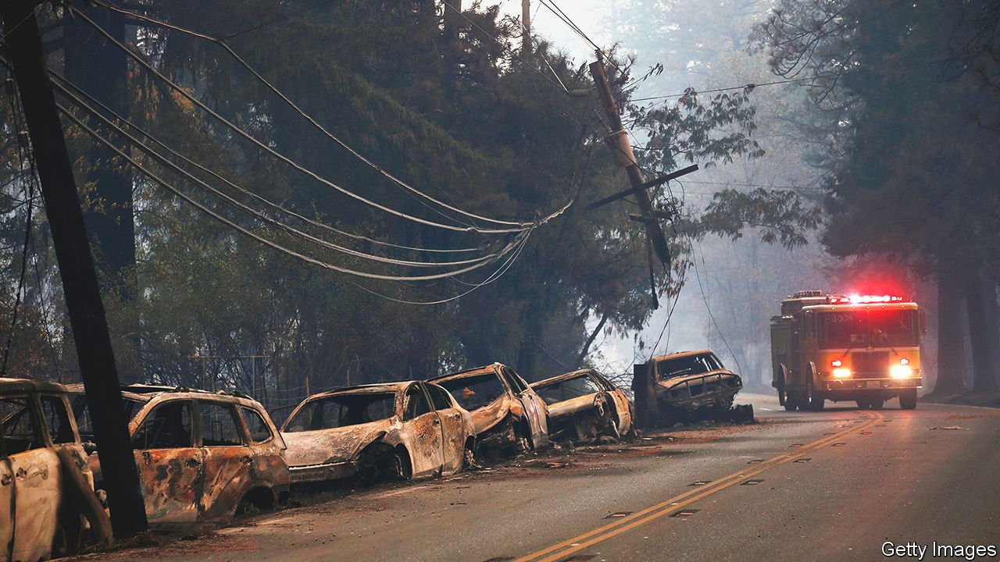

###### Fire in California

# A new book chronicles the blaze that destroyed Paradise, California 

##### Wildfires test the meaning of “natural disaster”, suggests Lizzie Johnson 

 

> Aug 21st 2021 

Paradise: One Town’s Struggle to Survive an American Wildfire. By Lizzie Johnson. Crown; 432 pages; $28

SOON AFTER giving birth to her third child, Rachelle Sanders is evacuated from Feather River Hospital in Paradise, California. It is November 8th 2018 and a wildfire is raging in the foothills of the Sierra Nevada mountains. Before long, flames are swallowing the town. The ambulances have all left and traffic is gridlocked as 27,000 people try to evacuate at the same time. Bundled into a car, her lower body still numb and a newborn in her lap, Ms Sanders and the driver make a grim plan. If the blaze overtakes them, he will take the baby and run.


The damage inflicted by wildfires is often measured in acres burned, buildings razed and lives lost. Lizzie Johnson, a former journalist at the San Francisco Chronicle (and now of the Washington Post), duly covers these costs in her new book. The Camp Fire, as the conflagration that incinerated Paradise is known, was the deadliest in California’s history, killing 85 people and destroying nearly 19,000 structures.

But the stories of individuals—such as Ms Sanders—on which the author focuses will haunt readers most. A school-bus driver navigates bumper-to-bumper traffic and harrowing roads lined with “drooping oak” and “tangled brush”, fuel for the flames, to get a group of children to safety. An emergency dispatcher stays on the phone with an elderly woman as she hides in her bathtub—until the line goes dead. Ms Johnson lived among her subjects while reporting the book, and the result is a painstakingly constructed narrative that reads as though she was scribbling notes alongside each of them as they fled for their lives.

Nestling in the grisly tales of those who escaped, and those who didn’t, are wider questions of culpability. The Camp Fire was sparked by equipment owned by Pacific Gas &amp; Electric (PG&amp;E), California’s biggest utility. Last year the company pled guilty to 84 counts of involuntary manslaughter. “I make this plea with great sadness and regret”, said Bill Johnson, then the firm’s chief executive, “with eyes wide open to what happened and to what must never happen again.” Yet it may have happened again. This summer’s Dixie Fire was the second largest on record in California. Again PG&amp;E acknowledged it may have provided the spark. Greenville, a town within 100 miles of Paradise, was seared from the map.

Ms Johnson suggests other culprits too. Houses were built willy-nilly on lots too cramped to provide “defensible space”, which can act as a firebreak. Paradise sprawled ever farther into the forest. Local officials narrowed the main highway in the name of beautification, which made evacuation more difficult. These blunders are not peculiar to Paradise. The allure of America’s wide-open spaces, combined with rocketing house prices, has led more people to settle in cheaper, fire-prone areas. Roughly half the population of the American West now lives at “the wildland-urban interface”, according to Headwaters Economics, a think-tank.

Fire, it is true, was a part of the western landscape long before settlements such as Paradise and Greenville were built. It helps regenerate soil and clear forests of debris. But the fact that the blazes are perennial does not mean tragedy is inevitable. In recounting the choices that turned a town into a tinderbox, “Paradise” nudges readers to think differently about fire.

Take the phrase “natural disaster”. It implies that a weather event is a freak accident or act of God, and that humans are helpless bystanders. But the damage wrought by wildfires today is caused as much by haphazard development and bad policy as Mother Nature. Can a natural disaster be caused by an electrical utility? What if it is exacerbated by man-made climate change?

Paradise itself is slowly rebuilding. Its welcome sign—charred but replaced—affirms that the town is “all its name implies”. Perhaps one day, Ms Johnson hopes, the slogan will again ring true. ■

