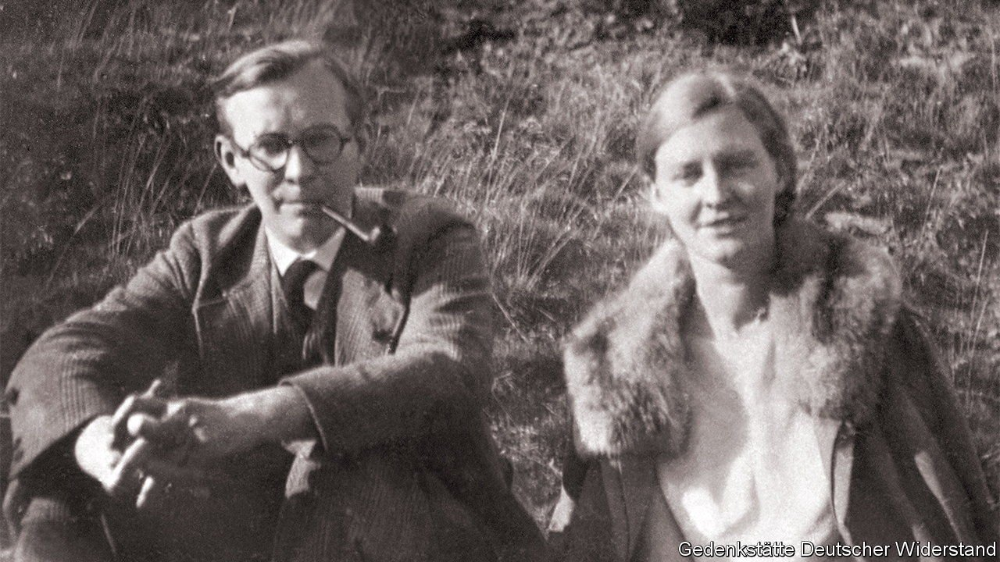

###### Resistance to Hitler

# A new book gives an American heroine her due 

##### Mildred Harnack’s courage has been largely unknown. Until now 

 

> Aug 21st 2021 

All the Frequent Troubles of Our Days. By Rebecca Donner. Little, Brown; 576 pages; $32. Canongate; £16.99

IN FEBRUARY 1943 a sympathetic chaplain at Plötzensee Prison in Berlin made one last visit to a condemned woman. She was bent over a book of Goethe’s poems, writing English translations in the margins. Mildred Harnack, an American teacher, was executed that day on Hitler’s direct orders. More than half a century later her great-great-niece found the book in the archives of the German Resistance Memorial. Harnack had been a leading figure in the anti-Nazi underground; yet whereas the world honoured such martyred anti-fascists as Sophie Scholl, killed six days later, almost nothing was known of this idealistic professor of literature from Wisconsin, or of how she came to lead the largest resistance cell in Berlin.


This obscurity was no accident. After the defeat of the Nazis, Harnack’s sister, aghast at reports of her involvement with anti-fascists and Soviet spies, ordered family members to destroy her letters. Fortunately her mother did not comply, stashing the correspondence in an attic. Harnack’s niece, Jane Donner, saw to it that the story was handed down to her own granddaughter, Rebecca Donner—who has produced a compelling portrait of her forebear’s courage, along with that of her German husband Arvid and their comrades.

Those who resisted the Nazis in Germany knew that they were marked. Harnack and Arvid, who met and married while at the University of Wisconsin, were a young academic couple living in Berlin when Adolf Hitler became chancellor in 1933. Immediately they formed a “discussion circle” of students, friends, factory workers, professors and writers, debating what to do as the Nazis locked up their enemies. Over the years the circle’s resistance strategies evolved, from leaflets to recruitment of new members to serving as Soviet spies while posing as “a dutiful servant of the Third Reich”.

Harnack was tall, blonde and blue-eyed; as president of the American Women’s Club in Berlin she masqueraded as the perfect Nazi wife. Meanwhile she and Arvid were funnelling military information to Allied contacts abroad. Even as the pressure steadily mounted, survivors would later recount, they persisted. “Relentless Nazi brutality invigorates their conviction that they must fight back steadily, diligently, without hesitation,” the author writes.

Harnack was careful to betray nothing in her letters home. So Ms Donner has pieced the story together from a vast array of sources. Her book is a tour de force of investigation: she searched two dozen archives in America, Europe and Russia, trawling through intelligence reports and official documents, plus scores of published and unpublished memoirs, diaries and letters. Her most precious source, however, is the memory of Donald Heath junior, who was the 11-year-old son of an American diplomat when he began acting as Harnack’s secret courier. His story fleshes out the lady with the “low, kind voice” whom he visited twice a week in 1939 on Woyrschstrasse, where she slipped notes for his father into his blue backpack.

The couple’s commitment to defying the dictator who was wrecking the country they called home shines through. Arvid was a nephew of a scholar who helped draft the Weimar constitution, part of an intellectual clan that became a “Who’s Who” of resistance to Hitler. His cousins the Bonhoeffers, Delbrücks and Ernst von Harnack participated in the most famous attempt on Hitler’s life, the failed military “Valkyrie” plot of 1944. Harnack joined their fight as women’s rights, too, were shredded by the Nazis. She lost her university teaching job, purged like tens of thousands of women, Jews and others.

The story unfolds in fragments. The early pages, as Ms Donner lays out Hitler’s overthrow of German democracy, can read like potted history. But as the pieces cohere, the couple’s story becomes gripping. They are betrayed, eventually, by a Soviet blunder. As the Gestapo moves in, arresting resisters from various cells, the reader hears first-hand accounts of their interrogation and torture. The abiding impression is of virtuous, extraordinarily brave people caught up in tragic horror. ■

