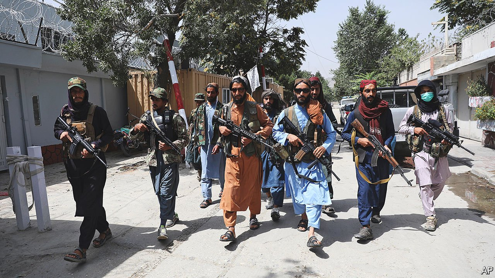
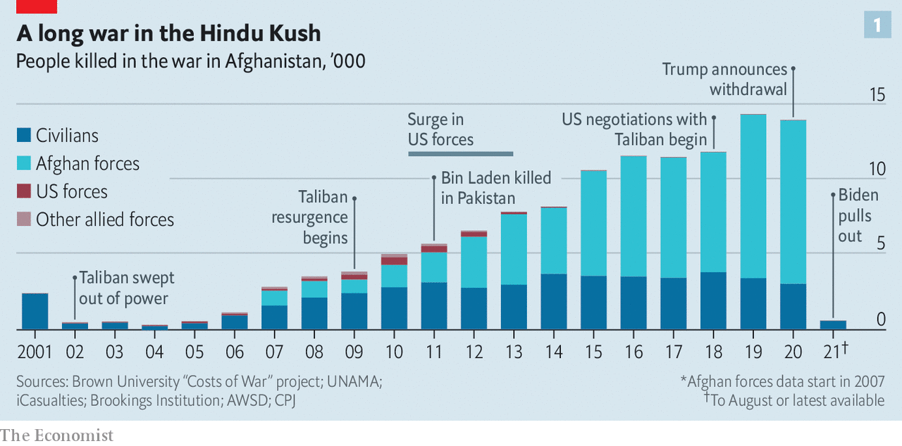
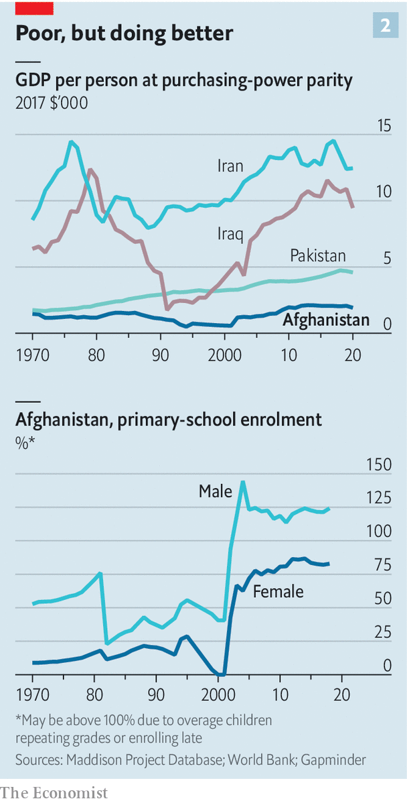
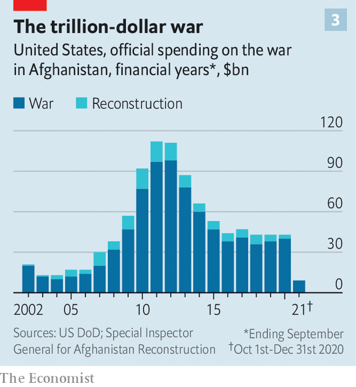

###### The Taliban are back in town

# From Saigon to Kabul: what America’s Afghan fiasco means for the world 

##### The defeat in Afghanistan is, like that in Vietnam, a turning-point. Many fear America’s foes will be emboldened; others hope it will now be more able to confront them 

 

> Aug 21st 2021 

“THE TALIBAN is not the North Vietnamese army,” declared President Joe Biden on July 8th, days after America abandoned Bagram air base, the hub of its war in Afghanistan for 20 years, without telling its Afghan commander. “They’re not remotely comparable in terms of capability. There’s going to be no circumstance where you see people being lifted off the roof of the embassy of the United States from Afghanistan.” By August 15th Chinooks were rattling windows in Kabul, shuttling American diplomats from their hulking embassy. At the city’s airport, desperate Afghans swarmed the runway; some clung to the undercarriage of a C-17 transporter, falling to their deaths.

 


The chaos on the runway contrasted with the Taliban’s nearly bloodless capture of Kabul a day earlier. The Taliban now control more of Afghanistan than they did in 2001, when America swept them from power in response to the September 11th attacks (see map). At the presidential palace in Kabul, Taliban fighters in dusty sandals seemed surprised at their victory as they posed around the desk abandoned by Ashraf Ghani, the country’s president. “We have reached a victory that wasn’t expected,” admitted , the Taliban’s deputy leader.

In the tense drama around the airport, the foes have treated each other warily. The Taliban have so far allowed America to run evacuation flights, but have forced back crowds trying to get onto them. With thousands of Americans left in Kabul the situation could grow more dangerous. The Taliban may grow impatient with thousands of American and British troops on Afghan soil, and angry at America’s decision to block access to foreign reserves.

America’s flight from Kabul, like its departure from Saigon in 1975, is a defining geopolitical moment: the world’s mightiest country has again been defeated by a weaker enemy. In both cases—then as a senator, now as president—Joe Biden advocated a rapid exit. And then as now, fierce critics of America predicted that such a chaotic abandonment would alarm allies and embolden adversaries. Neighbouring states and rich countries farther away can expect an unsettling new influx of refugees. Global jihadists, thousands of whom are thought to be sheltered by the Taliban, will see a divine hand in the way holy warriors have defeated two superpowers in Afghanistan—first the Soviet Union in 1989 and now America.


 


The consequences will be felt, above all, in Afghanistan itself. It is too early to say whether the Taliban’s triumph marks the final, or merely the latest, chapter in the country’s 42-year-old war—with more than 117,000 Afghans killed since 2001 (see chart 1). Afghanistan remains one of the world’s poorest countries. If Western aid is cut off, it stands to lose even the modest economic and social gains—such as the —of the past two decades (see chart 2). Much will depend on how the Taliban govern.

 


When they last ruled in Kabul, from 1996 to 2001, they plunged a country long ravaged by war into a theocratic tyranny. They halted female education and employment, banned most art and music, and massacred minorities. And they harboured militants of all stripes, notably al-Qaeda, which sought to export jihad around the world. The “emirate” was so repulsive that it was recognised only by Saudi Arabia, the United Arab Emirates and Pakistan, a long-time sponsor of the Taliban.

This time around, the Taliban want to show a gentler face. On August 17th one of their officials appeared on Afghanistan's main television network to be interviewed by a female presenter—an unimaginable scene during the first Taliban era. The group has also applied a light touch in the capital. “We were expecting a lot more brutality,” says Obaidullah Baheer, a lecturer at the American University in Kabul. Instead, he was “pleasantly surprised at their discipline and respectfulness”. Mr Baheer notes that the Taliban’s vehicles do not honk at civilian cars, forcing them off the road, as Afghan military ones used to.

Keeping the lights on

The Taliban’s priority is to keep the existing state going. Lacking technocrats or managers, they have declared a general amnesty for all government officials, urging them to return to work. The health minister and the mayor of Kabul remain in their posts. Antonio Giustozzi of King’s College London notes that the Taliban have cut deals with Salahuddin Rabbani, a former foreign minister, and Hamid Karzai, the first president installed by America. They have recruited army specialists to operate captured equipment and are trying to woo military pilots.

The Taliban's strategy in rural provinces that they have held for some time may hold other clues. They often piggybacked on government services, allowing teachers and doctors to continue working as long as they abided by Taliban rules. “They are going to assume control of what already exists, at least in the short term, and I think they will try to go for stability, rather than a revolution of any sort,” says Ashley Jackson of the Overseas Development Institute (ODI), a think-tank in London.

As they take over the country, says Martine van Bijlert of the Afghanistan Analysts Network, a research group, the Taliban are debating how to strike the balance between what many of their fighters see as ideological purity, on the one hand, and the demand for education that exists even among many of the more conservative Afghans. Mustapha Ben Messaoud, the chief of field operations in Afghanistan for Unicef, says he is “cautiously optimistic”.


How long this pragmatism lasts is anyone’s guess. The news out of some newly captured areas is worrying. In Herat, where 60% of the students at the university were women, female students have been ordered back to their homes. Women at work have been told to give up their jobs to male relatives. Zabihullah Mujahid, the Taliban’s spokesman, says that media outlets can remain open—as long as they do not “contradict Islamic values” or “broadcast anything that goes against our national interests”. That is hardly reassuring.

Nor will many Afghans be persuaded by the Taliban’s promise that there will be “no revenge on all those who are working with the Kabul administration or with the foreign forces”. After the Taliban took Spin Boldak, a town on the Pakistani border, dozens of government supporters were reportedly massacred. In Kandahar the Taliban kidnapped and murdered Nazar Mohammad, a popular comedian. Kabul is rife with reports that the Taliban are hunting former US army interpreters and Afghan commanders. One female judge in the city says she, and hundreds of her former colleagues, are terrified of reprisals. In Jalalabad on August 18th the Taliban reportedly killed several protesters waving the Afghan flag rather than the Taliban’s standard.

The hollow Afghan army

Even so, Taliban promises of “mercy” and safe passage for government soldiers who put down their arms goes some way to explaining how they swept away the Afghan army so easily. When the Soviet Union left Afghanistan in 1989, its client regime survived for three years before collapsing (in part because by then the Soviet Union itself had disappeared). The state built this time did not hold out long enough for America even to complete its departure. “We spent over a trillion dollars,” lamented Mr Biden on August 16th (see chart 3). “We trained and equipped an Afghan military force of some 300,000 strong…a force larger in size than the militaries of many of our NATO allies.” Why did it all dissolve in days?

 


In 20 years of America’s presence, the Taliban had seized only one city, Kunduz, holding it for brief periods. Yet starting with Zaranj in the south-west on August 6th, they took one provincial capital after another, culminating in the seizure of Kabul on August 15th. They control virtually all the territory once held by the former Northern Alliance, an anti-Taliban amalgam that America relied on in 2001. Amrullah Saleh, Mr Ghani’s vice-president, has fled to the Panjshir valley, declared himself the caretaker president and called for “resistance”. But his cause looks forlorn.

The Taliban’s success owes much to Pakistan’s support, America’s distraction in Iraq, drug money and the corruption of Afghan elites. But the militants also had agility. In the last stage of the war, they often embodied Sun Tzu’s dictum that the supreme art of war is to subdue the enemy without fighting. “What just happened is probably one of the best conceived and planned guerrilla campaigns ever,” says Mike Martin, a former British army officer in Helmand province, now at King’s College London. “The Taliban went into every district and flipped all the local militias by doing deals along tribal lines.” In Herat, for instance, the head of the provincial council cut a deal with the local Taliban commander (both were members of the Alizai tribe). “Once those local forces had flipped,” says Mr Martin, “there wasn't enough weight on the government side, so the army had to surrender.”

That the Taliban could strike such deals reflected a deeper problem. America and its allies acted as the midwives of a highly centralised state, whose constitution in 2004 echoed the monarchy of the 1960s. Mr Ghani, a former official in the World Bank and co-author of a book called “Fixing Failed States”, wanted to build national institutions that would disenfranchise local power-brokers. That went down badly with important tribes and clans. “These tensions between Kabul and regional actors opened up vacuums the Taliban were able to exploit,” observes Ibraheem Bahiss of the International Crisis Group, a think-tank. “They went from really limited appeal to virtually a national movement.”

The Afghan army that America built was large, well armed and equipped with air power. It was also utterly unsuited to the war at hand. The formal chain of command clashed with family and tribal loyalties, says Jack Watling of the Royal United Services Institute, a think-tank. The result was endemic corruption. “Equipment was going into the military, into big warehouses and then getting siphoned off all over the place,” he says.

Though the army was 352,000-strong on paper, the available force amounted to around 96,000 soldiers, according to CNA, a think-tank—not much larger than the Taliban’s 60,000 or so. American-supplied equipment was too complex to maintain, resulting in frequent breakdowns. That in turn confined much of the army to besieged bases. Many soldiers went unpaid and hungry, and casualties were high. A small cadre of Afghan special forces was left to do much of the fighting, but they were stretched thin.

America’s decision to leave was the coup de grâce. As a study of Vietnam by the RAND Corporation, published in 1978, noted, “the physical side of it—the withdrawal of troops, the loss of US airpower, declining aid—was no more disastrous than the concomitant psychological effects of no longer being regarded by the United States as worth saving.”

_______________


_______________

Gaining friends and seeking influence

Western countries are in a bind. Having failed calamitously, they now hope to exercise a “moderating influence” on the Taliban, as Dominic Raab, Britain’s foreign secretary, put it, by using two levers: aid and diplomatic recognition of the new regime. Neither is likely to be effective. Iran and Russia, once hostile to the Taliban, are now friendlier to them; both relish America’s humiliation in Afghanistan. Zamir Kabulov, Russia’s presidential envoy to Afghanistan, all but applauded their victory: the Taliban, he said, are “much more able to reach agreements than the puppet government in Kabul.” Pakistan, whose spooks nurtured the Taliban from birth, was even keener. “In Afghanistan they have broken the chains of slavery,” gushed Imran Khan, the prime minister.

The biggest diplomatic prize for the Taliban, however, is China, which shares a border with Afghanistan through the slender Wakhan corridor. On July 28th, with the American withdrawal nearly complete, China made a show of hosting a delegation of Taliban leaders in Tianjin and called the group a “decisive military and political force”. Shortly after it proved so, Chinese diplomats welcomed the prospect of “friendly and co-operative relations”.

How the relations with neighbours actually turn out depends, in part, on the Taliban’s links with international jihadist groups. China, for instance, worries about the presence of militant Uyghurs, whom it sees as a threat to stability in Xinjiang, where Uyghurs form a majority and are the subject of intense repression.

Islamist extremism has long been a concern to Western countries, too, even if the threat has abated since 2001. “We went to Afghanistan 20 years ago with one mission, and that mission was to deal with the folks who attacked us on 9/11,” said Antony Blinken, America’s secretary of state, on August 15th. “And we have succeeded in that mission.” Al-Qaeda, the group which was responsible, is a shadow of its former self. But its ideology has spread far and wide; it has spawned the likes of Islamic State, an even more brutal group born in Iraq and Syria, as well as offshoots and lone-wolf terrorists.

Mr Mujahid has tried to assuage concerns that Afghanistan will again become a base for global terrorism, as it was on 9/11: “We want to reassure everyone, especially the United States, that Afghanistan won’t be used to attack anybody.” But last month a UN team which monitors jihadist groups reported that al-Qaeda remained present in no fewer than 15 of Afghanistan’s 34 provinces, primarily along the country’s eastern fringes. A local branch of Islamic State is also present in several places, with anywhere from several hundred to 10,000 members. Western intelligence agencies reckon that Ayman al-Zawahiri, al-Qaeda’s leader since America’s killing of Osama bin Laden in 2011, is in Afghanistan, though ailing. The Taliban’s release of thousands of prisoners, many of them hardened jihadists, from Pul-e-Charkhi prison in Kabul compounds the problem.

American officials believe that they can keep the terrorists in check through a combination of watchful intelligence and targeted strikes. Mr Biden says that America has a robust “counterterrorism over-the-horizon capability”. Yet this capacity has been greatly weakened. America will soon lack a military or diplomatic presence on the ground. Afghanistan’s own spy agency, the National Directorate of Security, is unlikely to survive; if it does it is unlikely to co-operate with the West. American spooks will become more reliant on agents recruited mostly outside Afghanistan, and on signals intelligence.

Without an air base to operate from in Afghanistan, the country’s landlocked geography is another forbidding constraint. CIA drones once took off from next-door Pakistan but its relations with America are at rock-bottom. Missiles or warplanes could fly from bases in the Persian Gulf or an aircraft-carrier in the Arabian Sea, but they could not avoid passing over either Iran, an unlikely prospect, or Pakistan, with or without its permission.

Much as Mr Biden and his team reject comparisons to Vietnam, they are unavoidable. In both cases, civilian and military leaders misled Americans about a conflict with uncertain aims and unreliable partners, and on cultural terrain where they never found their footing. But there are many differences. The 2,452 American military deaths in Afghanistan are painful, but the war in Vietnam was far bloodier—with 25 times as many Americans killed—and more divisive. In other ways, the failure in Afghanistan is worse. The North Vietnamese army was a skilled and armoured force, notes Caitlin Talmadge of Georgetown University, perhaps twice the size of the Taliban and backed by a superpower. Yet the Taliban have taken a territory four times as large as South Vietnam.


A shock that rings around the world

Many historians have concluded that the Soviet Union invaded Afghanistan and expanded support for proxies in Central America and Africa in part out of the belief that America had been weakened by Vietnam. China has already seized on the debacle in Afghanistan to celebrate America’s retreat, if not decline. The Global Times, a jingoistic tabloid run by China’s Communist Party, crowed on August 16th that the withdrawal was an “omen of Taiwan's future”. If America was unwilling to absorb several thousand casualties in Afghanistan, it suggested, a war over Taiwan “would mean unthinkable costs”. Andrew Yang, a former Taiwanese defence minister, agrees that the withdrawal from Afghanistan matters to Taiwan: “That is a lesson to learn…Taiwan should depend on its own self-defences instead of US support.”

In India, many officials are troubled by a victory for Pakistan’s proxy, and the prospect of energised jihadism. And having aligned the country more closely with America against China, they are taken aback by America’s apparent unreliability. “The US withdrawal…showed utter disregard of what it would unleash in its wake,” argues Nirupama Rao, formerly India’s most senior diplomat. “It has devalued the worth and credibility of American power in the region,” she says.

Europeans fume that America’s withdrawal was presented to them as a fait accompli. For one diplomat, it “confirms a long-term trend of US disengagement”. Europeans, he said, must “draw conclusions” about America’s reliability when it comes to crises in places like the Middle East and the Sahel. British officials are apoplectic, too. Tom Tugendhat, a Conservative MP and chairman of Parliament’s foreign-affairs committee, who served in Afghanistan as a soldier, said Britain should “set out a vision…for reinvigorating our European NATO partners to make sure we're not dependent on a single ally, on the decision of a single leader”.

Yet complaints about American reliability are an old pastime. Europeans grumbled about Barack Obama’s reluctance to intervene in Libya in 2011 and his cancellation of air strikes on Syria in 2013. Gulf states fretted over Mr Trump’s failure to punish Iran for its attack on Saudi oil facilities in 2019. Taiwan already has experience of betrayal by America, when it switched formal diplomatic recognition to communist China in 1979, yet lives with it.

If the manner of Mr Biden’s withdrawal demonstrates American capriciousness, it also shows its indispensability. Few allies have anywhere else to turn as Russia and China assert themselves. “This is a hard blow for America,” acknowledges Michael Fullilove, director of the Lowy Institute, a think-tank in Sydney, “but it doesn’t change the calculus for Australia.” Asked whether Japan is worried, one senior official in Tokyo replies: “No, because Afghanistan is Afghanistan…Japan is different.”

 


And just as European allies welcomed America’s withdrawal from Vietnam, anxious that it was diverting resources and attention from the Soviet threat to Europe, many allies (and China hawks in Washington) spy an opportunity to refocus America on their concerns. As Mr Biden noted: “Our true strategic competitors—China and Russia—would love nothing more than the United States to continue to funnel billions of dollars in resources and attention into stabilising Afghanistan indefinitely.”

The long view

The enduring lesson from Vietnam may be the importance of perspective. In the short term America’s confidence was shaken and its adversaries cheered. Yet within 15 years of defeat in a war that was waged to hold back the communist tide, America had won the cold war and emerged as a power without peer. Its armed forces, shattered by the conflict, rebuilt themselves into an unrivalled, technologically advanced force. And four decades on, Vietnam is a close partner of the superpower it vanquished. That may be a consolation to America. It is of little solace to Afghans who trusted it to defend them, and must now face life under the Taliban.

For more coverage of Joe Biden’s presidency, visit our dedicated 

