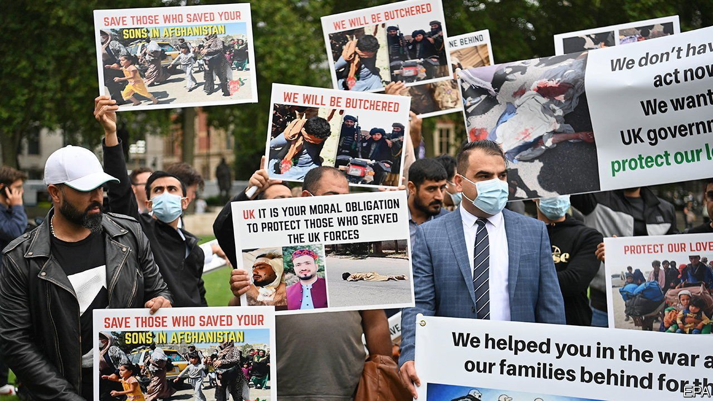

###### Left behind

# Boris Johnson promises to take in more Afghan refugees 

##### But some of the interpreters who served Britain’s army will not make it 

 

> Aug 19th 2021 

AT THE END of July, when the Taliban were beginning to make gains across Afghanistan, but had yet to capture any of the country’s main cities, dozens of retired British army officers wrote a letter to the government. Signed by five former chiefs of the defence staff and two former heads of the army, it complained that Britain’s programme for resettling Afghans who had previously worked for the British army was not up to the job. “Too many of our former interpreters have unnecessarily and unreasonably been rejected,” the signatories wrote. “If any of our former interpreters are murdered by the Taliban in the wake of our withdrawal, the dishonour would lay squarely at our nation’s feet.”

Barely two weeks later, the Taliban walked unopposed into Kabul, Afghanistan’s capital. The British government is still struggling with its responsibilities. On August 18th Parliament was recalled to debate the situation. Many MPs, including some Conservatives, were critical of the government, including its efforts to remove Afghans who worked for British troops. In the face of growing discontent, Boris Johnson, the prime minister, announced a new scheme to resettle 20,000 Afghans in Britain over the next five years. It did not halt the criticism.


Before British soldiers left in 2014, they employed Afghans as interpreters, drivers and the like (as did The Economist). Many more were hired as contractors by firms and charities working on behalf of the British government. From 2013 to June this year, just 1,400 families were settled in Britain. In April, as the American withdrawal gained pace, the government set up a scheme to resettle more. It has not made that much difference. By early August, only another 1,400 had moved. America has also struggled to issue visas to its former Afghan workers, but politicians there can at least blame a cumbersome legal process imposed by Congress. In Britain, government departments have more discretion, and ought to have been able to move faster.

There are 3,500 applications still being processed—and more are expected. The government reckons it can evacuate around 1,000 people a day. Sir Laurie Bristow, the British ambassador, has stayed at Kabul airport, signing visas personally. But for many people who would qualify, reaching the airport is now a challenge. Though troops—mostly from America but including several hundred Britons—are controlling the runways, the Taliban are guarding the entrances. And the evacuation will come to an end when American troops give up the airport, which is currently planned for August 31st. As Ben Wallace, the defence secretary, admitted on a radio show, “some people won’t get back.”

The government’s new scheme is unlikely to improve their lot. The “bespoke resettlement scheme” Mr Johnson announced is modelled on a similar one established for Syrian refugees. The details are so far hazy but that means it will probably select families from refugee camps in third countries, not from Afghanistan directly. Nor can Afghans expect reasonable treatment if they arrive any other way. Mr Johnson has made clear that his tough stance on asylum will not be lifted even in such difficult circumstances. The government will not, he stressed in the parliamentary debate, “be allowing people to come from Afghanistan to this country in an indiscriminate way.” The Taliban will now decide just how much dishonour is to lie at Britain’s feet. ■

