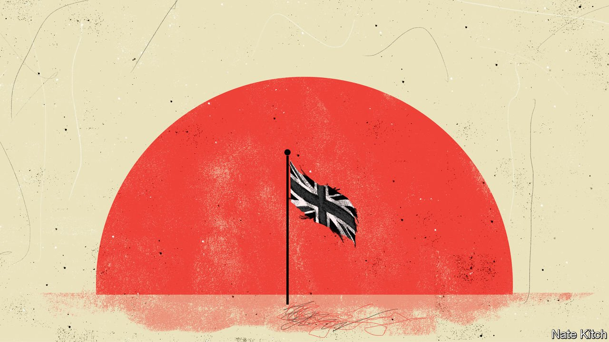

###### Bagehot

# For some MPs Afghanistan is personal as well as political 

##### The struggles of a group shaped by the conflict 

 

> Aug 21st 2021 

THE FIRST two decades of this century saw the rise of a new type of politician, or perhaps a new version of an old type of politician: young MPs shaped by one of the most difficult environments in the world, Afghanistan. Johnny Mercer, a former commando, gave his maiden speech about a friend who had died in his arms. Several of his new colleagues—Tom Tugendhat and James Heappey on the Conservative benches and Dan Jarvis and Clive Lewis on the Labour ones—had also fought on the ground.

Others were involved in different ways. Rory Stewart spent a month-and-a-half walking across Afghanistan in 2002 and later established a charity that works there, the Turquoise Mountain Foundation, which seeks to create arts-and-crafts jobs. Tobias Ellwood visited the country repeatedly after his brother was killed by an offshoot of al-Qaeda. The Russians, who had their own problems in the region in the 1980s, call such survivors “Afgantsy”.


A special parliamentary debate on August 18th saw the veterans loud in their condemnation of the West’s “humiliation”, “shame” and “betrayal”. In a riveting speech, met with rare applause, Mr Tugendhat talked about struggling with “anger, grief and rage”. Messrs Mercer and Jarvis emphasised the country’s obligations both to the Afghan people and British veterans. The only member of the group with a good word for Joe Biden is the one who works for the government. As armed-forces minister, Mr Heappey tweeted that “we either had to leave or fully re-engage to fight again. A decision had to be made.”

Most of these Afgantsy entered into politics because of their experiences in the country. Mr Tugendhat says his politics are “an extension of his military experience”. Mr Stewart explains that everything he has “tried to do is about bringing the lessons of Afghanistan into politics”. Mr Mercer gravitated to politics because he was searching for what he had found in the army: a chance to serve something greater than himself. He had never taken any interest before, but within a few months of leaving the army he was fighting a long-shot election in the previously safe Labour seat of Plymouth Moor View. The first vote he ever cast was for himself.

Mr Mercer’s move from firefights to parliamentary skirmishes is the most straightforward: he has devoted his energies to arguing for a better deal for veterans. Other stories are more subtle. Mr Stewart says he was converted to a “Burkean” conservatism in Afghanistan. He recoiled from policymaking abstractions, trying instead to work from the ground up. All of his political campaigns have involved long walks during which he collars passers-by to find out what they think. Mr Tugendhat’s commitment to fighting tyranny in Afghanistan has converted him into one of the Conservative Party’s leading China hawks; his experience of fighting alongside people from poorer backgrounds has turned him into one of the party’s most committed communitarians. “The reason I wanted to have a voice in our national debates”, he once told the Social Market Foundation, a think-tank, “was not because of what fighting taught me about other countries, but what serving alongside men and women from across our community taught me about our own country.”

Yet this reforming zeal has become bogged down in the quagmire of politics. On the Labour side, Mr Jarvis flirted with the idea of running for the leadership, only to see the job go to a veteran pacifist, Jeremy Corbyn. Mr Mercer has found politics frustrating and disappointing. He saw his dreams briefly come true—Boris Johnson created a new office for veterans’ affairs in 2019 and gave him a job helping to run it—only to then resign over the government’s refusal to rule out prosecuting British soldiers over historical allegations of abuse. Mr Stewart ran unsuccessfully against Mr Johnson for the leadership of the Conservatives; then, on failing to win, resigned from both the party and the House of Commons. He later launched an independent campaign for London mayor, only to withdraw because of the covid-19 pandemic. He is now preparing to move with his family to Jordan for two years to resume work with his charity. Mr Tugendhat has been elected by his fellow MPs to run the foreign-affairs select committee, but has been passed over for government jobs, having to wait on the backbenches while mediocrities such as Gavin Williamson, the education secretary, are given seats in the cabinet. The two Afghan veterans currently in the government (Mr Heappey and Leo Docherty, another defence minister) have not made much of a mark.

The graveyard of careers

Three years ago, Bagehot wrote a column expressing hope that a new generation of soldier-statespeople would bring seriousness and reconciliation to British politics. Patriotism was being cheapened by the Brexiteers and smeared by the Corbynistas. Britain had a surfeit of professional politicians whose experience of the world was limited to Oxbridge and think-tanks. But there were 50 or so MPs with military backgrounds, including the Afgantsy, now in the House of Commons. The soldier-statespeople had experienced life at its sharpest, and embodied the spirit of national service. Was it too much to hope that they would improve British political life?

Alas, it was. Westminster continues to be dominated by people who see politics as a game, rather than something that can make the difference between life and death. The sort of people who have always had a buffer to prevent them from failing (like Mr Johnson) or are more interested in day-to-day manoeuvring than policy outcomes (like Mr Williamson). Patriotism continues to be cheapened by flag-wavers who have never seen military action. And Britain continues to be the victim of a surreal gap between rhetoric and reality—basing its foreign policy on a proud boast about “global Britain”, only to then see 20 years of hard work in Afghanistan destroyed by the president of an increasingly self-obsessed and mercurial United States. ■

