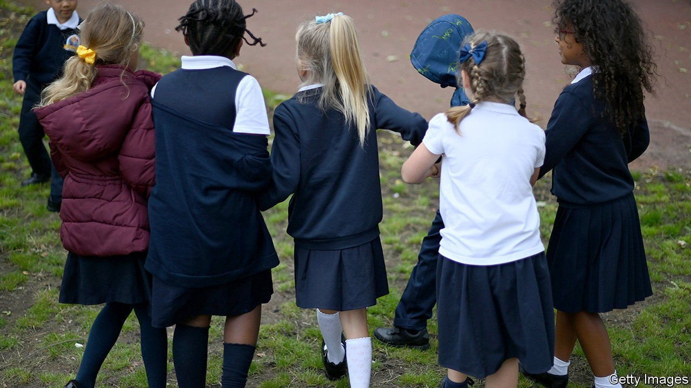
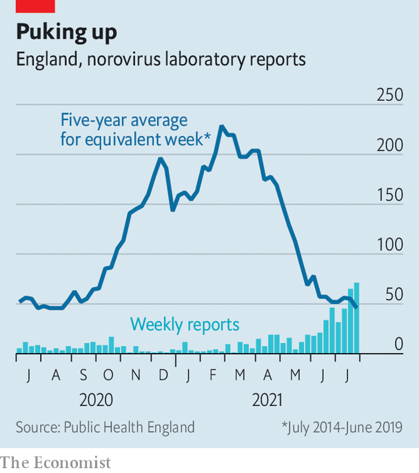

###### Nauseous nurseries

# Out of lockdown, Britons are discovering other viruses still exist 

##### The unwelcome return of norovirus 

 

> Aug 19th 2021 

THIS JUNE was the first time Ruby Bone, a 35-year-old who owns a design studio in south London, could let her son mix freely with other children. Born in May 2020, Raife had spent most of his life in lockdown. One afternoon, as they were heading to Ms Bone’s parents, he seemed a little unwell. Soon, “he was really, really sick”. Within a few days, Ms Bone’s husband was also throwing up. And then she was, too, and so were her parents. “It was really brutal,” she says. A doctor told her it was probably norovirus. After covid-19, “I didn’t even think about there being another virus out there,” says Ms Bone. It was just luck, she adds, that her 100-year-old grandmother did not catch it.

 


Raife’s was among the first cases of a wave of sickness that is now spreading across the country. According to data gathered by Public Health England, laboratory-confirmed cases of norovirus, which causes a sharp spell of illness including vomiting and diarrhoea, have been spiking since late May. Having been suppressed almost the entire way through the covid-19 pandemic, in the last week of July the number overtook the average for the previous five years (see chart).

The surge is causing particular problems in schools and nurseries, where most cases have so far originated. Unlike covid-19, which spreads through the air, norovirus is thought to spread via infected fluids on surfaces. Small children, who like to touch anything and everything, are therefore especially likely to pick it up and to spread it to family members. Though deeply unpleasant, as Ms Bone can attest, it is not deadly for most. But it can be to elderly or vulnerable people, and it can also force hospitals to shut wards in the case of an outbreak.

According to a recent study by researchers at the London School of Hygiene and Tropical Medicine and colleagues, the rapid spread is probably a result of lowered immunity, after a year in which most viruses were unable to leap easily from person to person. They estimate that if the amount of social contact increases to its pre-pandemic norm, then Britain could be in for a wave of norovirus this winter of twice the normal size. Other viruses that have been suppressed, such as flu, may also surge.

It is a worrying prospect. Despite the success of the country’s vaccination programme, Britain’s hospitals are already stretched, with more than 6,000 covid-19 patients and an unseasonal spike in other illnesses leaving precious little space for people with upset stomachs. Belatedly, government advice to stop the spread of covid-19 has switched from encouraging people to wash their hands to encouraging them to meet outdoors and to improve ventilation by opening windows. That is all well and good but if the norovirus trend continues, keeping some soap around may also prove smart.

