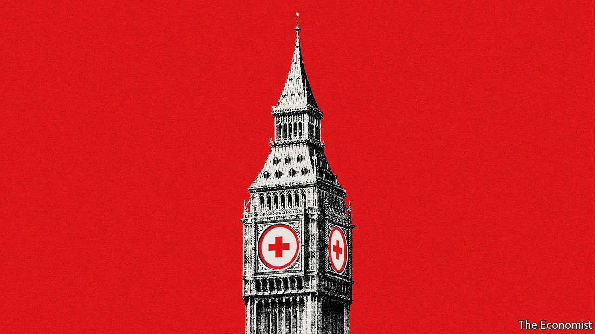

###### Ready for the next one

# Policymakers weigh up the future of Britain’s pandemic state 

##### As the threat from covid-19 recedes, what should stay? 

 

> Aug 21st 2021 

AS THE BODY count grew, Sharon Peacock, a microbiologist at the University of Cambridge, gathered a team to bid for state funding. Sir Patrick Vallance, Britain’s chief scientific adviser, quickly saw the potential of a new genetic-sequencing network, run by academics, and handed her £20m ($27m) in March 2020. Others did not. Some thought it “a massive stamp-collecting exercise,” which would prove of little real-world use, says Professor Peacock. Yet by the year’s end, Britain was doing more sequencing of the covid-19 genome than the rest of the world combined, allowing it to track mutations and work out their impact on transmission. Few people today call it a stamp-collecting exercise.

The British government believed its pandemic preparations were among the world’s best. That turned out to be nonsense, but the country’s scientists and officials have since built a virus-fighting infrastructure that is in many respects world-leading, including genetic sequencing, randomised trials, population surveys, vaccine purchasing and delivery. Even the much criticised test-and-trace system has improved. With vaccination sharply cutting deaths—the weekly average has so far peaked at around 90 during the current wave, compared with 1,200 in the previous one—policymakers are working out how to adapt these successes to a new era.


Some elements of the state’s response will be mothballed, no longer worth the cost. On August 16th the government reduced the bite of the test-and-trace app. Although it is believed to have prevented hundreds of thousands of cases, it infuriated businesses whose workers were told to isolate. Vaccinated Britons who are “pinged” will no longer be told to quarantine, only to take a PCR test. Lateral-flow tests, which are available free of charge, may not remain so. Elsewhere, though, it will be important not to dismantle the country’s new capabilities, says Jeremy Hunt, a former Tory health secretary.

Many of the best innovations are being sucked into the machinery of the state. The vaccine taskforce, set up beyond the civil service after early procurement failures, now sits within it. Genetic sequencing and test-and-trace will be part of a new health-protection outfit, the UK Health Security Agency (UKHSA). So, too, will the Joint Biosecurity Centre, set up to provide real-time analysis of the virus’s spread, and lauded by Sir Jeremy Farrar of the Wellcome Trust, a medical-research charity, as having “genuinely transformed” the pandemic response. Britain is also working with America to set up the Centre for Pandemic Preparedness, to oversee an international early-warning system.

The government has grand ambitions for the UKHSA, which starts work in October. Whereas its unloved predecessor, Public Health England (PHE), combined pandemic prevention with anti-obesity campaigns and the like, it will focus solely on external threats. Next time there is a pandemic—or a biological, chemical or nuclear attack—the agency will be at the heart of the response. Jenny Harries, its chief executive, wants to establish a routine genomic-sequencing system to target other infectious diseases, such as flu, and correctly diagnose people “who turn up with sniffles at the GP”, avoiding antibiotics where possible and thus reducing the risk of antimicrobial resistance.

Ministers also hope to replicate the conditions that boosted innovation during the pandemic. The RECOVERY trial, which uncovered two covid-19 treatments, saving millions of lives worldwide, would not have been viable without relaxing rules on signing up hospitals, says Sir Martin Landray, who ran it. Some 185 sites are now enrolled, and Sir Martin wants to use the study to look for influenza and respiratory-syncytial-virus treatments: “It would be a real shame if someone said, ‘Oh, wait a minute. You’re studying a slightly different virus, you’ve got to set it all up again.’”

The government’s life-sciences plan promises to make it simpler to run trials in the health service and to pare back regulation. Although Sir Martin approves, “it’s very hard shifting an entire system that’s been stuck in one particular way,” he warns. Others are less optimistic. Dominic Cummings, the prime minister’s erstwhile adviser, has written that he fears Downing Street’s attention is slipping. He argues that not enough is being done to accelerate vaccine development—which the government used its G7 presidency to advocate.

Attention will inevitably slip in the future. “It’s a bit of a golden opportunity for health protection,” says Dr Harries, “because the world can see what happens when there’s a health-protection incident. That will fade.” An earlier network of microbiology laboratories was wound down in 2003, when the public-health system was restructured. Then, when the covid-19 pandemic hit, such capacity had to be built from the ground up. Although the cost of genomic sequencing has fallen, permanent capacity will not come cheap. An early sign of the government’s commitment will arrive when it sets the UKHSA’s budget, which it is expected to do this autumn.

But money cannot solve all problems. The new agency will include outfits ranging from the excellent (the Joint Biosecurity Centre) to the less so (test-and-trace). At its heart, though, is the health-protection part of PHE. It struggled to co-ordinate local authorities, which are responsible for many public-health services, but over which it has little power. The new agency has beefed up the size of the teams responsible for liaising with councils, but the system is not being rewired. Meanwhile, both genetic sequencing and the vaccine taskforce benefited from being outside the remit of the state. Whether their excellence continues inside remains to be seen.

This is not the complete overhaul of the pandemic-prevention system for which some called in response to failures soon after covid-19 arrived. Dr Harries has experience responding to Ebola and a Novichok attack, but as deputy chief medical officer downplayed the importance of testing and argued against masks early on. She will now play a big part in drawing up a future pandemic playbook, and will need to get ahead of future crises. “They’re meant to be leading this global pathogen surveillance system,” sighs a scientist advising the government. “Well, as far as I can tell, they’re not doing anything.”

Even if the next disaster cannot be predicted, having good infrastructure can make all the difference. Ebola did not spread in Britain, but startled ministers established the UK Vaccines Research and Development Network in 2015 to identify worrying diseases and pay for work to render them less dangerous. Among its projects was the ChAdOx1 MERS vaccine by Oxford’s Jenner Institute. It was later adapted, becoming the ChAdOx1 nCOV-19 vaccine, or the Oxford-AstraZeneca jab. Tens of millions of Britons, and many more worldwide, have reason to be thankful. ■

Dig deeper

All our stories relating to the pandemic and the vaccines can be found on our . You can also find trackers showing ,  and the virus’s spread across  and .

