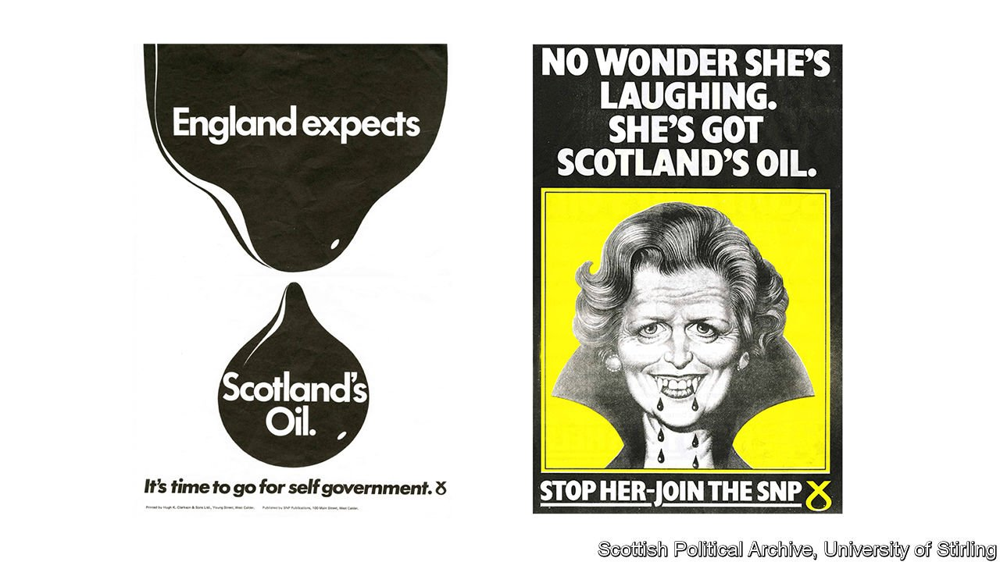
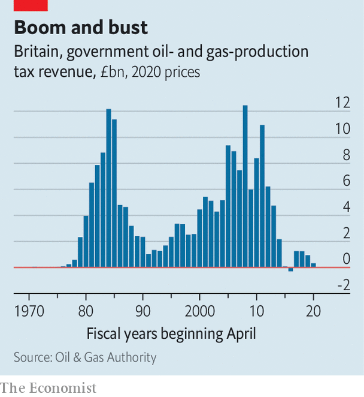

###### Slippery

# Scottish nationalism’s oil dilemma 

##### Once the black stuff fuelled separatism. These days it is a political headache 

 

> Aug 19th 2021 

FOR FIFTY years the Scottish National Party (SNP) ran on oil. The discovery of deposits beneath the North Sea in 1969 transformed Britain’s public finances, and ignited the separatist movement. Before the independence referendum of 2014, Alex Salmond, the party’s leader, told Scots that Westminster had frittered away their riches, pointing to Norway’s sovereign wealth fund as an example to follow. Even after defeat, Nicola Sturgeon, his successor, charmed oil executives, stressing their shared ambition to suck the seabed dry.

These days the party is conflicted. Increasingly, the young and idealistic independence movement is stirred by climate change, an issue to which it argues Britain’s Conservative government pays insufficient attention. Yet the Scottish government, normally attentive to the desires of its supporters, is struggling to wean itself off the black stuff. Nationalism’s animating cause, and for decades its fiscal panacea, is not easy to give up.


The tension has become a headache for Ms Sturgeon, Scotland’s first minister. Siccar Point Energy, a developer backed by the private-equity firms Blackstone and Bluewater, has applied for permission to start drilling in the Cambo oilfield off Shetland, which would fill as many as 800m barrels of oil over 25 years. The decision lies with the British government, a fact that would not normally stop Ms Sturgeon from expressing a view.

This time it has. On August 12th Ms Sturgeon wrote to Boris Johnson, the British prime minister, urging him to review whether drilling was compatible with the country’s emissions targets. Her own verdict was left unsaid. She acted after being confronted in her constituency by climate activists, to whom she also failed to give an answer. The SNP is negotiating a power-sharing agreement with the Scottish Green Party, which opposes the drilling and supports independence. If a deal is struck, it would cement a cross-party majority in the Scottish Parliament for a new referendum.

The SNP’s leadership knows the economics of resource nationalism are weaker than ever. Once, North Sea taxes went some way to fill the theoretical gap between public expenditure and tax receipts in an independent Scotland. Before the referendum, Mr Salmond declared the country to be on the cusp of a “second oil boom”, and said revenues could total £57bn ($90bn) in the next six years—nearly double the forecast of the British government’s fiscal watchdog.

 


Instead, they collapsed (see chart), repeatedly underperforming forecasts. Tax receipts came to just £414m last year, according to figures published on August 18th. Some 44bn barrels of oil (or the equivalent in gas) have been drawn from the ageing North Sea basin in the past 50 years; 10bn-20bn may remain, of which just 5bn have been confirmed or are reckoned to be extractable.

But the sector still employs tens of thousands of Scots, mostly in parliamentary seats in the north-east which teeter between the SNP and the pro-oil Conservatives. The nationalists’ ambition has been to replace oil jobs with new ones in green energy. Wind farms have proliferated, but they have been largely constructed abroad. A report by the Scottish Government’s “just-transition commission” published in March warned that the failure risks undermining the support of working-class Scots for decarbonisation.

Ms Sturgeon thus finds herself straddling two political constituencies, and two visions of independence: one green, the other black. She has happily opposed fracking and nuclear energy in Scotland, despite both strictly sitting under the control of the government in Westminster. On the Cambo oilfield, she is content for Mr Johnson to make the call. Once the SNP declared: “It’s Scotland’s oil.” These days it’s London’s problem. ■

