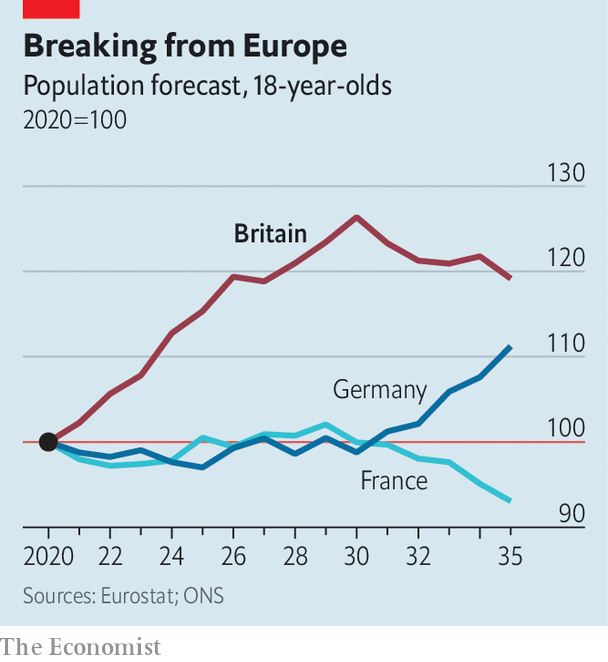

###### Demography

# The number of young adults in Britain is about to rise sharply 

##### The surge will change the country, while it lasts 

 

> Aug 21st 2021 

DEMOGRAPHY IS NOT quite destiny, but it certainly creates possibilities. A country with a large share of young adults will benefit from a demographic dividend if it can create jobs for them, as South Korea managed to in the 1980s and 1990s. Alternatively, it can become violent and unstable. The surge of military aggression in 19th-century Europe, the rise in homicide beginning in the 1960s and the Arab Spring a decade ago have all been blamed on youth bulges.

 


Now Britain has one, bucking the trend in the rich world. It is more subtle than those colossal demographic shifts, but is significant nonetheless. The number of 18-year-olds, which fell during the 2010s, has begun to rise sharply. Britain had 715,000 of them in 2020 and expects to have 893,000 in 2030—a 25% increase. It will take a decade for the number to begin to fall again (see chart).


A few other European countries, such as Ireland and Sweden, are going through similar gyrations. But Britain’s youth bulge is much more pronounced than the one in the EU as a whole (where the number of 18-year-olds will grow by a mere 2% between 2020 and 2030) or the one in America. It is product of historic demographic trends and immigration, and is likely to transform the country as it ages.

Britain’s post-war baby boom was odd. Although births jumped immediately after the war, the surge did not endure, as it did in America. Instead, the baby boom really got going in the second half of the 1950s. It peaked in 1964, when 876,000 babies were born. When that large cohort got around to having children, in the late 1980s and early 1990s, there was another baby boom, known as the “echo boom”. Many of the youngsters alive today are their children—an echo of the echo boom.

Economics and government policy increased the size of the bulge. Real wages rose from the mid-1990s until the financial crisis of 2008, persuading people they could afford to have children. So did immigration, points out David Coleman, a demographer at the University of Oxford. Britain opened its doors to eastern Europeans in 2004, earlier than most other European countries, and got lots of young workers who soon became parents. Between 1991 and 2011 the proportion of births in England and Wales to women born outside Britain doubled to 25%.

Schools have been the first to notice the bulge. There were more than 600,000 applications for secondary schools this year, 16% more than seven years ago. But because births declined after 2012, primary schools are quieter. The number of applicants is the lowest for seven years, meaning 92% of children this year got into their parents’ first-choice school. In east London, Tower Hamlets council is amalgamating primary schools, citing a “sudden fall” in applications.

Universities have been exposed to demographic fluctuations since 2015, when the government abolished caps on the number of students they were allowed to recruit. The youth bulge has just reached them. A combination of higher grades and a large cohort drove up applications from British 18-year-olds by 10% this year. That is nice for them and for the Unite Group, a student-housing firm with 74,000 beds in 173 buildings. Richard Smith, its chief executive, says that he has another 5,000 in the pipeline. But it worries the Treasury, which writes off many student loans.

As the swollen generation enters the workforce, businesses will benefit—beginning with the hospitality industry, which depends on young people. Bars, hotels and restaurants blame their present recruitment difficulties on Brexit, which has reduced the flow of immigrants from continental Europe, and on the indolence engendered by covid-19 lockdowns. But the decade-long decline in 18-year-olds has added to their difficulties. Hiring will soon become easier.

Over the longer term, the bulge of young adults will help support the welfare state. In 2020 Britain had 29 people aged 65 or over for every 100 people aged 15-64, which is almost exactly the same as the European average. The United Nations estimates that in 2050 the ratio in Britain will reach 43 per 100. That will cause difficulties, but Europe as a whole will be in a worse state, with 49 retirees for every 100 working-age people.

The impact on politics will be less pronounced, thinks Will Jennings, a political scientist at the University of Southampton. A rise in the number of young people should help the Labour Party, but only slightly, because the new voters will cluster in the cities and university towns where it is already strong. Besides, he says, it will act only as a “gentle brake” on the overall ageing of the electorate—a more powerful trend, which currently benefits the Conservatives.

Subtly, the bulge will also affect post-mortems on the earthquake that hit Britain in 2016. The big question about the country is how it will be affected by leaving the EU. The most satisfying answer will come not from looking at brief fluctuations in trade, investment and output but from comparing economies over many years. Anybody who attempts to do that must first answer a question, however. Should they control for Britain’s increasingly distinctive demography, and if so, how? ■

