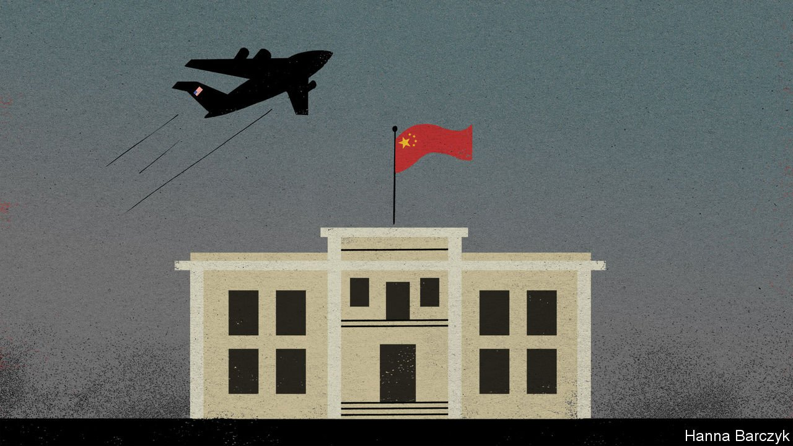

###### Chaguan

# China is happy to see America humbled in Afghanistan 

##### It does not love the Taliban, but is ready to do business with them 

 

> Aug 21st 2021 

ON THE AFTERNOON of August 17th, as scenes of horror unfolded around Kabul, China’s envoy to Afghanistan recorded the tranquil mood at his own embassy. The ambassador’s smartphone images, proudly shared on social media by Hu Xijin, the editor of a Communist Party tabloid, show the Chinese flag snapping crisply against a summer sky, and front doors guarded by nothing more menacing than a tall porcelain vase.

China’s propaganda machine is enjoying the fall of Afghanistan, at least for now. Chinese diplomats and state media have missed no chance to contrast the chaotic retreat of America and its allies with their own country’s continued welcome. For China, this is a chance to advance a model of foreign relations based on coldly weighed security and economic interests, rather than on lofty talk of building a better Afghanistan where girls may go to school. No bonds of affection or trust bind China and the Taliban. Instead, China has pursued a few narrowly defined goals during years of intensifying contacts with Taliban delegations. China’s list is headed by its desire for a stable Afghanistan, especially near that country’s short, mountainous border with China. Above all, China has made clear that in return for the international recognition that the Taliban crave, and (probably rather limited) investments in roads, mines and other infrastructure, they must deny any haven to exiles from China’s north-western region of Xinjiang, especially Uyghurs. China’s fear is that Uyghur militants, including some with combat experience in Syria or training in Iran, may hope to enter Xinjiang through Afghanistan. Though China’s iron-fisted rule in Xinjiang—featuring the demolition of mosques and the detention of Muslims to “cure” them of excessive piety—offends all that the Taliban purport to believe, the group needs China’s backing. Its political leader, Mullah Abdul Ghani Baradar, duly told China’s foreign minister on July 28th that the Taliban will never allow any force to use Afghan territory “to engage in acts detrimental to China”.


For months China has been calling on the Taliban to join a government of national unity and embrace a moderate version of Islam. In briefings with foreign diplomats in Beijing, Chinese officials now concede that they cannot know whether the Taliban’s promises to shun extremism will stick. But those same officials apply a favourite Chinese argument to Afghanistan’s rapid regime change: namely, that rulers can earn a mandate through material success and shows of broad public support, even if they never hold elections that impress snooty Westerners. Afghanistan fell without much of a fight, Chinese diplomats say in private. That suggests the Taliban enjoy a measure of legitimacy.


Praising the Taliban to the Chinese public carries risks. For a few hours a social media post by the People’s Daily, the party’s flagship newspaper, tested the line that the Taliban are former students from refugee camps who gained power with the support of the poor. The post went viral, but not in a good way, promoting complaints from netizens at warm words for a group known for brutalising women and beheading people in public. First the post was deleted, then online references to it censored.

Scolding America is more popular. In a telephone call, the foreign minister, Wang Yi, advised the secretary of state, Anthony Blinken, to reflect on the lesson of Afghanistan: that a foreign model cannot be “arbitrarily” applied to a country with a very different history and culture. Though America and China share an interest in Afghan stability, Mr Wang hinted that Chinese help might not come free. He grumbled that the Biden administration cannot seek to “contain and suppress China” then turn round and “hope for China’s co-operation”. The foreign ministry’s spokeswoman was still more scornful, calling America a destructive force that leaves “turbulence, division, broken families, deaths and other scars” wherever its troops tread.

State media boast that America is exposed as an unreliable ally. Special glee is reserved for the panic presumed to grip Taiwan, the democratic island that China claims as its own and that mainland leaders are sworn to invade, should it declare formal independence. Strikingly, when Taiwan’s prime minister, Su Tseng-chang, was asked whether his government, if attacked, might collapse like Afghanistan’s, he did not offer bluster about America showing up for sure. Instead, Mr Su drew another lesson from Afghanistan: that outsiders cannot save a country in internal disarray. Taiwan must believe it can defend itself, he told reporters in Taipei.


China, a reliably self-interested power

Zhu Yongbiao, director of the Centre for Afghanistan Studies at Lanzhou University, calls the blow to America’s global reputation the big upside for China. Against that, Mr Zhu concedes that China dislikes uncertainty. What is more, some Chinese scholars worry that by leaving Afghanistan, America has freed resources to focus on the Asia-Pacific region. Overall, he argues against exaggerating his country’s Afghan interests. Afghan chaos would be troublesome, but the Chinese border is not hard to lock down, and the West is the main target of Islamists, not China, he says. Mr Zhu scoffs at talk from Western analysts about Chinese ambitions to bind Afghanistan into its Belt and Road Initiative, a globe-spanning infrastructure scheme. “The economic gain would be small,” he ventures, noting that the BRI currently bypasses Afghanistan.

Chinese officials used to be defensive about their focus on economic development and stability. They asked others to respect China’s version of universal values, adapted to the conditions of a large, poor country. Now, they challenge the very notion of values-based foreign policies. Those may sound benign, it is argued, but are really cover for Westernisation, a disastrous folly. China is ready for a post-American age, guided by cold realism. That is a polarising moral to draw from Afghanistan’s agonies, that many in the West will find hard to welcome. These are polarising times.■

