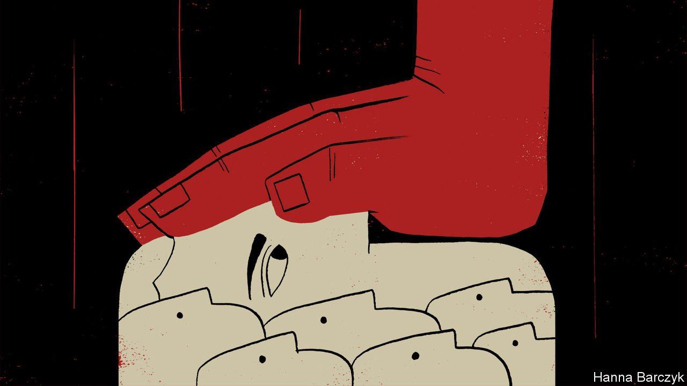

###### Teaching them a lesson

# Hong Kong’s government is crushing the city’s pro-democracy unions 

##### Workers will suffer 

 

> Aug 21st 2021 

ONCE CHINESE state media labelled the group a “poisonous tumour”, it was clear that its time was running out. Within hours of that slur, in late July, the Hong Kong Professional Teachers’ Union was disowned by the city’s education bureau. For ten days the union, which represents about 80% of the city’s teachers, sought a reprieve. It cut ties with pro-democracy groups and with Education International, a global umbrella group. It promised to dream up new ways for schools to promote Chinese culture. But in mid-August it said it would disband. The Communist Party had warned, through intermediaries, that its assets could be frozen and its leaders arrested if it did not, say local reports.

The organisation was the largest single-profession union in Hong Kong and a stalwart of the city’s pro-democracy movement. Its dissolution is a landmark in the party’s relentless dismantling of civil society. On August 15th the Civil Human Rights Front, a group that has organised many of the city’s biggest pro-democracy marches, also said it could no longer soldier on. In recent years fury at Hong Kong’s government had led to a surge of enthusiasm for organised labour. But one veteran activist says optimism has given way to “a sense of hopelessness, helplessness and fear”.


For years most unions in Hong Kong were affiliated with either the Communist Party or the Kuomintang, which fled mainland China for Taiwan in 1949. New ones loyal to neither party began to form in the 1970s. The teachers’ union was among the first of these. But organisations sympathetic to the Communist Party, such as the Hong Kong Federation of Trade Unions, an umbrella group for pro-government unions, have continued to dominate. They have done a poor job of fighting to improve workers’ rights in a city that has exceptionally powerful business lobbies.

Anti-government protests in 2019 brought hope of a fresh start. In August of that year workers took part in Hong Kong’s first general strike in half a century. Accountants, civil servants, engineers and IT workers started new unions. Bartenders, bus drivers and make-up artists did as well. The founders of these new groups were generally younger and better educated than those who had previously led the labour movement.

Their organisations were set up in solidarity with the pro-democracy movement and with the aim of helping stage further strikes. Some gained prominence during the pandemic. In February 2020 members of the Hospital Authority Employee Alliance, a newly founded union of medical workers, voted to stop work for a week in protest against the government’s decision to keep the borders with mainland China open, despite the spread of covid-19. Most Hong Kongers supported them.

The idea was also that new unions would come to influence politics directly. A share of seats in Hong Kong’s Legislative Council, known as Legco, are reserved for “functional” constituencies, namely business, professional and civil-society groups with a pro-government bias. Three of these seats are returned by a vote among the unions. In theory registering lots of new organisations gives the pro-democracy camp a bigger say.

In May 2021 Hong Kong’s labour minister said there had been a “tsunami-like” surge in applications to register new labour groups. He said there had been more than 4,000 such requests in 2020—at least 20 times more than in any of the previous four years—and that his department had so far processed only about a fifth of them. A few hundred of these unions are being founded to improve workers’ rights, say labour activists. Many of the rest result from campaigns run by both the pro-democracy and pro-government blocs of the labour movement to increase their voter base.

The party is hitting back. Winnie Yu, a nurse who led the strike by medical staff, was arrested in January (she had participated in a primary ballot to choose pro-democracy candidates for legislative elections, which the authorities claimed was illegal). Carole Ng of the Hong Kong Confederation of Trade Unions, which encompasses some 90 independent unions, faces the same charge. Her colleague Lee Cheuk-yan is serving 20 months in jail for participating in protests in 2019. Many think their confederation will become the party’s next target, now that the teachers’ union has put down its chalk.

In July police rounded up five members of a union for speech therapists, saying that children’s books they had published, which featured sheep defending their village from wolves, were “seditious”. Leaders of some other unions have resigned their posts, fearful of arrest. Members are drifting away. Meanwhile new rules prevent unions from having a vote in Legco elections for three years after they are founded (it used to be 12 months). In any case, an overhaul of the electoral system that was made final in May has in effect barred critics of the Communist Party from seeking election.

Activists think trade unions will increasingly resemble the hollow ones in mainland China, which exist primarily to help the party keep a lid on dissent. Workers will suffer. Hong Kong is one of the most unequal places in the world. The minimum wage is about $4.80 an hour. The poor earn more than in mainland China but Oxfam, an anti-poverty charity, says a “living wage” in Hong Kong would be $7. Hong Kongers endure some of the world’s longest working hours, and also have to pay its highest rents.

Many observers think teachers will now be encouraged to join the Federation of Education Workers, a pro-Beijing organisation that is not formally registered as a union. Educators could certainly use support. A survey in May found one-fifth of school teachers planned to retire or find a new career. Over 70% of them complained of “increased political pressure”. The education bureau has lately expelled several teachers from the profession, reportedly because of their involvement in protest movements. Many more have received formal warnings. The Federation of Education Workers says it may be able to help teachers accused of misconduct—but only if they first admit their mistakes. ■

