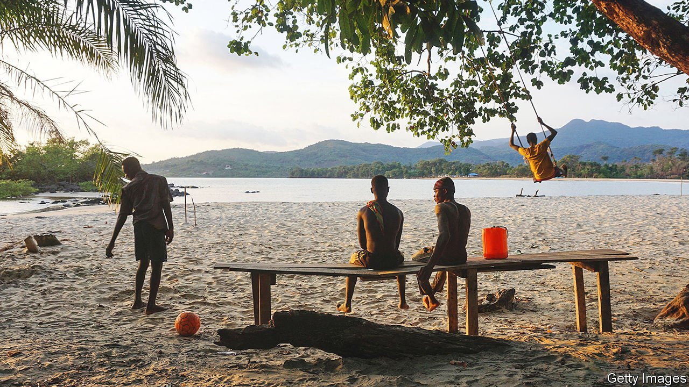

###### Hook, line and sinker?

# In Sierra Leone, a Chinese port-building plan raises ire 

##### Many locals think China is hoovering up their country’s rich natural resources 

 

> Aug 19th 2021 

TITO GBANDEWA sweeps a hand across a beach in Sierra Leone that many call one of the most beautiful in west Africa. The bark of nearby trees can cure a child’s cough, locals say. The nectar of its palms comes “from God to man”. In the distance, a boy fishes for grouper; children play in the surf. If the government has its way, all this will be gone, says Mr Gbandewa, who runs a small resort on the beach. In its place will be a Chinese-funded fishing harbour covering 100 hectares.

The project at Black Johnson beach (pictured) is officially described as part of China’s Belt and Road Initiative, a global infrastructure scheme. Sierra Leone is one of the world’s poorest countries and has long needed a harbour for deep-sea fishing boats. China has agreed to give it $55m to help build the port. But when details leaked out in May they were not well received. Many Sierra Leoneans fret that the project may threaten the surrounding rainforest and the country’s fledgling tourism industry. Some fear the development will include a fishmeal plant, which could make the environmental impact all the worse. The government says this is untrue.


Even some fisherfolk were alarmed. Around the world, including along the west African coast, China is buying fleets and building ports to help satisfy its own demand for fish. “They are creating a closed loop for their own supply chains,” says Whitley Saumweber of the Centre for Strategic and International Studies, an American think-tank. The impact is evident in west African waters, which are among the most overfished in the world. Chinese boats account for three-quarters of Sierra Leone’s modern fishing fleet. Reports abound that they catch more fish than they are legally allowed to. Locals who depend on fish for protein cannot compete. A single high-tech trawler can catch five times as much in a day as a small village fleet can in a year. Controlling ports, or having preferential access to them, makes it easier to bypass international restrictions on overfishing.

Belt and Road projects are often murky. For the one in Black Johnson, no environmental assessment has been carried out. Landowners have not been consulted. Tourism is crucial to Sierra Leone’s long-term plan for achieving middle-income status, known as “the Agenda for Prosperity”. But a tourism official says her ministry was not informed of the plan either. The fisheries ministry says bidding for the construction contract will be open and transparent. Chinese media suggest that two Chinese firms have already secured the deal.

It may smell fishy, but “there is no Chinese conspiracy,” says Jinghan Zeng, who follows China-Africa relations at Lancaster University in Britain. Chinese investors are still relatively new to Africa, so they make mistakes, he suggests. China’s state-owned firms often act like Western companies: pursuing profit without much regard for their home country’s diplomatic interests. In asking China for the grant to build the port, Sierra Leone was not necessarily making itself subservient: the country had previously axed plans to build an airport with $318m of Chinese loans.

Many Sierra Leoneans would disagree. They believe that China is hoovering up their country’s rich natural resources (timber, minerals and fish) with no regard for locals—and with the complicity of corrupt officials. In a survey last year, only 41% of respondents said China’s influence on their country was positive. That was down from 55% in 2015, and was a lower share than in all but one of the 18 African countries covered by the study. The mood in Sierra Leone has also soured since June, when a video published on social media showed a Chinese worker attacking a Sierra Leonean miner.

China is also trying other ways of winning public support. Since the pandemic hit, it has doled out 240,000 vaccines to Sierra Leone—more than the 192,000 provided by COVAX, a global vaccine-sharing scheme. In July the two countries celebrated 50 years of diplomatic relations; ahead of the anniversary, China’s ambassador said his country was keen to help boost tourism. If that involves attracting big-spending Chinese visitors, Black Johnson’s stunning sands may not be on offer. ■

