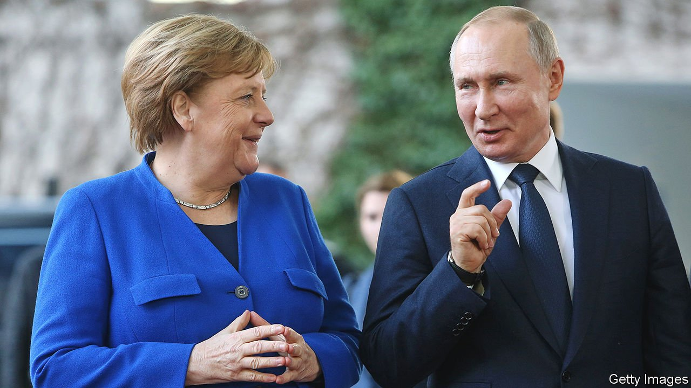

###### From “flawless” to lawless

# Angela Merkel bids Vladimir Putin a disillusioned farewell 

##### The German chancellor deeply distrusts her Russian counterpart 

 

> Aug 21st 2021 

WHEN ANGELA MERKEL took over as Germany’s chancellor in 2005 Western leaders had high hopes that Russia would progress from semi-authoritarian regime to liberal democracy. Four years earlier Vladimir Putin had declared in a speech in German to the Bundestag, “Russia is a friendly-minded European country.” The then chancellor, Gerhard Schröder, Mrs Merkel’s predecessor, became so chummy with Mr Putin that shortly before leaving office he approved the construction of a gas pipeline from Russia to Germany crossing the Baltic Sea. Russia provided 40% of Germany’s gas. Germany was about to become Russia’s largest trading partner.

Sixteen years later, each country’s expectation of the other has failed to materialise. Germany had imagined a more liberal Russia; Russia had hoped that Germany would help convince Europe to treat Russia as an equal, and to create a free-trade zone from Lisbon to Vladivostok. On August 20th Mrs Merkel will travel to Moscow during the last weeks of her chancellorship to say goodbye to a leader whom she has come to distrust deeply. Mr Putin will bid farewell to his most important interlocutor among Western leaders.


The debacle in Afghanistan will be high on their list, as well as the nearly finished gas pipeline, which America’s Congress fiercely opposes. Now known as Nord Stream 2, it has become a stain on Mrs Merkel’s legacy. The chancellor is normally adept at balancing competing interests, but she utterly underestimated how much the pipeline, which she supported mainly to appease the business lobby and her Social Democratic coalition partners, would upset America and Ukraine. They fear it will isolate Ukraine (which also stands to lose lucrative transit fees) and make Europe even more dependent on Russian gas. After her stop in Moscow Mrs Merkel will travel to Kyiv for talks with Volodymyr Zelensky, the Ukrainian president.

Pundits differ on whether the turning-point in German-Russian relations was Mr Putin’s annexation of Crimea in 2014, the Kremlin-directed hacking of the Bundestag’s computer systems in 2015 or the killing in 2019 of a Chechen dissident in a Berlin park. Yet all agree that the poisoning last year of Alexei Navalny, the Kremlin’s leading opponent, was the last straw. “German-Russia relations are at the lowest point since the end of the cold war, and they will deteriorate further still,” says Stefan Meister of the DGAP, a think-tank in Berlin. Mr Putin uses the conflict with the West to drum up nationalist support for his regime. He will become even more authoritarian, predicts Mr Meister, by increasing pressure on Russian media and nongovernmental organisations.

According to Andrey Kortunov, the head of the Russian International Affairs Council, a foreign-affairs think-tank in Moscow, the Russian government has no desire to increase tensions with Germany. It expects continuity with Mrs Merkel’s policies if Armin Laschet, her party’s candidate, becomes the next chancellor. If, however, the next chancellor is the Greens’ Annalena Baerbock, who opposes Nord Stream 2, Germany looks likely to get tougher with Russia. Either way, long gone are the too-cosy days of Mr Schröder, who once called Mr Putin a “flawless democrat”, and who is now the chairman of both Rosneft, Russia’s state-controlled oil company, and Nord Stream 2. ■

