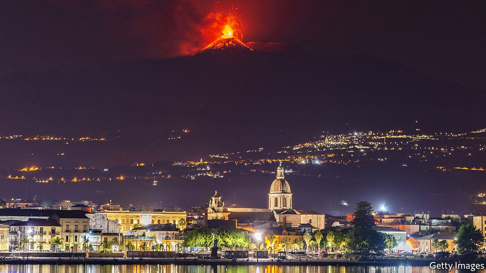

###### Sicilian defence

# Europe’s tenth-largest cities: Catania, in Etna’s shadow 

##### Our occasional series finds hopes for rebirth in what was once the Milan of the south 

 

> Aug 19th 2021 

IN THE VAST street market that tumbles out of Piazza Stesicoro you can find amulets and antiques, pirated CDs, trousers, tuna and horsemeat. Immigrant tailors bend over sewing machines fixed to little tables so that people who buy clothes can get them altered on the spot. Half a young sheep dangles from a hook.

Italy’s tenth-largest city pulsates with life, yet sits beneath a louring reminder of mortality: Mount Etna, which has been spewing fire, smoke and lava since February. Europe’s largest volcano is evidence that Catania is in one of Italy’s most seismically unpredictable areas. In 1693 an earthquake virtually destroyed the city, killing two-thirds of its inhabitants.


That showed catanesi that disaster can lead to rebirth, says Marella Ferrera, a fashion designer. Catania’s broad avenues, its stately piazzas and magnificent, noble residences all date from the years following the earthquake.

This understanding is acutely relevant today. Italy is poised to be the single biggest recipient of the EU’s €750bn ($884bn) covid-19 recovery plan, Next Generation EU (NGEU). A hefty share of the cash is destined for the south, in an effort to close the gap with Italy’s richer north. NGEU will help finance infrastructure projects, including an extension of Catania’s metro to the airport. That should encourage tourists to spend more time sightseeing in the vibrant but down-at-heel city before or after visiting the beaches of eastern Sicily. Catania’s mayor, Salvo Pogliese of the hard-right Brothers of Italy, says the number of apartments used to accommodate tourists shot up in the three years before the pandemic, from 200 to 1,390.

Catania also stands to benefit if the pandemic encourages more remote working. Now that location matters less, people will be freer to enjoy the pleasures and relatively low cost of living in cities such as Catania. That at least is the conviction behind Isola (Island), a privately funded project to create 1,000 square metres of co-working space in part of the sprawling Palazzo Biscari.

The city is building on better foundations than exist in other parts of the mezzogiorno. Catania has an ancient university, founded in 1434, and an entrepreneurial middle class. In the economic boom of the 1950s and 1960s it became known as the “Milan of the South”. Few call it that nowadays. But the city turns out antibiotics for Pfizer, microchips for ST Microelectronics, an Italo-French multinational, and solar panels for Enel Green Power. And Catania has reportedly been chosen as the site of a new microchip-production facility for which €750m has been earmarked in Italy’s national-recovery plan.

Mr Pogliese is eager to promote enterprise. He has introduced a scheme whereby companies seeking construction permits can pay €2,000 to guarantee a response within 48 hours. That mirrors what is happening at the national level, where Mario Draghi’s government has introduced legislation to reduce the bureaucratic delays that stifle Italy’s economic growth.

Yet clearing away red tape raises an issue as menacing as Etna. On Sicily, much of the delay is caused by checks to ascertain whether, for example, tender bids are from companies linked to the Mafia. A lot of Italians who hold no brief for organised crime feel development can no longer be held hostage to fears of Mafia infiltration.

Claudio Fava, a left-wing politician, takes a different view. His father was killed by the Mafia. Mr Fava says organised crime remains deeply rooted in poor areas of Catania such as San Cristoforo, a decrepit inner-city quarter, and Librino, a suburb of soulless tower blocks. These places are not as violent as they used to be. But that, he says, is because the Mafia is increasingly focused on white-collar crime, including the securing of public tenders. It is particularly active in renewable energy—on which a lot of the NGEU money will be spent. “Anyone who thinks that the Mafia has lost its ability to penetrate the legitimate economy is either being ingenuous or devious,” he says. ■

