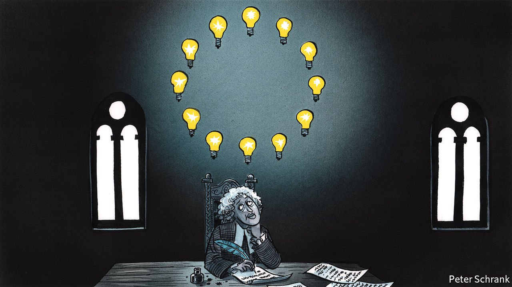

###### Charlemagne

# How an 18th-century French abbot still sways the EU 

##### Saint-Pierre described a union of nations in clunky prose to make Brussels proud 

 

> Aug 19th 2021 

THE “Project for Bringing About Perpetual Peace in Europe” did not receive rave reviews when published in 1713. Voltaire thought the author, the Abbot of Saint-Pierre, was deluded. “The peace…will no more be realised than among elephants, rhinoceroses, wolves, or dogs,” he wrote. Showing less understanding of nature than of politics, he added: “Carnivorous animals will always tear one another to pieces at the first opportunity.”

Over the years, European intellectuals queued up to give the work a kicking. Immanuel Kant poked holes in it. Rousseau labelled it naive. Frederick II of Prussia declared the plan “very practicable: all it lacks to be successful is the consent of all Europe and a few other such small details.” Yet skip forward three centuries and the plan is, more or less, in place as the European Union.


To understand the EU today, one could usefully turn to the works of the abbot, now largely forgotten outside academia. Glance between Saint-Pierre’s 18th-century blueprint and the EU as it stands, and they are strikingly similar. In both cases, European countries agree to club together, submit themselves to the rulings of a court and devise rules by means of a continental parliament. Both have a rotating presidency. Contributions to the budget are based on wealth. Saint-Pierre even called his scheme a “European union”. Only Saint-Pierre’s inclusion of long-defunct countries such as Venice and Savoy gives the game away.

At the heart of both schemes is a radical idea. Under Saint-Pierre’s plan, sovereigns would submit to a superior law, enforced by independent supranational institutions. Coming more than half a century before Americans kicked out the British and the French started decapitating kings, this was radical. Without such a principle, argued Saint-Pierre, sovereigns would be stuck in a Hobbesian nightmare of constant struggle. Judging by the intervening three centuries of on-and-off wars and failed attempts to unify the continent spelled out in Shane Weller’s recent “The idea of Europe: A Critical History”, Saint-Pierre was on to something.

The rule of law has made the latest crack at European integration a success. Whether mighty Germany or tiny Malta, all members of the modern EU agree to subject themselves to the rulings of the European Court of Justice and laws put forward by the European Commission. Fundamentally, it is down to trust, or rather the lack of it. One country does not always believe another will abide by the rules, so other institutions must enforce them. This makes recent challenges to the supremacy of EU law from judges in Germany and Poland, who have questioned the authority of the ECJ, so dangerous. What was true in 1713 is even more true now. Without a clear legal basis, things can fall apart.

Saint-Pierre had a subtle understanding of sovereignty, which still applies today. From one perspective, most enthusiastically put forward by Brexiters, pooling sovereignty weakens it. For Saint-Pierre, true sovereignty involved no longer fearing one’s neighbours, since insecurity makes independence an illusion. The same logic is at work in the EU. Small countries appreciate the EU because it protects them from the excesses of big countries. Take the euro. Rather than suffer monetary whiplash from a decision by the Bundesbank, small countries can give up their monetary independence in exchange for a modest say in a bigger project. Saint-Pierre knew that sacrificing sovereignty is sometimes the only way of saving it.

Likewise, criticism of the abbot’s plan holds true for the EU today. Rousseau was almost right when he argued that Saint-Pierre’s idea could come about only through violent means. It took two world wars for European leaders to abandon their objections to such a scheme. In the EU, things still go forward when things go wrong. A pandemic and the biggest recession in the club’s history were needed for Germany and other holdouts to agree to the club issuing common debt.

Even Saint-Pierre’s failings feel appropriate for an ancestor of the EU. The abbot was a clunky writer, on a par with Brussels’s best bloviators. Where Americans have “life, liberty and the pursuit of happiness”, the EU has “concrete achievements which first create a de facto solidarity”. In an age when Europe’s fiercest intellects were forging the Enlightenment, Saint-Pierre was decidedly second-rate, littering his argument with factual errors. One academic labelled him a “genius of European idiocy”.

But the abbot fits squarely into the EU’s long tradition of grey men and women who ultimately succeed despite having first been written off. Jacques Delors was initially seen as a patsy of Paris and Bonn, yet managed to become the commission’s most illustrious leader, leaving behind the single market, a path to monetary union and a natty flag. Ursula von der Leyen, the current German chief of the commission, ended up in Brussels only after her domestic career had gone off track. Yet the commission has quietly become more powerful on her watch. Second-tier types have a way of succeeding in the EU.

Forgotten forebears

Given Saint-Pierre’s foresight, it is at first odd that he is so little known. Unfortunately, there is a tendency in Brussels to trace the history of European integration no further back than the bloodless, legal approach that took hold after 1945, points out Luuk van Middelaar, a Dutch historian. Attempts before that—whether in the shape of Napoleon or Hitler charging across Europe or more diplomatic efforts—are played down. This makes the history neater, but less honest. For a club that is obsessed with notions of “European values” this is disappointing. The EU is always keen to claim such noble ideals as democracy and the rule of law as distinctly European traits. But imperialism and totalitarianism have just as long a pedigree on the continent. Rather than deal with that history, the EU overlooks it. Forgetting about Saint-Pierre’s efforts is one consequence of that tendency to brush over a messy past. ■

