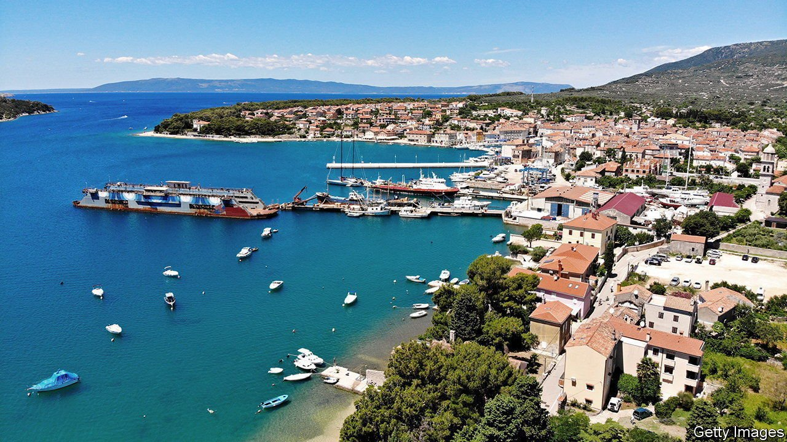

###### Sink or swim

# Should relics of the Habsburg navy be restored? 

##### A Croatian island is rent in twain 

 

> Aug 21st 2021 

TOURISTS IN CRES, a pretty town on the rock-strewn Croatian island of the same name, have no idea what they are looking at. In the distance is a wall of steel, painted white and blue. Many locals hate it. They think this relic of their ship-repairing past is a piece of junk that spoils the view and should be scrapped. But wait! Is it not the last maritime object afloat from the Austro-Hungarian Imperial and Royal Navy, which vanished with its empire in 1918? Preserve it, say some historians. Sink it, say less romantic islanders.

Built in 1913, the floating dry dock repaired submarines in the first world war. After 1918 Italy’s navy used it, since a chunk of territory along the north-east strip of the Adriatic had become Italian. After the second world war, when Cres became part of Yugoslavia, the dock repaired naval vessels until it was sold as a commercial asset in 1984. In 1991 the island became part of independent Croatia. Its dry dock closed down last year.


Bojana Vuksanovic, a local architect, thinks it an extraordinary piece of maritime history. In a nearby palace she has an exhibition, showing how it could become a museum and performance space. Fancy new marinas, she says, are wiping out local history. But many locals say Cres has more pressing needs than restoring the dock. “I’m a fisherman,” says a shipyard worker. “We should tow it out to sea and sink it—to attract the fish.”

Elsewhere in Croatia royalty bows before the more recent communist past. The Galeb, a ship on which Yugoslavia’s Marshal Tito cruised the world, is being restored to its former glory. But the Habsburgs’ yacht, which took Franz Ferdinand, heir to the throne, on his last naval voyage en route to his assassination in Sarajevo in 1914, lay forlorn near Split. Officials in left-leaning Rijeka, the Galeb’s home port, secured €5m ($5.8m) of EU funds topped up with Croatian money to preserve the boat. No such luck for Franz Ferdinand’s vessel. It has sunk.

