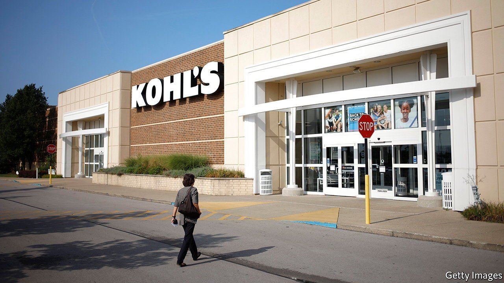
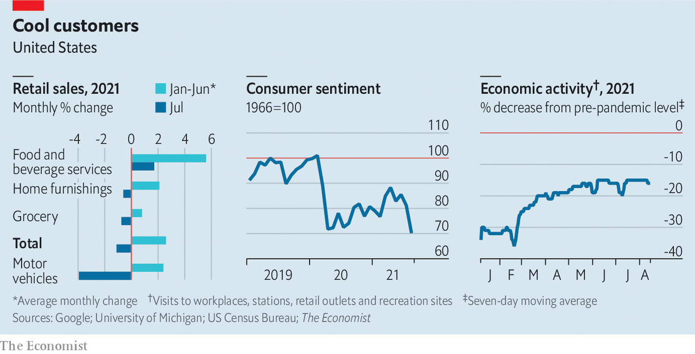

###### The dog days of summer

# American consumers become warier 

##### Could the Delta variant be denting confidence? 

 

> Aug 19th 2021 

 


FLUSH with stimulus cash and a hoard of savings, consumers have powered America’s recovery. But the fervour is cooling. Figures released on August 17th showed that retail spending shrank by 1% in July compared with the previous month. Some of that could reflect disruption to the supply of cars. But caution about covid-19 may be playing a role too. Sentiment has fallen steeply, and mobility indicators have stalled.■


