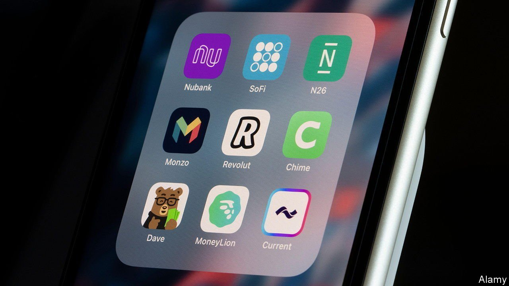

###### New tricks

# Can neobanks’ popularity outlast the pandemic? 

##### The fintechs saw a surge of interest during lockdown. Now to turn a profit 

 

> Aug 21st 2021 

“WHAT DO YOU think we are, a bank?” scoffs an advertisement for Current, a neobank, on New York’s subway. It goes on to paint bank branches, poor customer service and overdraft fees as relics. The company is one of a hundred-odd “neobanks” vying to shake up retail banking in America, and which have exploded in size and number in the past year. On August 13th Chime, the country’s biggest neobank, raised a round of funding that valued it at $25bn—about the same as America’s 13th largest listed bank.

As the advert suggests, most neobanks are not technically banks. They offer debit cards and online banking services through snazzy apps. But instead of obtaining a banking charter, which is onerous, costly and time-consuming, they often negotiate partnerships with small regional lenders, which hold and insure customers’ deposits. The startups pride themselves on their speed: they typically deposit paycheques a few days faster than large banks and, thanks to simpler identity checks, open accounts in minutes, even for customers with poor credit histories.


Unlike conventional banks, which also earn money on overdraft and other fees, neobanks make most if not all of their money from interchange fees on debit-card transactions. Regulators allow small banks to charge at least double the interchange fees that large ones do; the benefit is passed on to the fintechs that latch on to them. In exchange, partner banks grow the pool of deposits against which they lend.

The pandemic partly explains neobanks’ success. Lockdowns nudged customers to open online bank accounts from home. That neobanks cashed stimulus cheques swiftly probably also helped. According to Apptopia, a data provider, the number of monthly active users of neobank apps doubled between July 2019 and June 2021, while those of traditional banking apps shrank a little. Top neobanks boasted nearly 20m downloads in the first half of this year alone.

The underlying drivers of the boom, though, are long-standing. Many customers have been poorly served by the financial system, if not shut out altogether. (The Federal Reserve estimates that one in five adults were either unbanked or underbanked in 2018.) The larger neobanks aspire to help those living paycheque to paycheque; others cater to specific underserved groups such as migrants. Social purpose aside, this makes business sense: such customers tend to save little and spend often, which suits the interchange-fee business, explains Max Flötotto of McKinsey, a consultancy. Jarad Fisher of Dave, another neobank, hopes that, once in the system, customers “graduate” to using more profitable services. To that end, his firm helps consumers find gig work.

Optimists say incumbent banks will struggle to compete with neobanks, given the difficulty of modernising technology and customer service, and the risk of cannibalising their fee-based business. Banks’ shareholders may also be less keen on innovation than venture capitalists, says Scott Galloway of New York University.

But the challengers face hurdles, too. A business based on interchange fees is only viable if costs are contained and volumes are high. All neobanks must bleed cash building trust with the hesitant underbanked and luring the already banked with freebies, but life is especially hard for the small ones that chase narrow customer segments. Chime aside, few firms turn a profit. Surveys suggest that a small fraction of bank customers regard the fintechs as their primary bank. Meanwhile, giants such as Google and Walmart are starting to dabble in digital finance.

Many neobanks have realised that, if they are to achieve sustained profitability, they have to get into lending, says Jeff Tijssen of Bain, another consultancy. A few firms are launching credit cards and other lending products, venturing further into the terrain of conventional banks. Some might be swallowed up by the incumbents. Others might even, eventually, seek charters of their own. ■


