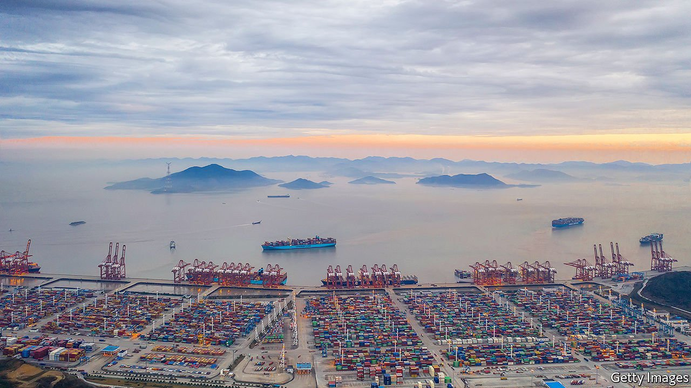
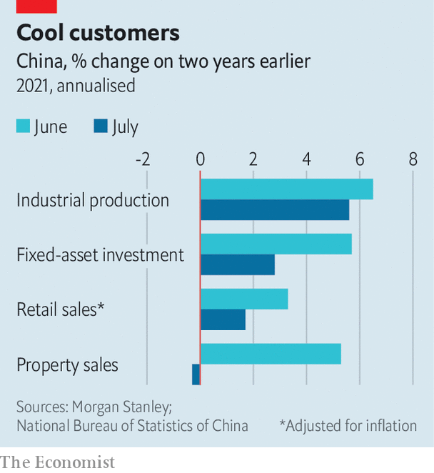

###### Delta neutral

# China’s Delta dilemma 

##### Efforts to battle the virus compound an economic slowdown 

 

> Aug 19th 2021 

TRADE HAS flowed through the port of Ningbo on China’s east coast since the Tang Dynasty in the 8th century. After the first opium war ended in 1842, it was one of five points of entry forcibly opened to foreign merchants. And in the first half of this year the port (which merged with neighbouring Zhoushan port in 2015) handled more tonnes of cargo than anywhere else in the world. A tour group of 80 students recently spent three days admiring the free-trade zone and the port’s “hardcore” power, as Ningbo city government put it.

But on August 11th activity at one of the port’s busiest terminals came to an abrupt halt. A 34-year-old dockworker, who had come into contact with visiting crews, was diagnosed with the  despite having received two shots of the Sinovac vaccine. That solitary infection was all it took for the government to shut down operations and consign 254 of his close contacts (and a further 396 of their contacts) to quarantine.


The case is revealing in three ways. It illustrates once more how hard it is . It demonstrates how hard China will, yet again, nonetheless try to do just that. And it shows how widely around the world this struggle will be felt. The terminal shutdown follows a similar closure at Yantian port on China’s south coast in May (as well as disruptions wrought by last month’s typhoon In-Fa). It now takes about 70 days for ocean freight to travel from its point of origin in China to its final destination in America, compared with 47 last August, according to Freightos, a digital freight marketplace. Some experts worry that the shipping delays and the prospect of future shutdowns may even disrupt the West’s Christmas shopping.

The port infection is part of an outbreak that was first discovered on July 20th at Nanjing airport. By August 10th it had spread across a dozen provinces. Unlike other countries, which are learning to live with Delta, China has imposed a hardcore combination of widespread testing and uncompromising quarantines. Anyone who tests positive is whisked to hospital, even if they are free of symptoms. Anyone judged to have come into close contact with them (based on mobile-phone data and other indicators) is quarantined, as are close contacts of these contacts. By August 10th China had quarantined 50,808 people, more than 20 for every active confirmed case. The government has discouraged inessential travel between cities and provinces. And two of the worst-hit cities, Nanjing and Zhengzhou, have postponed the start of the school year. According to a gauge of lockdowns devised by Goldman Sachs, a bank, China’s restrictions are now as tight as they were in April 2020.

The impact of the restrictions is already showing up in high-frequency data. Airports were operating at only 38% of their capacity on August 12th, according to Flight Master, an online-travel platform. And the median amount of traffic congestion in the 12 cities most affected by the outbreak has fallen 12% below its pre-pandemic norm, according to Ernan Cui of Gavekal Dragonomics, a research firm.

This immobilisation will add to an economic slowdown that was already under way. Industrial production, retail sales, investment and property sales were all weaker than expected in July (see chart), partly because the government is trying to curb steelmaking to preserve the environment, and housing speculation to preserve financial stability. Ting Lu of Nomura, another bank, expects GDP to be only 0.3% higher this quarter than last. He has cut his forecast for growth this year from 8.9% to 8.2%, which might warrant further easing from China’s central bank, even as housing curbs remain.

 


China’s slowdown is moving financial markets at home—the CSI300 index of large Chinese stocks has fallen by 4% since August 10th—and worldwide. The price of iron ore has slumped by 21% since the end of last month, and the price of copper has fallen by more than 5%. China’s tough stance will also prevent any revival of travel to other countries. That is bad news for places like Thailand, which relied on Chinese visitors for almost 30% of its tourist receipts before the pandemic.

China’s fight against Delta will be costly. But it is also proving successful. New local infections (excluding imported cases) dropped to just six on August 16th. The outbreak has started to narrow in scope as well as scale: 134 neighbourhoods still remain at risk, by the government‘s reckoning, down from 224 on August 10th.

China has both an unusual ability to contain Delta outbreaks and a strong incentive to do so. It lacks two of the characteristics that have allowed other countries to tolerate an otherwise disturbing rate of Delta infections. Relatively few of China’s people have caught covid-19 in the past. As a consequence, few have any natural immunity to the disease. And although a respectable percentage of the population have received two jabs (over 55%, according to the government) China’s vaccines appear less effective than Western versions. The share of China’s population that enjoys some kind of immunity is lower than India’s or even Indonesia’s, according to Goldman Sachs, even though its vaccination rate is far higher. If China were to drop its defences and tolerate the infection rates common in Europe and America, the number of people suffering from severe illness could rise to alarming levels.

China is unusually good at fighting Delta. And it needs to be. Having failed to fail against previous waves of the disease, it is now obliged to succeed again.

For more expert analysis of the biggest stories in economics, business and markets, , our weekly newsletter.

An early version of this article was published online on August 17th 2021

