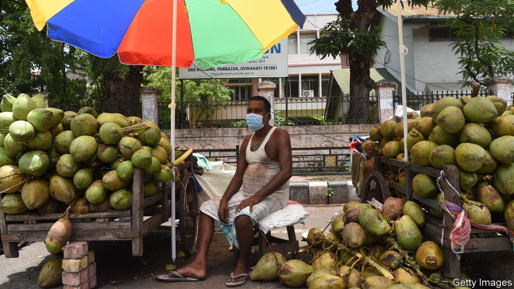
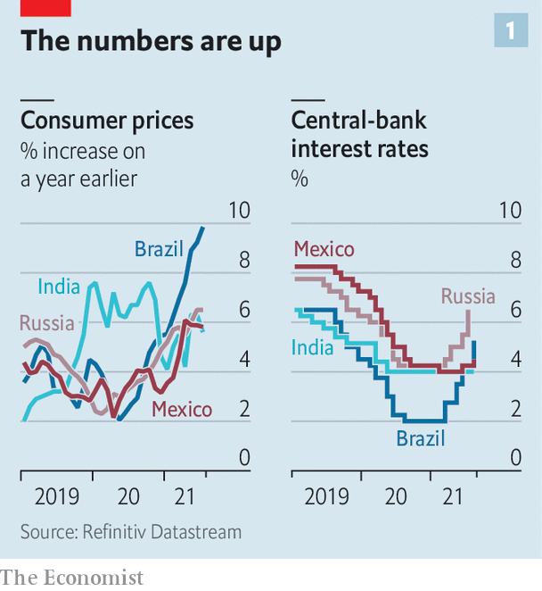
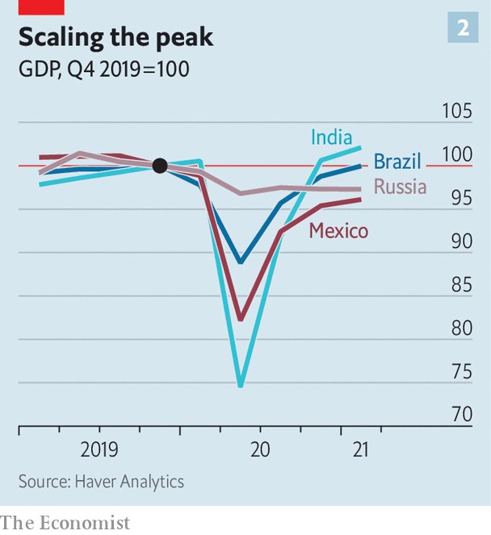
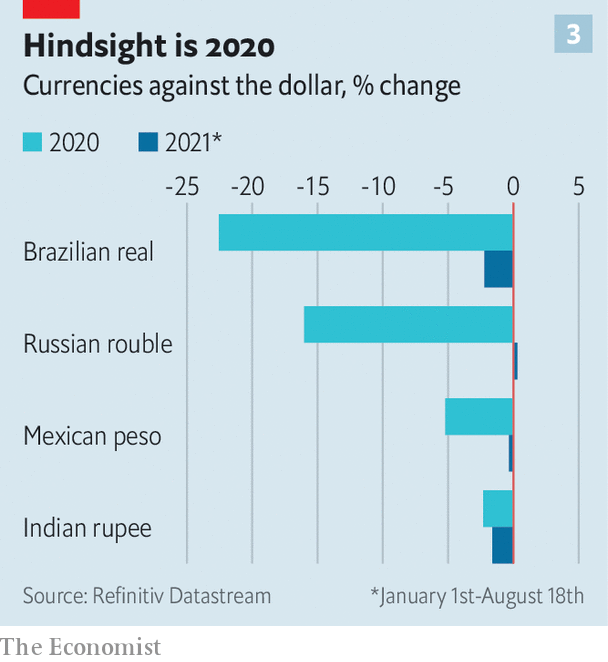

###### Feeling the heat

# Emerging-market policymakers grapple with rising inflation 

##### Some central banks are raising interest rates. But that could slow economic recovery 

 

> Aug 21st 2021 

IT HAS BEEN a long few months for the emerging world. Punishing temperatures—July was the hottest month on record worldwide, according to a recent analysis—fanned fires on Turkey’s Mediterranean shores and scorched Russia’s wheat fields. Covid-19 rages across countries with low vaccination rates. Just 24% of Brazilians, 9% of Indians and 7% of South Africans are double-jabbed. On top of everything else, inflation is running hot, too.

Soaring food and energy prices have pushed inflation to uncomfortably high levels. In Brazil consumer prices are 9% higher than they were a year ago (see chart), more than twice the central bank’s target. In Russia inflation is 6.5%, well above the central bank’s aim of 4%. Inflation in India, which had been high in 2020, rose above 6% this summer—north of the Reserve Bank’s target range. Policymakers in poorer countries have navigated a fraught path this year. The outbreak of high prices lays another severe test at their feet.

 


Growth has mostly resumed, despite the continued ravages of covid-19. In parts of the emerging world, such as India, output has already regained its pre-pandemic level. In others, such as Russia, it is expected to do so by the end of the year. Soaring prices for oil, metals and agricultural products have been a boon for commodity exporters. But recoveries have been frustratingly uneven. Better times for export industries have not always translated into broader labour-market recovery. Business is booming in Brazil’s mining towns, for instance, but the unemployment rate across the country, at 14.6%, has scarcely declined from its pandemic peak.


That, in turn, has placed pressure on governments to extend or even increase spending on relief programmes. Economic growth is boosting tax revenues in many countries, improving the public finances that were battered by covid-19. Still, fiscal deficits remain large. A decision in June to expand grain handouts means that India’s central government is likely to borrow more than the 6.8% of GDP expected in the budget for the 2022 fiscal year. Brazil, which borrowed an eye-watering 13.4% of GDP last year, has extended its emergency cash transfers. Chile and Colombia, which limited their borrowing to a modest 7% of GDP in 2020 last year, are planning to borrow about as much or more this year, according to the Institute of International Finance, a bankers’ group.

When you combine more money flowing through the economy with supply disruptions, though, the result is inflationary pressure. Emerging-market central bankers, like their rich-world counterparts, argue that high inflation is merely temporary. But, unlike their advanced-economy peers, some have not felt comfortable enough to wait and see. They have more recent experience of bouts of high inflation, and doubt that public expectations of low inflation are as firmly anchored as in rich countries. They have thus moved forcefully to rein in inflation. Brazil’s central bank raised interest rates by a full percentage point on August 4th, on top of three increases of 0.75 percentage points each since March. The Central Bank of Russia also announced a full-point rise on July 23rd, also its fourth of the year. Mexico and Peru raised interest rates on August 12th. Other central banks that have held fire are expected to tighten in coming months.

 


This determination to curb inflation may have kept foreign investors interested. Early this year some economists worried that a roaring recovery in America and the prospect of higher interest rates there could lead to a rush of money out of emerging economies: an echo of the “taper tantrum” of 2013, when the Federal Reserve began normalising monetary policy after the financial crisis. An uptick in American Treasury yields in February and March this year was accompanied by a slowdown in portfolio flows to emerging markets, seemingly presaging worse to come.

That has not materialised, however, and not only because Treasury yields have dropped back from their spring highs. It also reflects a more robust policy framework in emerging economies, and greater resilience to market swings. In recent decades they have built up foreign-exchange reserves and limited their dependence on foreign-currency debt. Most survived a severe squeeze in March 2020, when panicked investors rushed to havens and emerging markets’ currencies tumbled, with minimal economic damage.

By comparison, recent exchange-rate wobbles have been modest, which has limited the extent to which higher import prices add to inflationary pressure. So far this year the Brazilian real and the Indian rupee have weakened against the dollar by about 2%. (The real sank by nearly a quarter last year, and by about 20% during the ructions of 2013.) Vigilant central banks probably helped keep investors from growing skittish.

 


But higher interest rates are tough medicine at home. Large increases pose a risk to growth. Slower growth in turn hurts the public coffers, even as higher interest rates raise governments’ borrowing costs. Among the large emerging economies, the risk of a crisis is perhaps most palpable in Brazil, where a loss of confidence in the public finances contributed to a deep recession in 2015 and 2016. If the fiscal risk premium that bond-buyers demand continues to rise, then the government may soon face a terrible choice between slashing spending while unemployment remains high and a full-blown fiscal crisis. Indeed, on August 12th Roberto Campos Neto, the head of Brazil’s central bank, fretted that markets were beginning to perceive a “fiscal deterioration” that could jeopardise economic recovery.

Recent woes only make the inflation problem starker—and at risk of spilling over to other countries. A severe drought in Brazil has reduced the capacity of its hydroelectric plants and sent energy prices soaring. It also threatens the production of export crops like coffee, leading to reduced supplies and higher prices. Low levels of the Paraná river have forced firms like Vale, a mining company, to reduce the loads of iron ore being carried on barges, causing global shortages. Russia’s government is taxing wheat shipments abroad, contributing to higher prices worldwide.

The fever could break later in the year, as bottlenecks ease and as demand from America and China cools a little. Yet there is also a risk of new disruptions: fresh outbreaks of covid-19, more natural disasters or social unrest, perhaps related to higher food prices. And for exporters like Brazil, softer commodity prices bring their own problems, such as a tumbling currency and an economic slowdown. A turn for the worse in one country could sour investor sentiment towards other places. Emerging markets have handled the economic strains of the past 18 months with fortitude. But a break in the heat cannot come soon enough. ■


