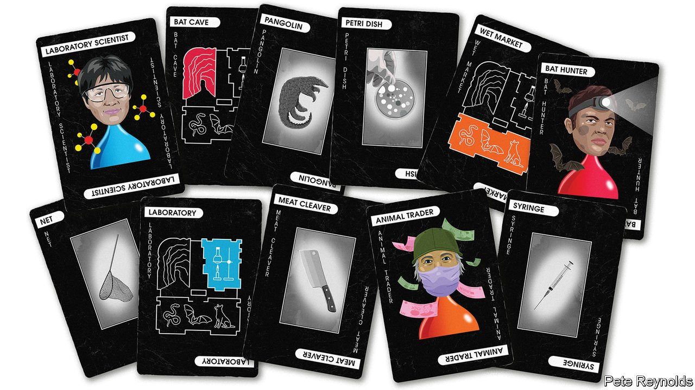
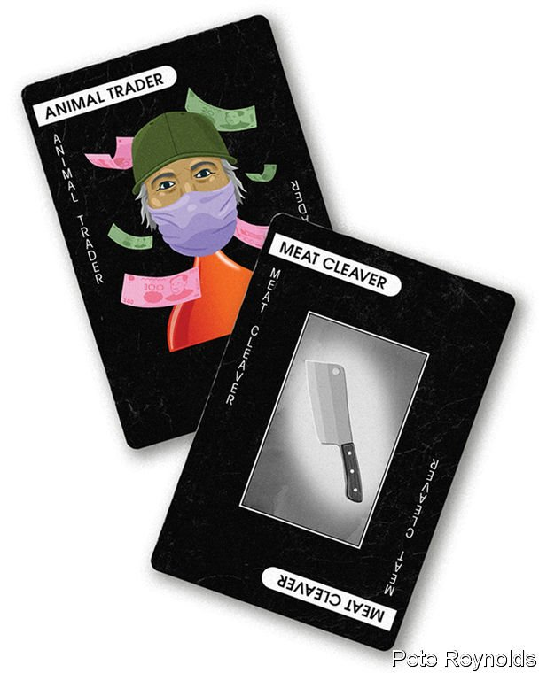

###### Origins and obfuscation

# The world needs a proper investigation into how covid-19 started 

##### China, though, is not keen 

 

> Aug 21st 2021 

“THE VIRUS MYSTERY”, broadcast on August 12th, drew uncommonly wide attention for a Danish television documentary. That was because it featured Peter Ben Embarek, an expert on food security and zoonotic diseases, casting doubt on the conclusions of a “joint study” on the origins of the covid-19 pandemic carried out earlier this year under the auspices of the World Health Organisation (WHO). Dr Ben Embarek was the senior WHO figure who went to China as part of that study.

In March the joint study reported that it was “extremely unlikely” that the virus had been released in a laboratory accident. Dr Ben Embarek revealed that this conclusion did not come from a balanced assessment of all the relevant evidence but from a steadfast refusal by the Chinese members of the joint study to support anything stronger. Indeed they only allowed even that minimal assessment on the condition that the report did not call for further investigation into the question. He also pointed out that the idea that the point of spillover was someone collecting bat samples for research purposes belongs in the “likely” basket, along with other human interactions with wild bats.


Problems in the joint study had long been clear. Within the WHO one source describes it as “riddled with compromises and sloppiness”. Tedros Adhanom Ghebreyesus, the WHO’s director-general, was uneasy about the way it was carried out. He pushed back at the marginalisation of the lab-leak hypothesis, particularly when the final report was released in March. He has since called for further investigations into it, as well as into other possibilities.

The further unravelling of the joint study matters because, more than a year and a half after the covid-19 outbreak in Wuhan, a city in Hubei, was first recognised as the work of a new pathogen, there has been nothing like a thorough international investigation of how that pathogen, SARS-CoV-2, got into humans and spread round the world. The pandemic’s death toll stands at 9m-18m, according to a model which The Economist has built on the basis of excess-mortality reports and other indicators. The question of how it started matters both for the relatives of the dead and for those who wish to prevent such an outbreak happening again. China’s efforts to stop the world from answering it are both shabby and, to an extent, self-defeating. The more the truth seems hidden, the more it seems suspicious.

Earnest calls for an international investigation into the origins of covid-19 began in April 2020, voiced most clearly by Scott Morrison, the prime minister of Australia. The next month the World Health Assembly, the gathering of government representatives which serves as the WHO’s decision-making body, passed a motion calling for a study into the origins of the pandemic. But in order to be acceptable to China—which had reacted furiously to Mr Morrison’s original suggestion—the work was set up as a joint research project between two teams of scientists, one Chinese, one international. And it was to be based on “scientific and collaborative field missions”, rather than a targeted and forensic inquiry into all the relevant circumstances.

The terms of reference, which were subsequently negotiated behind closed doors, allowed the Chinese hosts to frame the joint study’s work in the way which best suited them. The study was set up to build on pre-existing Chinese research, not to delve into unvetted data. Investigating the laboratories that had been working with coronaviruses like SARS-CoV-2 in Wuhan was not part of its terms of reference.

After a lot of wrangling, the international team got to China in January this year. Data about the first reported covid-19 cases, those from December 2019, were one subject of friction with their hosts. The Chinese had reported 174 such cases, but would not share the underlying data on which those reports were based. Hearing that these vital data were not being made available worried Dr Tedros enough that he lobbied the Chinese government for access. The authorities declined, citing concerns over citizens’ privacy. It could have been anonymised.

Elsewhere the team appears to have been knowingly misled. Take, for example, the live-animal trade at the Huanan seafood and wildlife market, a site associated with a number of Wuhan’s earliest recorded cases of covid-19. In its final report, the study group took at face value claims there was no credible evidence that live mammals were sold there in 2019. A lot of eyewitness accounts gainsay that; so does a study published in Scientific Reports, a journal, this summer.

One report and no more

The Scientific Reports paper found that 18 species of mammal had been for sale in Wuhan between May 2017 and November 2019; gunshot wounds and trapping injuries suggested that almost a third of them were taken from the wild. Although the paper was published only recently, it was submitted to the journal in October 2020. Chinese law requires that all covid-19 research be reviewed by the government before it is sent to a journal. Some Chinese authorities would have known of its contents before the team arrived.

The market is not the only way for animals and the pathogens they carry to get into Wuhan. The horseshoe bats in which the closest wild relatives to SARS-CoV-2 have been found do not live anywhere near the city, but the two laboratories there that were known to have engaged in coronavirus research received samples from bat caves around the country. The joint-study team was not allowed to investigate the procedures around, or documentation of, this research; when it visited the laboratories the team was shown presentations on safety procedures but no more.

 


When the researchers left Wuhan the WHO’s Geneva headquarters told them that their report needed to be laid out scientifically and could express dissenting opinions; the international members and the Chinese members did not have to reach a consensus. However, according to sources within the WHO, the team felt committed to producing a joint report with their Chinese counterparts. Dr Tedros was so unhappy with what finally emerged from the processes that he nobbled the report as it left the starting blocks, rejecting its contention that the possibility of a lab leak needed no further investigation.

On May 26th President Joe Biden ordered America’s intelligence services to report on the pandemic’s origins in 90 days (time will be up on August 24th). When he and his fellow G7 leaders met in June they joined in calling for a timely, transparent and science-based follow-up study. On July 16th Dr Tedros laid out the next steps which the WHO wants to see taken. They include further work on the Wuhan animal markets, studies of early cases and audits of local laboratories.

The Chinese government has reacted angrily to the idea of further studies on its territory. Zeng Yixin, the vice-minister of China’s National Health Commission, said he was “shocked” by the plan to investigate a lab leak, saying it was “impossible” to accept. According to the Global Times, a tub-thumping tabloid run by the Communist Party, 55 countries have sent written complaints about the proposal for further investigations to the WHO. Dr Tedros, elected director-general with China’s support in 2017 and derided by President Donald Trump as China’s puppet, may now face a Chinese-backed candidate when he looks for reappointment later this year.

In the absence of any hope that China will co-operate, sources of data beyond its control have become increasingly important. One area of interest is genetic sequence data. Another is early cases exported from China.

See what you did there

An online open-source-intelligence group which calls itself DRASTIC has been scouring sequencing data to get insight into activities at the Wuhan Institute of Virology (WIV). When researchers publish sequences they typically post the raw data from which those sequences are assembled to public databases such as the sequence-read archive at America’s National Centre for Biotechnology Information. Contamination events in the laboratory, or within sequencing machines themselves, mean these data sometimes contain sequences not meant to be there. In theory such evidence could reveal nefarious goings-on.

Such work, while promising, takes a lot of resources. If you have the sort of supercomputers available to America’s national labs it gets easier. Gilles Demaneuf, a data scientist who works with DRASTIC, says he has a hunch the American intelligence community’s 90-day study is working the same angle. It is conceivable that the intelligence services might have been able to filch raw sequence reads directly from Chinese sequencing machines, thus picking up even more data.

Sequencing data only offers a way forward if the virus did indeed leak out of a lab, something which remains a possibility but which is far from proven. The study of early cases should be useful whatever route it took; the closer you get to understanding the when and where of the crossing-over from animal to human, the easier it should be to learn something of the how.

On the basis of information provided by China the joint study concluded it was unlikely for there to have been any substantial transmission in Wuhan before December 2019. That is unlikely to be true. For one thing the South China Morning Post, a newspaper based in Hong Kong, obtained government documents in 2020 which showed one to five new cases a day in Wuhan from November 17th 2019 onwards. Further evidence has strengthened the possibility that the virus could have been in circulation much earlier than the official story allows.

 


That circulation need not have been limited to China. There is increasing evidence suggesting early infections elsewhere. These cases would have been exported from China; no virologists doubt that Hubei was where the virus got going within humans. But if circulation in Hubei goes back further than thought and cannot be directly assessed through studies there, the presence of cases elsewhere offers an alternative way to get an idea of the timing. If a specific travel link were identified, that might help identify a group in Hubei which was infected early on.

A recent study of blood samples from 9,144 adults in 12 different regions of France found seven which contained antibodies against SARS-CoV-2, all of them taken in November 2019. An Italian lung-cancer screening trial has found samples taken in September 2019 which seem to contain anti-SARS-CoV-2 antibodies. Another antibody study suggests the virus was circulating at a low level in northern Italy at the same time, notably in Lombardy, a region which has close connections to Wuhan through the garment trade, and saw Europe’s first major outbreak of covid-19 in March 2020.

Antibody tests can give false positives. In a preprint published on August 6th by the Lancet, researchers in Lombardy reported on looking instead for SARS-CoV-2 gene sequences. Examining 289 swabs and urine tests taken from people who had presented with a rash as far back as the second half of 2019, they found SARS-CoV-2 sequences in 13, the earliest of which was taken on September 12th.

Sudhir Kumar of Temple University in Philadelphia says the Lancet preprint is likely to inspire other investigators to go back and look at retrospective hospital samples. That should help his own research into the origins of the virus. A family tree Dr Kumar and his colleagues have built from vast numbers of published SARS-CoV-2 genomes allows them to predict the sequence of the progenitor virus from which they are all descended. This sequence differs in three places from that found in the earliest samples taken from patients in Wuhan, meaning there had been enough spread for a certain amount of viral mutation to take place before December. Dr Kumar says that an analysis of the Lombardy sequences suggests that the timeline for the origin of the virus in China might now extend back to the late summer.

More systematic international research into these early infections and their circumstances is needed. Maria Van Kerkhove, head of emerging diseases and zoonoses at the WHO, suggests it may be possible to prioritise work in areas which saw the earliest outbreaks in America, France, Italy and Spain. “I think the floodgates will open one day,” says Dr Kumar.

A last line of light

An early origin would fit with the timeline that lab-leak proponents tend to favour. Early this August, the minority Republican staff on the House foreign-affairs committee released an 84-page report arguing this case. It makes much of a small but deadly disease outbreak which took place at an abandoned copper mine in Yunnan in 2012. As DRASTIC showed last year, a virus studied at WIV which had been taken from that mine is the closest known relative to SARS-CoV-2.

The report sees importance in the removal, on September 12th 2019, of a database containing details of sequences and samples from the WIV. This is read as the beginning of a cover-up, and thus as the point when the authorities first knew something had gone amiss, arguing for a leak in late August or early September. The WIV says it was a response to cyber-attacks.

A leak is not the only research-related possibility. The first person infected could have been someone employed by the WIV or another lab to collect bats and samples—the prospect to which Dr Ben Embarek pointed in his television interview. And it is important to remember that some other form of spillover outside the lab, either directly from a bat or by way of some other species, may well be to blame.

China clearly does not want lab-leaks investigated; but that does not mean it knows one happened. It is also being misleading about Huanan market, denying access to early-case data and obfuscating in various other non-lab-leak-specific ways. The most obvious explanation is that it does not really want any definitive answer to the question. An unsanitary market, a reckless bat-catcher or a hapless spelunker would not be as bad in terms of blame as a source in a government laboratory. But any definite answer to the origin question probably leaves China looking bad, unless it can find a way to blame someone else. To that end China has called for an investigation of Fort Detrick in Maryland, historically the home of American bioweapons research; state media regularly publish speculations about its involvement.

The possibility of spillover from wild bats does not have to be studied in China. Yunnan abuts onto Laos, Myanmar and Vietnam, and bats are not sticklers in matters of territory. Samples taken outside China could provide a good idea of viral diversity the other side of the border. A thorough evaluation of the existing farm-animal and wildlife trade in the region would also be useful.

Yet there is an inherent risk in such work that needs to be considered. Efforts to uncover the roots of covid-19 by seeking out a natural reservoir of something very like SARS-CoV-2 would, by definition, expose people to the sort of risks that can seed pandemics. Ironically, the very possibility of a lab leak raises questions about how most safely to pursue investigations into other possibilities.

 


When he called for further inquiries in July, Dr Tedros also announced the formation of a new permanent group of pathogen hunters, the International Scientific Advisory Group for Origins of Novel Pathogens (SAGO). He wants it to organise further studies of SARS-CoV-2. But it will also need to look at more general questions for the future—such as how to be sure that, come what may, studies of pathogens involved in past disease outbreaks never create further outbreaks of their own. ■

Dig deeper

All our stories relating to the pandemic and the vaccines can be found on our . You can also find trackers showing ,  and the virus’s spread across  and .

