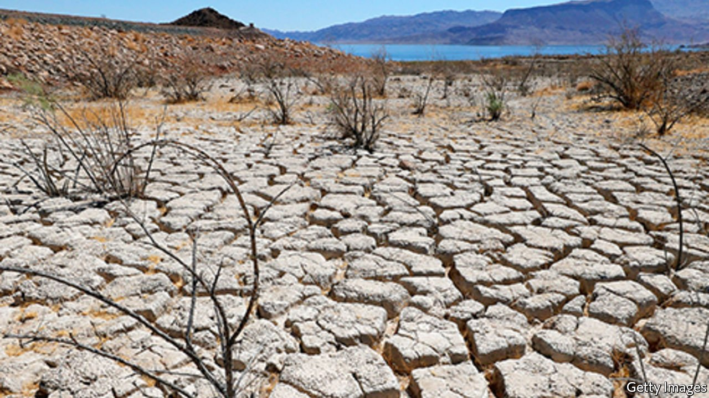

###### Megadry

# Americans are moving to a region plagued by a 22-year drought 

##### Pricing water properly would help ease shortages 

 

> Aug 21st 2021 

“WEATHER WAS the ultimate arbiter in the American West,” Marc Reisner wrote in “Cadillac Desert”, his book on water there, published in 1986. Reisner was musing about the great white winter of 1886, which devastated cattle ranching, and the blistering drought that followed. But 135 years later the sentiment still rings true. The West is in the grip of a 22-year  that is the second-worst in the past 1,200 years.

The effects are being felt across the West. Lake Mead, the largest reservoir in the United States, is at its lowest level since it was first filled in the 1930s. Water levels are so low that the Bureau of Reclamation, an agency of the Interior Department, declared the first-ever water shortage on the Colorado River on August 16th. Reduced snowpack in the Rocky Mountains and Sierra Nevadas has turned forests into tinderboxes and . Joshua trees, though native to the desert, are parched and dying.


The West, a mountainous region where three deserts meet, is used to drought. Building cities in a place that can resemble Mars required deft engineering and lots of capital. However, the “Millennium Drought'’ is different from its predecessors. Drought refers to a dry period that eventually ends. But now two longer-term trends are at work: climate change, which is making the region hotter and drier, and population growth, as Americans move west. Most of the fastest-growing cities are in the south-west. Phoenix, which gets 18cm (7 inches) of rain a year, grew faster than any other big US city over the past decade.

What can be done? Proper pricing would help. Few things are more precious in the West than water, yet local governments and utilities provide it cheaply. That removes incentives to conserve, aside from neighbourly commitment to the public good. A system that charged people, farms and firms commensurate with their use, and was subject to the laws of supply and demand, would encourage conservation among the more profligate users and prevent costs rocketing for those who may not be able to afford the price of water on an open market—such as poor rural towns or Native American tribes. Such a system would need better metering. If Americans could use an app to see how much water they used, they would find that they consumed more per person than the inhabitants of any other big country.

For pricing to work, the West’s outdated system of water rights will need an overhaul. Agriculture slurps up 70% of the water that flows down the Colorado River, which serves 40m people across the south-west. But in many states, farmers or ranchers forfeit their water rights if they don’t use them. Such “use it or lose it” clauses mean that the reward for conservation can be the loss of one’s livelihood. A law passed recently in Arizona will let people leave water in rivers without jeopardising their rights. Similar schemes are cropping up around the region. Water trading also shows promise. Physically moving water is tricky, but trading within basins, as Australia does, could benefit farmers and cities.

The conservation needed to water the West will require more than just market fixes. Policymakers must accept that a few wet seasons won’t bail them out. One reason water-rationing for the Colorado River basin could be so painful is that rights were allocated based on  about the river’s flows. Some officials would still rather plan for more dams or aqueducts than reckon with the reality of shrinking reservoirs. Instead they should focus on reducing water consumption. In Las Vegas each person uses 47% less water than in 2002, reducing overall usage even as the population increased.

America is rich enough to  and to look after its watersheds. That will help mitigate the effects of climate change. But drought is not a problem unique to the American West. The World Health Organisation estimates that water scarcity afflicts 40% of the global population. The West can be either an exemplar of resilience or a warning to the rest of the drought-stricken world. The region has long been inhospitable. It doesn’t have to become uninhabitable. ■

