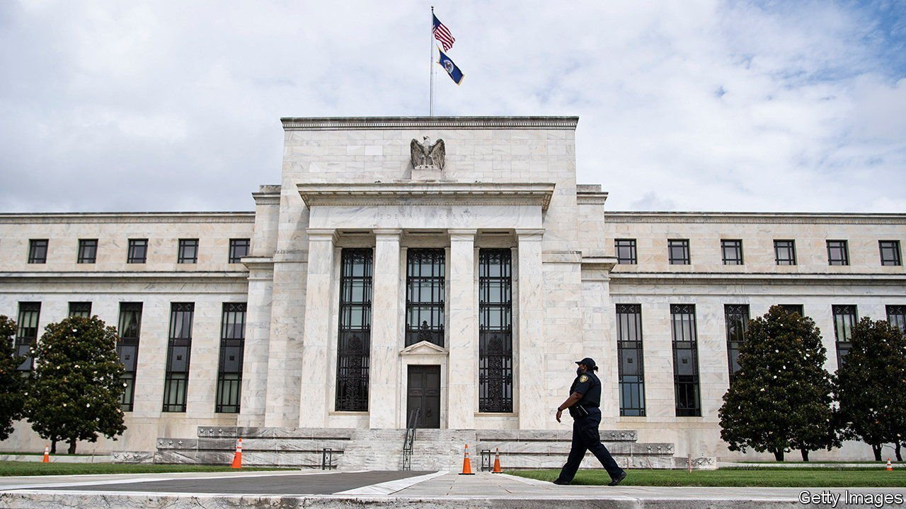
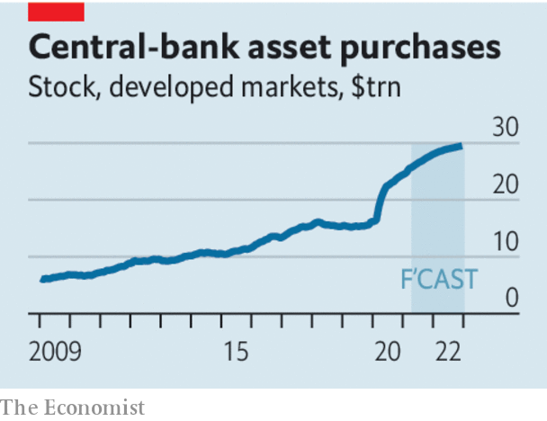

###### Jackson Hole

# Central banks should make clear what QE is for, and then reverse it 

##### Monetary policy has become a muddle 

 

> Aug 21st 2021 

ON AUGUST 26TH central bankers will gather for their annual Jackson Hole jamboree with the shine having come off their record. A year ago they had forestalled a financial crisis during the pandemic’s first wave. Today an inflation surge has made a mockery of the Federal Reserve’s forecasts; a parliamentary committee has said that the Bank of England has a “dangerous addiction” to buying bonds; and everybody expects the European Central Bank (ECB) to undershoot, over a period of years, its shiny new “symmetric” inflation target of 2%, unveiled in July.

The disquieting sense of monetary powerlessness is compounded by the spread of the Delta variant of coronavirus, which threatens to raise prices and depress global growth. Monetary policy cannot do much about port terminals closing because of outbreaks—as China’s Ningbo-Zhoushan did on August 11th—nor about Australia and New Zealand returning to lockdowns. In America consumer confidence tumbled in the first half of August. It was not for want of monetary stimulus.


Yet the trickiest challenge facing central banks is when and how to reverse the past year-and-a-half of quantitative easing (QE), the buying of long-term bonds using newly created money. On current forecasts rich-world central banks’ balance-sheets will have reached a combined $28trn in size by the end of the year, about two-fifths of which is attributable to QE during the pandemic. Critics says central banks face a “QE ratchet” because their bond holdings only go in one direction: they surged after the global financial crisis and never fell much before the pandemic struck. Even many emerging markets, now grappling with an , have dabbled in QE and must soon decide its future.

 


Debate over QE within central banks is dominated by short-term considerations about the need for stimulus. Yet there is only weak evidence that accumulating or holding bonds helps economies much when, as now, financial markets are calm. The trouble is that investors have been encouraged to interpret decisions about QE as a signal about when central banks might raise interest rates, a policy whose effects are more tangible. The resulting sensitivity of interest-rate expectations to QE announcements makes the policy hard to unwind. The Fed is nervous about triggering another “taper tantrum”, the episode in 2013 when the suggestion that it might curtail its bond-buying shook markets. In the euro zone things are further complicated because QE has also had the side-effect of mutualising some of the debts of member states.

Central bankers should be explicit about the purpose and effectiveness of QE. Buying bonds is an essential tool for stabilising financial markets in a crisis like that of spring last year. But it is increasingly clear that it should fall to government spending or tax cuts to rescue the real economy when interest rates have already reached zero. Today’s economic data bear that out: one reason America has a troublesome price surge while the ECB’s inflation target looks unfeasibly high is that America has had much more fiscal stimulus—cumulative QE, as a share of GDP, has been similar. Being explicit about which tools serve what purpose, and playing down the perceived link between bond-buying and interest rates, would let central banks unwind QE.

That would be welcome because of QE’s long-term downsides, of which there is growing awareness. One danger about which The Economist has long warned is that bloated central-bank balance-sheets are a threat to the stability of the public finances. Purchases of long-term bonds are paid for by creating central-bank reserves—electronic cash which carries a floating rate of interest (commercial banks hold these reserves and receive any interest). Should policymakers need to raise interest rates to fight inflation, the new reserves will become costlier to service. Because central banks are owned by governments—Britain’s has explicitly underwritten QE—any such burden will ultimately fall on taxpayers.

A rapid exit from QE would remove that danger. But the overarching goal should be to recognise the tool’s limitations and consequences. At present central bankers do not want to talk down their own firepower and do not see it as their job to take account of QE’s fiscal threat. Instead the state should take an integrated view of its finances. That may involve redesigning how institutions work, by giving governments the job of weighing up the policy’s costs and benefits. At the same time, central banks might be given an advisory role on the size of government deficit that would help stabilise economies in a downturn. As it is, the justifications for QE have become murky, as have the interactions between fiscal and monetary policies. It is time for transparency and a clear division of labour. ■

