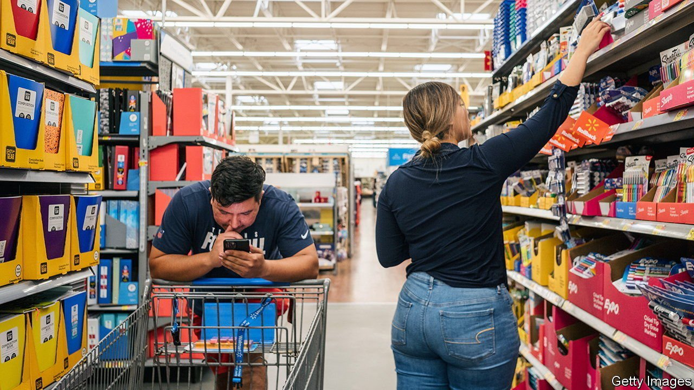

###### Retail revival

# How American retailers have adapted to the Amazon effect 

##### The e-commerce marketplace is more dynamic than regulators realise 

 

> Aug 21st 2021 

AFTER REELING from the shock of the pandemic, America’s consumers came roaring back early this year, fuelled by vaccines, stimulus cheques and their instinctive bullishness. Now their enthusiasm is starting to ebb.  in July were 1.1% lower than a month earlier and a consumer-confidence survey by the University of Michigan suggests that shoppers lost more of their swagger in early August. The Delta variant has played on their nerves while price spikes and supply-chain glitches have dulled enthusiasm for buying some products such as cars—sales of which dropped by 3.9% last month, compared with June. There is now a sense that the rate of growth in consumer spending is returning to a more pedestrian pace after 18 giddy months of wild shrinkages and splurges.

Yet even as normality beckons it is ever clearer that the pattern of spending has been transformed. One change is well-known: a lift in the level of e-commerce. The other is less familiar. An industry that was supposed to have been annihilated by Amazon has bounced back.


In 2017-19 all the talk was of a “retail apocalypse” and “retailmaggedon”. The fear was that a steady rise in e-commerce and  into new products would drive traditional retailers towards extinction, just as Kodak failed to adapt to the digital-photography revolution and eventually went bust. When Sears, which led the rise of suburban shopping culture after the second world war, declared bankruptcy in 2018 it seemed possible that many more large retailers would struggle to avoid the same fate. The spectre was of a pile of shopping-mall rubble, 16m lost retail jobs and a mountain of useless inventory, loomed over by a dominant Amazon and the grin of Jeff Bezos.

Things have turned out rather differently. The pandemic has certainly sped up the shift towards e-commerce sales, which have risen from 14% of the total in 2018 to 20% this year according to JPMorgan Chase, a bank. Although the pace of growth has slowed in the past few months there will be no return to the past.

Meanwhile the industry’s structure is starting to look different. Amazon has thrived: its market share of e-commerce stands at about 40% overall and is far higher than that in some categories, such as books. Shopping centres have struggled to attract the same numbers of visitors as before, and some have defaulted on their debt. Nonetheless, the health of the non-Amazon retail industry looks better than it once did. At $2.5trn, for example, the market value of American listed retailers is 88% higher than at the start of 2018, while their total net debt burden has been easing since the end of 2019. The number of people employed in the retail trade is only 4% below its post-war peak in 2017.

Behind these numbers there are three types of fightback. First, the biggest retailers have embraced the digital world. This week Walmart predicted that its global e-commerce revenues would reach $75bn for the full year (about 13% of the firm’s total sales). It has made a big push in hybrid types of shopping that involve online activity but harness its stores, such as “click-and-collect” and online memberships. Target has promoted a similar service and digital sales now make up almost a fifth of its total.

The second fightback is from digital-only alternatives to Amazon. Although the veteran marketplace eBay has struggled over the years, Shopify, which helps merchants sell online and fulfil orders, has seen its share of American online sales reach 9% and its market value soar to $188bn. Many other digital firms are operating in lucrative niches, from Instacart in grocery delivery to Etsy in interactive shopping for artisanal goods.

Finally, some brands are taking control of distribution. Nike stopped selling directly on Amazon in 2019 and instead reaches consumers through its own apps and platforms. Its digital sales rose by two-thirds in the year to May, to 20% of the total.

The retail drama has several lessons. For firms in other industries facing digital disruption the key is to experiment and invest. Before Walmart got back its groove it had innumerable false starts and it has raised its capital spending by 40%. Antitrust regulators need to stay more up to date. Even as they stampede to regulate big tech there is mounting evidence that the e-commerce marketplace is more dynamic than they realise.

Apocalypse averted

The wave of experimentation will probably continue. New payment apps and social-media firms with hordes of customers are expanding into e-commerce, and retailers are shifting into online advertising and entertainment. For America’s indefatigable consumers, and for its workers, the good news is that competition—combined with an almighty shock—have led to a more innovative industry, rather than the end of the world. ■

