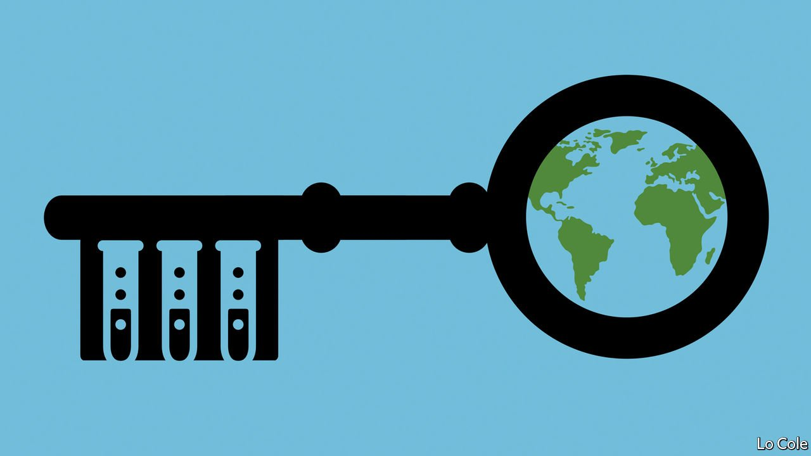

###### No more leaks

# Regardless of how covid-19 spread, we need to better prevent lab leaks 

##### Even a small reduction in the risk of another pandemic is worth the price 

 

> Aug 21st 2021 

TO PREVENT THE next pandemic, it would help to know how this one started. However, the answer to that question might embarrass China’s rulers. So they have obstructed investigations into how the virus emerged, and promoted far-fetched theories about it having originated somewhere else. The world thus has only a  in Hubei province in the second half of 2019.

American spooks are about to finish a 90-day review of covid-19’s possible origins, on President Joe Biden’s orders. It is unlikely to reach a firm conclusion. Yet it is clear that the answer China least wants to hear—that the virus could have leaked from a lab in Wuhan, or been picked up by a researcher collecting samples in the field—is plausible. And it would not be the first time this has happened. The flu pandemic of 1977, which killed 700,000 people, is now believed to have begun with a lab leak in north-east Asia—possibly in China, possibly in the Soviet Union. With new laboratories being built all the time to handle dangerous pathogens, and with the era of synthetic biology just around the corner, the task of tightening lab biosafety has become urgent.


People who work with deadly pathogens do so with scandalously little transparency or supervision. Rules in some places are not legally binding or subject to independent oversight. That has to change. The world needs to know who is working with which pathogens, where, and under what sort of safety protocols. (Intelligence agencies do not see this as part of their remit, but they should.) International standards are needed, and a global body to advise on the most dangerous kinds of work. This will be hard to accomplish, but there is a precedent. A committee of the World Health Organisation (WHO) monitors and inspects the two labs that hold smallpox, a deadly virus that was eradicated in the wild through vaccination, and reviews proposed research.

America, which could be leading the way, is not. Researchers who receive federal grants to study pathogens have to follow federal rules. Private labs are not so constrained. This will not do. Ideally there would be an agreed set of basic rules, enforced by a watchdog that is independent of the bodies that fund research. The backers of a project cannot be neutral arbiters of its safety.

Many other countries follow America’s lead on biosafety. So if it improves its rules and procedures, others will, too. That could be a step towards a proper set of global norms. And it would be in every country’s interest, even China’s, to abide by such norms. Meetings this year to discuss a pandemic treaty offer a chance to harmonise rules on lab biosafety. Organisations such as the WHO, the G7 and the OECD could also do more to promote transparency and security.

Governments need to ask whether certain kinds of research are too risky to be allowed. Gain-of-function research, which genetically alters organisms such as viruses in ways that can make them more dangerous, deserves special scrutiny. So does viral collection in the wild.

New tools are needed as well as new rules. Real-time genomic surveillance at border crossings could catch novel pathogens as they emerge. Sewage and air could be sampled more widely. Ways to create vaccines even faster should be explored.

And if some scientists complain that all this will make their work costlier and harder, there is an obvious rejoinder. Perhaps 15m people have died directly of covid-19, and the resulting economic damage has impoverished many millions more. If better biosafety reduces the chance of another pandemic even slightly, it will be cheap at the price. ■

Dig deeper

All our stories relating to the pandemic and the vaccines can be found on our . You can also find trackers showing ,  and the virus’s spread across  and .

