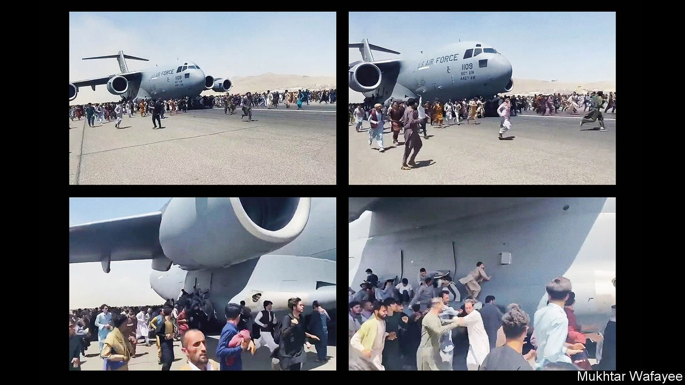

###### Biden’s debacle

# The fiasco in Afghanistan is a grave blow to America’s standing 

##### And much of the blame lies squarely with Joe Biden 

 

> Aug 21st 2021 

IF THE PROPAGANDISTS of the Taliban had scripted the collapse of America’s 20-year mission to reshape Afghanistan, they could not have come up with more harrowing images. As insurgents swept into Kabul, desperate Afghans, terrified about what the victorious zealots might do, chased departing American cargo planes down the runway, trying to clamber into the landing gear and inevitably falling to their deaths. The American-backed government had surrendered without a fight—something that American officials were insisting would not happen only days before. Afghans were left in such a horrifying bind that clinging to the wheels of a hurtling aircraft seemed their best option.

America has spent $2trn in Afghanistan; more than 2,000 American lives have been lost, not to mention countless Afghan ones. And yet, even if Afghans are more prosperous now than when America invaded, Afghanistan is back to square one. The Taliban control more of the country than they did when they lost power, they are better armed, having seized the weapons America showered on the Afghan army, and they have now won the ultimate affirmation: defeating a superpower.


The insurgents have made a show of magnanimity, pledging that they will not take revenge on those who worked for the toppled government and insisting that they will respect women’s rights, within their interpretation of Islamic law. But that interpretation kept most girls out of school and most women confined to their homes when the group was last in power, in the 1990s. Brutal punishments—floggings, stonings, amputations—were common. The freedoms that urban Afghans took for granted over the past 20 years have just gone up in smoke. It is an appalling outcome for Afghanistan’s 39m people, and .

It is not surprising that America failed to turn Afghanistan into a democracy. Nation-building is difficult, and few imagined that it could become Switzerland. Nor was it unreasonable for Joe Biden, America’s president, to want to draw the conflict to a close. America has spent 20 years in a place of only modest strategic importance about which most American voters have long since ceased to care. The original reason for the invasion—to dismantle al-Qaeda’s main base of operations—was largely achieved, though that achievement could now be reversed.

The claim that America is showing itself to be a fickle ally by allowing the Afghan government to fall is also overblown, given the duration, scale and expense of the American deployment. The defunct regime in Kabul was not an ally in the way that Germany or Japan is. It was far weaker, more corrupt and completely dependent on America for its survival.

But none of that absolved America of the responsibility to withdraw in an orderly fashion. Mr Biden  for the welfare of ordinary Afghans. The irony is that America had a plan to do just that, which had been in the works for several years. It had hugely scaled down its garrison, from around 100,000 troops in 2011 to fewer than 10,000 by 2017, along with a similar number from other NATO countries. They were not supposed to defeat the Taliban, but prevent the Afghan army’s collapse, largely through air power, and so force the Taliban to the negotiating table.


Apologists for Mr Biden argue that his predecessor, Donald Trump, had already scuppered this plan by trying to rush it to a conclusion before last year’s presidential election in America. It is true that Mr Trump was so desperate to strike a quick deal that he accepted preposterous terms, agreeing to end America’s deployment without even securing a ceasefire, let alone a clear plan to end the civil war. He had already reduced the American presence to little more than 2,000 soldiers by the time Mr Biden took office, and had promised to get the rest out by May 1st.

But Mr Biden did not have to stick to this agreement. In fact, he didn’t entirely, refusing to keep to the original timetable. The Taliban were clearly not holding up their end of the bargain, pressing their advantage on the battlefield instead of negotiating in good faith with the Afghan government. That could have been grounds to halt or reverse the American withdrawal. There was little political pressure within America to bring the war to a speedy conclusion. Yet Mr Biden was working to an arbitrary and flippant deadline of his own, seeking to end the war by the 20th anniversary of 9/11. Although the speed of the Afghan government’s implosion surprised most observers, including this newspaper, America’s soldiers and politicians were among the most naively optimistic, insisting that a total collapse was a vanishingly remote prospect. And when it became clear that the Afghan army was melting away, Mr Biden pressed on intransigently, despite the likely consequences.

As a result, America’s power to deter its enemies and reassure its friends has diminished. Its intelligence was flawed, its planning rigid, its leaders capricious and its concern for allies minimal. That is likely to embolden jihadists everywhere, who will take the Taliban’s victory as evidence that God is on their side. It will  on the part of hostile governments such as Russia’s or China’s, and worry America’s friends. Mr Biden has defended the withdrawal by arguing that Afghanistan was a distraction from more pressing problems, such as America’s rivalry with China. But by leaving Afghanistan in such a chaotic fashion, Mr Biden will have made those other problems harder to deal with.


After the fall

The shambolic withdrawal does not reduce the obligation of America and its allies to ordinary Afghans, but increases it. They should use what leverage they still have to urge moderation on the Taliban, especially in their treatment of women. The displaced will need humanitarian aid. Western countries should also admit more Afghan refugees, the ranks of whom are likely to swell, and provide generous assistance to Afghanistan’s neighbours to look after those who remain in the region. The haste of European leaders to declare that they cannot take in many persecuted Afghans even as violent zealots seize control is almost as lamentable as America’s botched exit. It is too late to save Afghanistan, but there is still time to help its people. ■

For more coverage of Joe Biden’s presidency, visit our dedicated 

