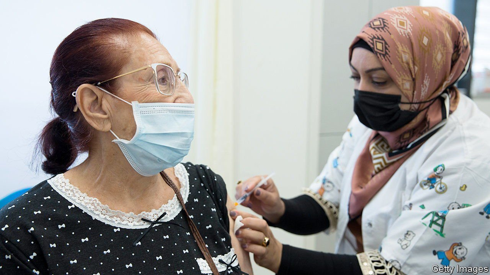

###### A wave of criticism

# Israel’s prime minister gets a hard lesson in pandemic politics 

##### Containing the virus is not as easy as Naftali Bennett thought 

 

> Aug 21st 2021 

JUST TWO months ago, in early June, cases of covid-19 were waning in Israel. With one of the highest vaccination rates in the world, the country seemed to be nearly done with the virus. Masks were discarded and restrictions lifted. But the end was illusory. The spread of the Delta variant has caused a spike in new cases. More than 8,000 were logged on August 17th.

The Delta variant may have entered Israel before Naftali Bennett became prime minister on June 13th, but he has taken a beating over his handling of the outbreak. The government “received the country in the best state in the world in regard to coronavirus”, says Binyamin Netanyahu, who preceded Mr Bennett and is now leader of the opposition. The prime minister, says Mr Netanyahu, has spoiled that success.


Mr Netanyahu’s criticism is self-serving, but for much of July he did call on the government to give Israelis a third dose of the vaccine. On July 29th the government said it would do just that, jabbing those over 60 for a third time—the first country to do so. It has since broadened the policy to those over 50. Some restrictions have also been renewed, such as limits on the size of indoor and outdoor gatherings.

Early data suggest the new jabs do indeed offer more protection from infection. Officials hope they will reduce pressure on hospitals. Mr Bennett is desperate to avoid another lockdown, claiming that the three previous ones, under Mr Netanyahu, had “a direct price in human lives”. The prime minister also fears that Israelis may not abide by a fourth lockdown.

Israelis are already souring on Mr Bennett. According to a recent poll, 43% of them think Mr Netanyahu did a better job of handling the pandemic. Only 21% favoured Mr Bennett. His party, Yamina, was never all that popular. It won just seven seats (out of 120) in the last election. But the coalition opposed to Mr Netanyahu needed Yamina to form a government, so Mr Bennett was offered the top job for two years in order to gain his support.

As part of the coalition agreement, Mr Bennett cannot remove or discipline ministers of other parties. That includes nearly all senior cabinet ministers, most of whom have left Mr Bennett to fend for himself when it comes to the pandemic. Erstwhile rivals, such as Yair Lapid, the foreign minister, and Avigdor Lieberman, the finance minister, rarely attend meetings of the “coronavirus cabinet”.

Mr Bennett is largely to blame for the pressure he is under. In 2020 he positioned himself as Mr Netanyahu’s chief critic, even writing a book, “How to Beat Covid-19”, in which he confidently explained how Israel could adopt a “zero infections” policy. In July he promised to rid the country of the virus in five weeks. Now, though, he is resorting to word games. He has largely stopped saying “coronavirus” in public, preferring “the Delta virus”, in order to convince voters that he is facing an entirely new challenge.

Mr Bennett says, “The pandemic is teaching the whole world a lesson in humility.” Yet he hasn’t stopped personalising the fight against covid-19, much as Mr Netanyahu did. On August 17th he celebrated the fact that a million Israelis had got a third jab, calling it “an expression of trust” in himself. If this wave begins to dwindle soon, Mr Bennett can claim that, unlike Mr Netanyahu, he succeeded without resorting to a lockdown. But if cases continue to rise, he may find himself even more isolated. Health experts are watching the outbreak closely. Politicians are, too. ■

Dig deeper

All our stories relating to the pandemic and the vaccines can be found on our . You can also find trackers showing ,  and the virus’s spread across  and .

