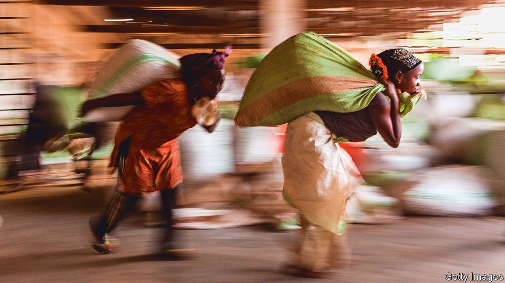

###### Heading towards a dilemma

# Rich countries want to strike trade deals in Africa 

##### But the wrong approach could hinder the continent’s own integration 

 

> Aug 21st 2021 

“WE WILL BE the guinea pig,” said Uhuru Kenyatta, Kenya’s president, before trade talks with America opened last year. A deal would make Kenya only the second African country after Morocco to sign a free-trade agreement with the United States. Officials in the Trump administration called the proposed deal “a model” for future ones. But such bilateral talks jar with Africa’s push for regional integration and with President Joe Biden’s emphasis on multilateralism. Negotiations are now on hold while America works out what to do next.

The pause reflects a sense of drift in Africa’s trade relations with the West, as both America and Europe rethink how they do business with the continent. In the past they granted concessions, such as lower tariffs on African exports, without requiring African countries to reciprocate. Now they are increasingly looking to negotiate two-way agreements which will open up African markets, too. The old approach was paternalistic and gave Africans little say. But the new one, handled badly, could put Africa’s own integration at risk.


Since 2000 American policy has been built around the African Growth and Opportunity Act (AGOA), which grants duty-free access to thousands of products exported from around 40 eligible countries. It was a law passed by Congress, not a treaty negotiated between governments, so African countries have no control over the eligibility criteria. That creates friction. Rwanda, for example, was partially suspended in 2018 because its ban on imported second-hand clothes, intended to boost local production, irked the American firms that export them.

Now African countries must wait anxiously to see if Congress will extend AGOA beyond its current expiry date in 2025. The uncertainty makes business “too unpredictable”, sighs a Ugandan technocrat. Kenya’s push for a fully fledged trade deal with America is an attempt to seize the initiative. It also draws on the promise of AGOA itself, which was always envisaged as a stepping stone towards negotiated pacts.

But there is a snag. Kenya is part of the East African Community, which is, on paper, a customs union. If Kenya were to lower barriers to American products, then the other five countries in the bloc would either have to let those products leak into their own markets or tighten border checks to keep them out. Negotiating with countries as a group, rather than individually, would be a less divisive way forward.

Whoever is at the table, many American businesses now favour moving away from AGOA-like trade concessions and towards reciprocal agreements. They do not want to “lose out” while other countries strike deals, says Witney Schneidman, a former deputy assistant secretary of state for African affairs. For instance, a refrigerator made in America enters South Africa with a far higher tariff than one made in the EU, notes Mr Schneidman.

Meanwhile European countries are stuck in a quagmire of their own. They once gave preferential access to exports from their former colonies in Africa, the Caribbean and the Pacific. That clashed with World Trade Organisation rules. So in 2000 the EU started touting reciprocal deals called “economic partnership agreements”, negotiated with regional blocs. Britain is adopting a similar model in its post-Brexit trade with Africa.

A southern African pact with the EU came into force in 2016. But countries such as Nigeria (in the west African bloc) and Tanzania (in the east) have refused to sign deals in their respective regions. They worry, with some justification, that dropping tariffs would expose nascent industries to a flood of European competition.

The incentive to cut a deal with Europe is also undermined by existing systems of trade preferences, which overlap like onion skins. Peel off one layer, as the EU is doing, and countries like Kenya lose access to European markets—unless they sign up for an economic partnership agreement. But poorer countries such as Tanzania can export duty-free without a deal, thanks to a different layer of benefits. Unsurprisingly the two neighbours in the same east African bloc find themselves at odds.

Yet the whole continent is supposed to be pursuing its own ambitious agenda for integration. This year 37 countries started the gradual process of trading under an African Continental Free Trade Area (AfCFTA). They want to kick-start Africa’s stalled industrialisation by selling manufactured goods to each other, rather than raw materials to distant continents. Kenya’s solo negotiations with America “may undermine the AfCFTA”, says Prudence Sebahizi, the African Union’s chief technical adviser on the pact. He fears that American goods may displace African ones in Kenya’s market.

Influential voices urge a rethink. “Rich countries should not be picking African integration apart,” says David Luke of the London School of Economics. Carlos Lopes, the African Union’s representative on future relations with Europe, suggests trade talks with the rest of the world could wait until the AfCFTA is embedded and Africa is ready to negotiate as a single bloc.

Others think that strategy unrealistic. An EU official says Europe shares the vision of an Africa that “can speak with one voice”. But the best way to get there, he says, is to build on existing deals. The AfCFTA is still being assembled. “It’s only when we get an African customs union that Africa can negotiate as a bloc,” says Trudi Hartzenberg of the Trade Law Centre, a South African think-tank, “and that’s a long way off.” Free-trade areas can, and do, overlap.

African countries are caught in a contradiction. Politically they demand to be treated as equal partners, but the economic order remains profoundly unequal. “A Goliath is negotiating with a David,” says Africa Kiiza of SEATINI, a Uganda-based campaign group. “Reciprocity between unequals can’t work.” ■

