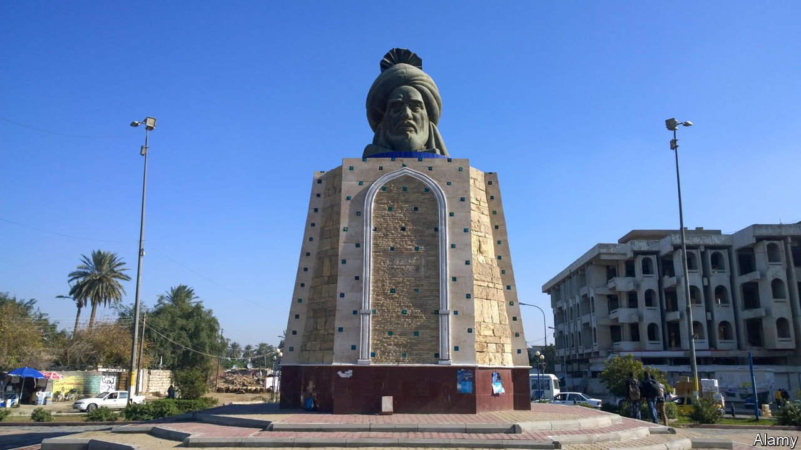

###### Caliph hanger

# Shia zealots try to cancel a statue of Baghdad’s founder 

##### But most Iraqis are no longer angry about crimes of the eighth century 

 

> Aug 21st 2021 

THEY WERE inspired by activists in America and Britain who toppled statues of Confederate soldiers and 18th-century slave-traders. Their target was 1,000 years older, however. Shia radicals in Iraq want to tear down a bust of Abu Jaafar al-Mansur, which sits on a pedestal in Baghdad (pictured). Mansur, the second Abbasid caliph, who ruled from 754 to 775AD, created a vast empire and founded Baghdad itself, which he called the “City of Peace”. For a while it was the greatest city in the world.

But Mansur is remembered by some as a Sunni tyrant who treated Shias more brutally than Saddam Hussein or the jihadists of Islamic State. He is said to have ordered the poisoning of Imam Jaafar al-Sadiq, the sixth of 12 imams revered by Shias. This recently led to small protests at the statue and calls for its destruction. “The continued existence of this statue in Baghdad is a disgrace, and we can only regain some honour when it is demolished,” reads a statement by Yasser al-Habib, an influential Shia cleric based in England.


Historians are aghast. “To reduce Mansur to a base sectarian figure is a travesty,” says Justin Marozzi, author of a fine history of Baghdad. Mansur did fill crypts with Shia skulls in an effort to eliminate competition to Abbasid rule. Both the Abbasids and the Shias claimed legitimacy by tracing their lineage back to the Prophet Muhammad. But Mansur also turned Baghdad into a hub of science, culture and religion, leading to Islam’s “golden age”.

In 2005 Mansur’s bust was knocked off its perch by a bomb, raising sectarian tension. To avoid a repeat, security forces dispersed the recent protests around the monument. Social-media posts about Mr Habib’s statement were banned and bystanders photographing the statue detained. President Barham Salih tried to mollify Sunni imams at the tomb of Abu Hanifa, an important place of worship for Sunnis that the radicals also threatened to destroy.

Most Iraqis seem to be fed up with attempts to divide them along sectarian lines, often by politicians trying to shift attention from their own failures. The call to destroy the statue was not taken up by Shia militias. Youth groups from the Shias’ holy city of Najaf even offered to defend it as “a symbol of Iraqi heritage”. And this ecumenical spirit may be spreading. Iraq’s prime minister, Mustafa al-Kadhimi, a Shia, has called on leaders from countries spanning the Sunni-Shia divide, such as Saudi Arabia and Iran, to gather for a summit at the end of the month. The venue, of course, would be Baghdad, Mansur’s city of peace.

